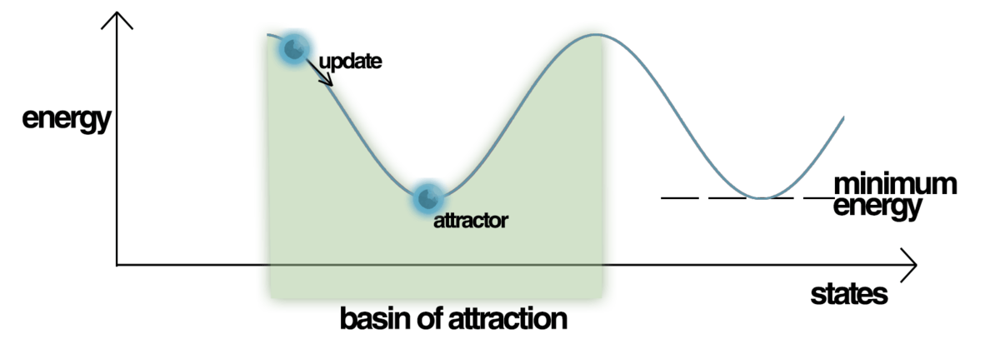

<p align="center">
  <a href="https://xkcd.com/793/">XKCD 793: A physicist encountering machine learning for the first time</a>
</p>

---

**✨ Update (November 2021):** _Please consider reading [Transformers Are Secretly Collectives of Spin Systems](https://mcbal.github.io/post/transformers-are-secretly-collectives-of-spin-systems/) for an arguably more comprehensive approach towards understanding transformers from a physics perspective._


# Introduction
In 2017, [Attention Is All You Need](https://arxiv.org/abs/1706.03762) [^ref:aiayn] demonstrated state-of-the-art performance in neural machine translation by stacking only (self-)attention layers. Compared to recurrent neural networks, Transformer models exhibit efficient parallel processing of tokens, leading to better modeling of long-range correlations and, most importantly, [favorable scaling in terms of data and compute](https://arxiv.org/abs/2001.08361). Since then, Transformers seem to have taken over natural language processing. Widespread adoption of attention-based architectures seems likely given recent work like [An Image is Worth 16x16 Words: Transformers for Image Recognition at Scale](https://arxiv.org/abs/2010.11929) and the flurry of developments addressing the architecture's quadratic scaling bottlenecks.

Recently, the papers [Hopfield Networks is All You Need](https://arxiv.org/abs/2008.02217) [^ref:hiayn] [^ref:hiayn-blog] [^ref:hian-performers-blog] and [Large Associative Memory Problem in Neurobiology and Machine Learning](https://arxiv.org/abs/2008.06996) [^ref:hopfield-new] provided complementary post-facto explanations of some of the success of Transformers from the perspective of energy-based models. In this post, I provide a biased overview of (self-)attention in Transformers and summarize its connections to modern Hopfield networks. Along the way, I look for intuition from physics and indulge in hand-wavy arguments on how an energy-based perspective can shed light on training and improving Transformer models.

# A growing zoo of Transformers
Let's start off with an overview of the components in a vanilla Transformer model. Since our focus is on (self-)attention, I am going to assume some prior knowledge[^attn-resources] and skip comprehensive architecture descriptions and experimental results. In [Section 3](#from-hopfield-networks-to-transformers), we will start from scratch and use Hopfield networks to build back up to the attention module described below.

## Vanilla Transformers
The proto-Transformer was introduced in an encoder-decoder context for machine translation in [Attention Is All You Need](https://arxiv.org/abs/1706.03762). The original motivation seems to have been mostly driven by engineering efforts to model long-range correlations in sequence data and the recent successes of attention mechanisms stacked on top of recurrent neural networks. The main contribution and selling point of the paper was making an attention-only approach to sequence modeling work.


Let's focus on the encoder on the left and ignore the decoder on the right. Transformer models accept (batches of) sets of vectors, which covers most inputs people care about in machine learning. Text can be modelled as a sequence of embedded tokens. Images can be viewed as a snaky sequence of embedded pixels or embedded patches of pixels. Since sets have no notion of ordering, learned or fixed positional information needs to be explicitly added to the input vectors.

The main module in the Transformer encoder block is the multi-head _self-attention_, which is based on a (scaled) dot-product attention mechanism acting on a set of $d$-dimensional vectors:

\begin{equation}
  \mathrm{Attention}\left( \mathbf{Q}, \mathbf{K}, \mathbf{V} \right) = \mathrm{softmax} \left( \frac{\mathbf{Q} \mathbf{K}^T}{\sqrt{d}} \right) \mathbf{V}
  \label{eq:vanilla-attention}
\end{equation}

Here, queries $\mathbf{Q}$, keys $\mathbf{K}$, and values $\mathbf{V}$ are matrices obtained from acting with different linear transformations --- parametrized respectively by weights $\mathbf{W}_{\mathbf{Q}}$, $\mathbf{W}_{\mathbf{K}}$, and $\mathbf{W}_{\mathbf{V}}$ --- on the same set of $d$-dimensional inputs. _Cross-attention_ takes the inputs for its queries from a different source than for its keys and values, as can be glimpsed from the decoder part of the architecture on the right. 

For every input query, the updated output query of \eqref{eq:vanilla-attention} is a linear combination of values weighted by an attention vector quantifying the overlap of the input query with the keys corresponding to these values. Stacking input query attention vectors leads to an attention matrix. Since all objects are vectors and the attention mechanism is just a dot product between vectors, we can think of the attention module as matching query vectors to their "closest" key vectors in latent space and summing up contributions from value vectors, weighted by the "closeness" of their keys to the queries.

The remaining components of the Transformer encoder block are needed to make the module work properly in practice:
  
- The _multi-headedness_ of the attention module refers to chunking up the dimension of the vector space and having multiple attention operations running in parallel in the same module, yet with each acting on a lower-dimensional segment of the full space. This is a trick to (1) get around the fact that every input vector only couples to one query at a time to calculate its attention coefficient, and (2) provide multiple starting points in the subspaces for the queries, which might help to avoid bad local minima in parameter space during optimization.
- A positional feed-forward network, made up of two linear layers with a non-linearity in between, is inserted at the end of the module. Folklore wisdom tells us that the feed-forward layer needs to blow up the dimension of the latent space by a factor of four for it to be able to "disentangle" the represention. More likely though, it's a way to increase model capacity and warp latent spaces since the attention modules on their own are pretty much linear apart from the $\mathrm{softmax}$-operator used to obtain the normalized attention coefficients.
- Residual connections are added to control the flow of gradients.
- Layer normalisation is used to control learning dynamics and keep vector norms from exploding.

## Beyond vanilla: confronting quadratic scaling
Most architectural variations of the vanilla Transformer are targeted at the attention module, which scales poorly with respect to the input sequence length $N$. Since the overlap of all queries with all keys is required, calculating a dense attention matrix scales like $\mathcal{O}(N^2)$ in time and space. Limits on the context window of the attention mechanism during training prevent the model from learning how to deal with long sequences and long-range correlations. The majority of post-vanilla Transformer species can be classified into one of the following buckets[^attn-resources]:
- Low-rank approximations: truncate the matrix product $\mathbf{Q} \mathbf{K}^T$ since it's likely not full rank for structured data
- Sparsification: reduce the attention calculation from all query-key pairs to a subset because not all of them feel the need to talk to each other
- Recurrence: keep track of a (compressed) history of context
- Kernels: approximate the attention operation with kernel methods

For the remainder of our discussion, we will focus on vanilla Transformers. One of the goals of this blog post is to explore how a different perspective on the _function_ of attention-based algorithms might lead to qualitatively different improvements beyond what is possible by relying on scaling and reducing computational complexity alone.

# From Hopfield networks to Transformers

In this section, we provide a short history of Hopfield networks and gradually build up intuition until we can recognize the Transformer self-attention mechanism for what it really is. We refer to the [blog post](https://ml-jku.github.io/hopfield-layers/) accompanying [Hopfield Networks is All You Need](https://arxiv.org/abs/2008.02217) for more details and insightful visualizations of pattern storage and retrieval.

## Classical discrete Hopfield networks
A [Hopfield network](https://en.wikipedia.org/wiki/Hopfield_network) is a simple model for associative memory popularized by John Hopfield in his 1982 paper [Neural Networks and Physical Systems with Emergent Collective Computational Abilities](https://www.pnas.org/content/pnas/79/8/2554.full.pdf)[^ref:hopfield-old]. The task of an associative memory is to store and retrieve patterns, preferably in a way that allows one to recover stored patterns quickly with a low error rate.

The basic idea of the Hopfield network --- and other energy-based models like [Boltzmann machines](https://en.wikipedia.org/wiki/Boltzmann_machine) --- is to construct an _energy function_ which defines an _energy landscape_ containing basins of attraction around patterns we want to store. Starting at any pattern, we want to have an update rule pointing towards the closest stored pattern, guided by a scalar "closeness" score provided by the energy function.

[](https://en.wikipedia.org/wiki/Hopfield_network)

Let's make this a bit more formal but not too formal. Consider trying to store a set of $N$ binary patterns $\{\boldsymbol{x}_{i}\}_{i=1}^{N}$ where each pattern $\boldsymbol{x}_{i}$ is a $d$-dimensional vector whose entries are either $-1$ or $1$. For example, in the case of storing black-and-white images, every image would correspond to a string of pixel values, a binary pattern $\boldsymbol{x}_{i}$.

For any query $\boldsymbol{\xi} \in \mathbb{R}^{d}$, or _state pattern_, we want to find a way to retrieve the closest _stored pattern_. In his paper, Hopfield considered the energy function

\begin{equation}
  E = - \frac{1}{2} \boldsymbol{\xi}^{T} \boldsymbol{W} \boldsymbol{\xi} + \boldsymbol{\xi}^{T} \boldsymbol{b} = - \frac{1}{2} \sum_{i=1}^{d} \sum_{j=1}^{d} w_{ij} \xi_{i} \xi_{j} + \sum_{i=1}^{d} b_{i} \xi_{i} ,
  \label{eq:ising}
\end{equation}

where $\boldsymbol{b} \in \mathbb{R}^{d}$ denotes a bias vector and the weights $\boldsymbol{W} \in \mathbb{R}^{d \times d}$ are set to the sum of the outer products of the patterns we want to store

\begin{equation}
  \boldsymbol{W} = \sum_{i=1}^{N} \boldsymbol{x}_{i} \otimes \boldsymbol{x}_{i}^{T}.
\end{equation}

The state pattern update rule is given by the sign of the gradient of \eqref{eq:ising} with respect to $\boldsymbol{\xi}$ and can be done in one step (synchronously) or separately for every component of the vector (asynchronously):

\begin{equation}
  \boldsymbol{\xi}_{n+1} = \mathrm{sgn} \left( \boldsymbol{W}  \boldsymbol{\xi}_{n} - \boldsymbol{b} \right).
\end{equation}

The storage capacity of this system for retrieval of patterns with a small amount of errors can be shown to be $C \cong 0.14 d$, scaling linearly with the dimension of the pattern vector.

### Physical intuition
Physicists immediately recognize the energy function \eqref{eq:ising} as an incarnation of the [Ising model](https://en.wikipedia.org/wiki/Ising_model#Application_to_neuroscience). Spin degree of freedoms $\xi_{i}$ are grouped into patterns $\boldsymbol{\xi}$ that are equivalent to _spin configurations_ of $d$ spins. The weight matrix is a sum of stored-pattern spin configurations, serving as attractors for the state-pattern spin configuration. The couplings $w_{ij}$ can be regarded a sum of samples of an underlying pattern data distribution. They are not restricted to (nearest-)neighbors and their values are neither uniform like in exactly solvable models nor totally random like in spin glass models.

<!-- After identifying relevant degrees of freedom, physicists combine appropriate conceptual structures with arguments based on locality, symmetry, and physical and mathematical intuition to write down a model description, usually after a lot of hard work and trial-and-error.-->

> **Neural networks and spin glasses**: There is some literature on connections between [spin glasses](https://en.wikipedia.org/wiki/Spin_glass) and [neural networks](https://en.wikipedia.org/wiki/Neural_network). Spin glasses are phases of matter describing disordered magnetic systems exhibiting both [quenched disorder](https://en.wikipedia.org/wiki/Order_and_disorder#Quenched_disorder) and frustratation. Spin glasses were a major inspiration for Hopfield networks, as beautifully explained by the condensed matter physicist [Philip W. Anderson](https://en.wikipedia.org/wiki/Philip_W._Anderson) in a [column series for Physics Today](https://en.wikipedia.org/wiki/Spin_glass#cite_note-10) (1988-1990). However, apart from [Efficient training of energy-based models via spin-glass control](https://arxiv.org/abs/1910.01592) [^ref:spin-glass], I could not find any recent papers that point to a productive research direction beyond qualitative statements like "here's two hard problems where symmetry and order will not help you solve them".

## Modern discrete Hopfield networks

Modern discrete Hopfield networks (or _dense_ associative memories) introduced the following family of energy functions to improve pattern storage capacity and pattern separation capabilities [^ref:modern-dam1] [^ref:modern-dam2]

\begin{equation}
  E = - \sum_{i=1}^{N} F \left( \boldsymbol{x}_{i}^{T} \cdot \boldsymbol{\xi} \right)
\end{equation}

Compared to the classical discrete Hopfield network energy function \eqref{eq:ising}, the explicit weight matrix is gone and the energy has been reduced to a sum of a function of dot products between the state pattern $\boldsymbol{\xi}$ and every stored pattern $\boldsymbol{x}_i$. For a polynomial interaction function $F(x) = x^{a}$, low-error storage capacity is $C \cong d^{a-1}$. The quadratic, classical discrete Hopfield network is recovered by setting $a=2$.

Essentially, the role of $F(x)$ is to separate close patterns by blowing up differences in dot product values. Few things blow up better than exponentials, so
we can generalize the energy to

\begin{equation}
  E = - \sum_{i=1}^{N} \exp \left( \boldsymbol{x}_{i}^{T} \cdot \boldsymbol{\xi} \right)
\end{equation}

with storage capacity $C \cong 2^{d\/2}$. The corresponding update rules for modern discrete Hopfield networks can be shown to converge quickly with high probability[^ref:modern-dam2].

## Modern continuous Hopfield networks

Most machine learning applications are tailored to work with continuous embeddings (vector representations) rather than discrete patterns. Is there a way to generalize modern Hopfield networks to continuous data? Recently, [Hopfield Networks is All You Need](https://arxiv.org/abs/2008.02217) proposed the following energy function to deal with continuous $d$-dimensional patterns[^vector-spin-model]: 

\begin{equation}
  E(\boldsymbol{\xi}; \boldsymbol{X}) = \frac{1}{2} \boldsymbol{\xi}^T \boldsymbol{\xi} -\mathrm{logsumexp} \left( \boldsymbol{X}^T \boldsymbol{\xi} \right),
  \label{eq:energyfunc}
\end{equation}

which we consider to be a function of the state pattern $\boldsymbol{\xi} \in \mathbb{R}^{d}$ and parametrized by $N$ stored patterns $\boldsymbol{X} = (\mathbf{x}_{1}, \ldots, \mathbf{x}_{N}) \in \mathbb{R}^{d \times N}$. From the point of view of [restricted Boltzmann machines](https://en.wikipedia.org/wiki/Restricted_Boltzmann_machine), the stored patterns $\boldsymbol{X}^T$ can also be interpreted as weights mapping $\boldsymbol{\xi}$ to hidden units[^ref:hopfield-new].

> **Smoothly taking a maximum**: The $\mathrm{logsumexp}$ operator is defined for vectors $\mathbf{x}$ as
\begin{equation}
\mathrm{logsumexp} \left( \mathbf{x} \right) = \log \left( \sum_{i=1}^{N} \mathrm{e}^{x_i} \right)
\end{equation}
while for matrix arguments (like a batch of vectors), the $\mathrm{sumexp}$ is understood to apply to just one dimension after which the $\log$ acts element-wise on the resulting vector.

### Physical intuition

We assume that the stored patterns equilibrate much quicker than those of the state pattern so that the former can effectively be considered "frozen". The energy function \eqref{eq:energyfunc} looks deceptively simple: there is a single state pattern and there are no interactions among stored patterns. The first term takes care of making sure the norm of the input state pattern is finite, while the second term scores the query's overlap based on its individual alignment with every stored pattern. The exponential function in the term

\begin{equation}
  \mathrm{logsumexp} \left( \boldsymbol{X}^T \boldsymbol{\xi} \right) = \log \left( \sum_{i=1}^{N} \mathrm{e}^{\mathbf{x}_i \cdot \boldsymbol{\xi}} \right)
\end{equation}

is used to pull apart close patterns by blowing up differences in the dot product between state pattern and stored patterns. From the perspective of the query, it is not so much an interaction term but rather a measure of the alignment of the query to external "magnetic fields" generated by the stored patterns. 

### Deriving the update rule

In the spirit of hand-waving, let us refuse to resort to of the dynamical systems machinery used in the original references [^ref:hiayn] [^ref:hopfield-new] and rather derive the update rule for the state pattern $\boldsymbol{\xi}$ by taking the derivative of the energy function \eqref{eq:energyfunc} with respect to $\boldsymbol{\xi}$

\begin{equation}
  \nabla_{\boldsymbol{\xi}} E(\boldsymbol{\xi}; \boldsymbol{X}) = \boldsymbol{\xi} - \boldsymbol{X} \ \mathrm{softmax} \left( \boldsymbol{X}^T \boldsymbol{\xi} \right).
\end{equation}

A gradient descent update with step size $\gamma$ looks like

\begin{equation}
  \boldsymbol{\xi}_{n+1} = \boldsymbol{\xi}_{n} - \gamma \left( \boldsymbol{\xi}_{n} - \boldsymbol{X} \ \mathrm{softmax} \left( \boldsymbol{X}^T \boldsymbol{\xi}_{n}\right) \right).
  \label{eq:conthopfupdate}
\end{equation}

We are very confident that the topography of the energy landscape allows us to take big steps and boldly set $\gamma = 1$ to recover the familiar update rule

\begin{align}
  \boldsymbol{\xi}_{n+1}  = \boldsymbol{X} \ \mathrm{softmax} \left( \boldsymbol{X}^T \boldsymbol{\xi}_{n}\right) .
\end{align}

The updated vector is a linear combination of all stored patterns, weighted by an attention vector quantifying the overlap with the input pattern.

## Modern continuous Hopfield Networks as energy-based models

Let's now try to connect the system defined by the energy function \eqref{eq:energyfunc} to the statistical mechanics framework of energy-based models [^ref:lecun] [^ref:physicsml].

### Energy-based models: a gentle introduction
Energy-based models learn a parametrized energy function $E_{\theta}$ which maps data points $\boldsymbol{x}$ to real, scalar energy values $E_{\theta}(\boldsymbol{x})$. The data distribution is modeled by the [Boltzmann distribution](https://en.wikipedia.org/wiki/Boltzmann_distribution),
\begin{equation}
  p_{\theta}(\boldsymbol{x}) = \frac{\mathrm{e}^{ - E_{\theta}(\boldsymbol{x}) }}{Z(\theta)},
  \label{eq:boltzmann}
\end{equation}
where $Z(\theta) = \int \mathrm{d} \boldsymbol{x} \ \mathrm{e}^{-E(\boldsymbol{x})}$ denotes the system's partition function. Configurations $\boldsymbol{x}$ with low energies $E_{\theta}(\boldsymbol{x})$ are considered more likely and their weight contributes more strongly to the partition function.

To steer the model distribution $p_{\theta}$ towards a target data distribution $p_{\mathrm{data}}$, we can try to minimize the likelihood loss function

\begin{equation}
  \mathcal{L}_{\mathrm{ML}} (\theta) = \mathbb{E}_{\boldsymbol{x} \sim p_{\mathrm{data}}} \left[ -\log p_{\theta} (\boldsymbol{x}) \right],
  \label{eq:nll}
\end{equation}

where the negative log-likelihood equals

\begin{equation}
  -\log p_{\theta} (\boldsymbol{x}) = E_{\theta} (\boldsymbol{x}) + \log Z (\theta).
\end{equation}

This is a hard optimization problem because calculating $\log Z (\theta)$ is hard for the vast majority of high-dimensional data distributions we care about. In practice, people resort to approximations like contrastive divergence to push the energy down on "positive examples" drawn from the data distribution while pushing up on "negative examples" obtained from sampling the model distribution. Even though sampling from \eqref{eq:boltzmann} can be done with methods like Markov Chain Monte Carlo, it is computationally expensive to do so, especially as part of an inner-loop optimization step[^gan-remark].

### Exactly optimizing modern continuous Hopfield networks
So what about the system defined by the energy function \eqref{eq:energyfunc}? Let's consider the stored patterns $\mathbf{X} \in \mathbb{R}^{d \times N}$ as the model parameters we want to optimise. The task for the model is then to try to memorise incoming state patterns $\boldsymbol{\xi} \in \mathbb{R}^{d}$ drawn from some data distribution $p_{\mathrm{data}}$ by deciding what kind of patterns to store. The partition function looks like

\begin{equation}
  Z = \int \mathrm{d} \boldsymbol{\xi} \ \mathrm{e}^{-E(\boldsymbol{\xi})} = \int \mathrm{d} \boldsymbol{\xi} \ \mathrm{e}^{-\frac{1}{2} \boldsymbol{\xi}^T \boldsymbol{\xi}} \left( \sum_{i=1}^{N} \mathrm{e}^{ \boldsymbol{x}^{T}_{i} \cdot \boldsymbol{\xi} } \right)
  \label{eq:zforcontinuoushopfield}
\end{equation}

which, because of the $\log$ in the "interaction term", boils down to a sum of [$n$-dimensional Gaussian integrals](https://en.wikipedia.org/wiki/Gaussian_integral#n-dimensional_with_linear_term)

\begin{aligned}
  Z = (2\pi)^{n/2} \sum_{i=1}^{N} \mathrm{e}^{ \frac{1}{2} \boldsymbol{x}_{i}^{T} \cdot \boldsymbol{x}_{i} }
\end{aligned}

After taking the logarithm, we end up with the $\mathrm{logsumexp}$ operator:

\begin{equation}
  \log Z = \frac{n}{2} \log \left( 2\pi \right) + \mathrm{logsumexp} \left( \frac{1}{2} \mathrm{diag} \left( \boldsymbol{X}^{T} \boldsymbol{X} \right) \right)
\end{equation}

where the $\mathrm{diag}$ operator is understood to turn the diagonal of its matrix argument into a vector. Plugging this expression into \eqref{eq:nll} leads to the following loss function for the matrix of stored patterns

\begin{align}
  \mathcal{L}_{\mathrm{ML}} (\mathbf{X}) = & \mathbb{E}_{\boldsymbol{\xi} \sim p_{\mathrm{data}}} \left[ \frac{1}{2} \boldsymbol{\xi}^T \boldsymbol{\xi} -\mathrm{logsumexp} \left( \boldsymbol{X}^T \boldsymbol{\xi} \right) \right] \nonumber \\\\
  & + \mathrm{logsumexp} \left( \frac{1}{2} \mathrm{diag} \left( \boldsymbol{X}^{T} \boldsymbol{X} \right) \right) + \frac{n}{2} \log \left( 2\pi \right)
\end{align}

and a gradient

\begin{align}
  \nabla_{\mathbf{X}} \mathcal{L}_{\mathrm{ML}} (\mathbf{X}) = & - \mathbb{E}_{\boldsymbol{\xi} \sim p_{\mathrm{data}}} \left[ \boldsymbol{\xi} \otimes \mathrm{softmax} \left( \boldsymbol{X}^T \boldsymbol{\xi} \right) \right] \nonumber \\\\
  & + \boldsymbol{X} \ \mathrm{softmax} \left( \frac{1}{2} \mathrm{diag} \left( \boldsymbol{X}^{T} \boldsymbol{X} \right) \right) 
\end{align}

and an update with step size $\gamma$

\begin{align}
  \mathbf{X}_{n+1} = \ \mathbf{X}_{n} &+ \gamma \ \mathbb{E}_{\boldsymbol{\xi} \sim p_{\mathrm{data}}} \left[ \boldsymbol{\xi} \otimes \mathrm{softmax} \left( \boldsymbol{X}^T_{n} \boldsymbol{\xi} \right) \right] \nonumber \\\\
  & - \gamma \ \mathbf{X}_{n} \ \mathrm{softmax} \left( \frac{1}{2} \mathrm{diag} \left( \boldsymbol{X}^{T}_{n} \boldsymbol{X}_{n} \right) \right)
\end{align}

Let's try to guess what this means for a single input state pattern. The first gradient term pushes all stored patterns towards the sample but weighted by a dot-product attention vector quantifying their overlap with the input pattern, similar to \eqref{eq:conthopfupdate} but in the other direction. The second gradient term comes from the partition function and acts as a regularizer by keeping the norms of the stored patterns in check. Regularization keeps pattern values within a reasonable range and pushes the system towards regions in parameter space with non-trivial small dot-product values.

## Transformers store and retrieve context-dependent patterns

Making the leap from modern continous Hopfield networks to the vanilla Transformer (self-)attention mechanism we encountered in [Section 2](#a-growing-zoo-of-transformers) requires a few additional steps, as explained in detail in the [blog post](https://ml-jku.github.io/hopfield-layers/) accompanying [Hopfield Networks is All You Need](https://arxiv.org/abs/2008.02217).

- We want to act on multipe $d$-dimensional state patterns at the same time in order to retrieve multiple updated patterns in parallel:
\begin{align}
  \boldsymbol{\xi} \in \mathbb{R}^{d} \to \boldsymbol{\Xi} = (\boldsymbol{\xi}_{1}, \ldots, \boldsymbol{\xi}_{S}) \in \mathbb{R}^{d \times S}
\end{align}
so that
\begin{align}
  \boldsymbol{\Xi}_{n+1}  = \boldsymbol{X} \ \mathrm{softmax} \left( \boldsymbol{X}^T \boldsymbol{\Xi}_{n}\right) .
\end{align}
In practice, the number of state patterns $S$ is often taken to be equal to the number of stored patterns $N$.
- We want to map stored patterns $\mathbf{X}$ and state patterns $\boldsymbol{\Xi}$ respectively to _keys_ $\mathbf{K} \in \mathbb{R}^{N \times d}$ and _queries_ $\mathbf{Q} \in \mathbb{R}^{S \times d}$ in a common feature space using linear transformations $\mathbf{W_{K}}$ and $\mathbf{W_{Q}}$.
- We want introduce another linear transformation $\mathbf{W_{V}}$ on stored patterns to transform them into _values_ $\mathbf{V} \in \mathbb{R}^{N \times d}$ appropriate for the keys' content.
- We want to modify the learning dynamics by decreasing the inverse temperature to $\beta = 1 / \sqrt{d}$, effectively making the $\mathrm{softmax}$ softer by increasing the temperature of the system[^footnote:beta]. Physically, this might correspond to warming up the system just enough to get out of the spin-glass phase while not introducing too much thermal noise[^ref:spin-glass].

The result is the update rule we stated without explanation in [Section 2](#a-growing-zoo-of-transformers):
\begin{equation}
  \mathbf{Q}^{\mathrm{updated}} = \mathrm{Attention}\left( \mathbf{Q}, \mathbf{K}, \mathbf{V} \right) = \mathrm{softmax} \left( \frac{\mathbf{Q} \mathbf{K}^T}{\sqrt{d}} \right) \mathbf{V},
  \label{eq:transformerattnupdate}
\end{equation}
where the $\mathrm{softmax}$ acts row-wise. In practice, the vanilla Transformer module additionally wraps the above attention module in (1) residual connections to control the flow of gradients, (2) layer norms to control pattern normalisations and learning dynamics, and (3) a positional feed-forward network for additional model capacity.

## Where are patterns stored in a Transformer?
Let's try to digest the implications of these quite substantial changes. It's useful to think of Transformer (self-)attention modules as dynamic pattern storage and retrieval systems. In modern continuous Hopfield networks, stored patterns are considered a given. However, in the Transformer (self-)attenton module, patterns to be matched and retrieved are _dependent on inputs_ and _implicitly stored in the weights_ $\mathbf{W_{Q}}$, $\mathbf{W_{K}}$, and $\mathbf{W_{V}}$ of the linear transformations. In every layer, the module needs to learn how to map a set of inputs to patterns it wants to store (keys and values) as well as how to best retrieve them (queries). Within the same layer, dynamically generated queries are matched to keys within the same latent space. Between attention modules of neighboring layers, the non-linear activation function in the positional feed-forward network warps latent spaces.

<!-- ## Transformer self-attention as energy-based models
For completeness, we can try to write down the energy function of the Transformer self-attention module. Starting from \eqref{eq:energyfunc}

Instead of stored patterns $X$ we considered fixed, the energy function 

that is implicitly being optimised for by making the necessary substitutions in Eq [] :

\begin{equation}
  E(\boldsymbol{\xi}; \boldsymbol{X}) = \frac{1}{2} \mathrm{diag} \left( \boldsymbol{\Xi}^T \boldsymbol{\Xi} \right) -\mathrm{logsumexp} \left( \boldsymbol{X}^T \boldsymbol{\Xi} \right),
  \label{eq:transformerenergy}
\end{equation}

\begin{equation}
  E(\boldsymbol{\xi}; \boldsymbol{X}) = \frac{1}{2} \mathrm{diag} \left( \boldsymbol{\Xi}^T \boldsymbol{\Xi} \right) -\mathrm{logsumexp} \left( \boldsymbol{X}^T \boldsymbol{\Xi} \right),
  \label{eq:transformerenergy}
\end{equation}

Checking whether this transformed energy function still leads to a tractable Gaussian partition function (possibly involving the determinant of a sum of products of linear transformation matrices), is left as an exercise for the reader. -->

# Training Transformers
Now that we are aware of an energy-based interpretation of dot-product (self-)attention, we can start hand-waving about what could be going on during the supervised training procedure of Transformer models and how energy-based models suggest a qualitatively different approach to improving attention mechanisms. 

## Pretraining loss functions
The goal of pretraining loss functions is to induce _useful_ data-dependent pattern storage and retrieval behavior. Pretraining strategies for Transformer-based language models rely on loss functions derived from auxiliary tasks to learn statistical patterns in natural language. Starting from almost identical model architectures, autoregressive models like GPT-3 leverage all their parameters to predict the next token in a sequence given previous tokens while autoencoding models like BERT try to reconstruct corrupted tokens. In both cases, the loss function is a cross-entropy loss involving predictions in the space of the model's token vocabulary.

## Stepping through the Transformer: implicit energy minimization
Although no energy function is _explicitly_ optimized during training[^implicit-energy], let's see how far we can push hand-wavy energy-based arguments by stepping through the forward and backward pass of a Transformer model. We have learned that the attention update \eqref{eq:transformerattnupdate} in every Transformer layer is actually a hidden gradient step. This trivial insight leads to a trio of trivial observations.

**Trivial Observation #1:** _During training, the update step \eqref{eq:transformerattnupdate} of the attention mechanism in a Transformer layer acts as an inner-loop optimization step, minimizing an implicit energy function determined by the queries, keys, and values constructed from the output of the previous layer._

**Trivial Observation #2:** _During the forward pass of a deep Transformer model, a nested hierarchy of energy functions is minimized._

**Trivial Observation #3:** _During the backward pass of a deep Transformer model, the parameters of its attention modules get updated such that the inner-loop optimization steps conspire to pattern match queries to keys in such a way that the sequentially-updated final latent representations are useful for improving the loss._

## Meta-learning and few-shot inference
Squinting our eyes, we can see traces of a _meta-learning_ problem: how to tune model parameters --- in particular the attention mechanisms' linear transformation matrices --- such that applying a sequence of one-step attention updates to sets of input patterns converges to representations useful for minimizing the (meta-)loss function. Learnable modules of a differentiable program can of course often be considered part of a larger meta-learning setup. But what this point of view suggests is that confining the one-step inner-loop update to a simple associative memory pattern lookup might be quite restrictive.

Yet even with with a simple dense associative memory, OpenAI's paper [Language Models are Few-Shot Learners](https://arxiv.org/abs/2005.14165) showed that large-capacity models like GPT-3 already exhibit quite impressive meta-learning capabilities. The energy-based perspective provides a naive yet attractive explanation for this phenomenon. At inference time, the few-shot demonstrations, which make up the initial part of a few-shot learning query, condition the sequential generation process by providing basins of attraction in the energy landscape for other energy minimization steps to be pulled towards. _The GPT-3 model is memorizing to the extent the demonstrations match patterns seen during training and generalizing within the possibilities of the rudimentary attention dynamics of the simple underlying energy functions._

# Beyond dot-product attention
Let's conclude this post with two related thoughts inspired by an energy-based perspective on current attention architectures: attention dynamics and modeling very long sequences.

## Attention dynamics: embracing collective phenomena
We have seen that the energy function of a modern continuous Hopfield network \eqref{eq:energyfunc} is rather uninspiring from a physics perspective. Theoretically, the exponential storage and efficient retrieval of patterns is obtained by burning deep valleys into the energy landscape around stored patterns (keys) for neighbouring state patterns (queries) to quickly roll into. In practice, the authors of [Hopfield Networks is All You Need](https://arxiv.org/abs/2008.02217) observed three kinds of fixed-point behavior in a pretrained BERT model: (1) global fixed points averaging over all stored patterns, (2) metastable states averaging over a subset of stored patterns, and (3) fixed points returning a single, well-separated stored pattern.

What does this tell us? Assuming the attention updates converge faithfully during training, the linear maps turning input vectors into queries, keys, and values can become bottlenecks in terms of being able to separate patterns and organise the energy landscape. Additionally, the lack of interactions among patterns and the decoupled dot-product overlap between queries and keys puts considerable limits on how the network can process information. In practice, this is being partially addressed by using multiple attention heads (see [Section 2](#a-growing-zoo-of-transformers)), but this solution does not feel satisfactory.

## Why very long sequences should not be needed
Recurrent neural networks try to compress patterns in a single hidden state via sequential propagation but often fail to do so and forget stuff along the way. Transformers bake patterns into a hierarchical energy landscape but focus on a fixed-length context window to store and retrieve patterns. As we've seen in [Section 2](#a-growing-zoo-of-transformers), a lot of research on improving Transformers focuses on alleviating the $\mathcal{O}(N^2)$ bottleneck of the attention computation with the implicit goal of scaling to longer sequences and enabling larger context windows.

But very long sequences should not be needed if patterns are allowed to talk to each other. A model should not need all of the world as context if patterns and emergent concepts can be connected. It's definitely worthwhile to try to reduce the computational complexity of current attention architectures, but it might be far more valuable to swap the simple energy-based model \eqref{eq:energyfunc} for more interesting energy-based models. Why not dust off the old unrestricted Boltzmann machine once again? Or experiment with any one of a century's worth of physics models? Not to train them explicitly, but have them serve as implicit models underlying more intricate attention mechanisms, mediated by (local) interactions among patterns. Naturally, after so much hand-waving, our journey has to end here.

# Conclusion
Even if attention turns out to _not_ be all we need, (self-)attention modules have established themselves as highly parallelizable neural network building blocks capable of dynamically routing information based on context. We have seen that dot-product attention modules in Transformer models work by encoding high-dimensional patterns into the landscapes of simple energy functions, enabling fast pattern storage and retrieval. During training, these landscapes are sculpted to accommodate statistical patterns found in data by hierarchically matching and combining latent pattern representations through a sequence of implicit energy function minimizations.

We argued that an energy-based perspective on attention provides an intuitive explanation of meta-learning capabilities of large-capacity language models and encourages the exploration of qualitatively different attention mechanisms for pattern storage and retrievel. Rather than naively scaling the current generation of Transformers, it might be more rewarding to scale learning itself by exploring more powerful, expressive, and computationally efficient attention mechanisms, guided by energy-based models. Perhaps we should consider looking at neural networks again like John Hopfield already did in 1982: _physical systems with emergent collective computational abilities_.


# References & footnotes

If you happen to find this work useful, please consider citing it as:

```
@article{bal2020energyattention,
  title   = {An Energy-Based Perspective on Attention Mechanisms in Transformers},
  author  = {Bal, Matthias},
  year    = {2020},
  month   = {December},
  url     = {https://mcbal.github.io/post/an-energy-based-perspective-on-attention-mechanisms-in-transformers/},
}
```

[^ref:aiayn]: _Ashish Vaswani, Noam Shazeer, Niki Parmar, Jakob Uszkoreit, Llion Jones, Aidan N. Gomez, Lukasz Kaiser, and Illia Polosukhin, [Attention Is All You Need](https://arxiv.org/abs/1706.03762) (2017)_

[^ref:hiayn]: _Hubert Ramsauer, Bernhard Schäfl, Johannes Lehner, Philipp Seidl, Michael Widrich, Lukas Gruber, Markus Holzleitner, Milena Pavlović, Geir Kjetil Sandve, Victor Greiff, David Kreil, Michael Kopp, Günter Klambauer, Johannes Brandstetter, and Sepp Hochreiter, [Hopfield Networks is All You Need](https://arxiv.org/abs/2008.02217) (2020)_

[^ref:hiayn-blog]: _Johannes Brandstetter, https://ml-jku.github.io/hopfield-layers/ (2020)_

[^ref:hian-performers-blog]: _Johannes Brandstetter and Hubert Ramsauer, https://ml-jku.github.io/blog-post-performer/ (2020)_

[^ref:hopfield-new]: _Dmitry Krotov and John Hopfield, [Large Associative Memory Problem in Neurobiology and Machine Learning](https://arxiv.org/abs/2008.06996) (2020)_

[^ref:hopfield-old]: _John Hopfield, [Neural Networks and Physical Systems with Emergent Collective Computational Abilities](https://www.pnas.org/content/pnas/79/8/2554.full.pdf) (1982)_

[^ref:modern-dam1]: _Dmitry Krotov and John Hopfield, [Dense Associative Memory for Pattern Recognition](https://arxiv.org/abs/1606.01164) (2016)_

[^ref:modern-dam2]: _Mete Demircigil, Judith Heusel, Matthias Löwe, Sven Upgang, and Franck Vermet, [On a Model of Associative Memory with Huge Storage Capacity](https://arxiv.org/abs/1702.01929) (2017)_

[^attn-resources]: If you have only just joined the attention revolution, there are a lot of great resources out there to get you started. Yannic Kilcher provides a great introduction in his [video on Attention is All You Need](https://www.youtube.com/watch?v=iDulhoQ2pro). The [High Performance NLP tutorial slides](http://gabrielilharco.com/publications/EMNLP_2020_Tutorial__High_Performance_NLP.pdf) presented at [EMNLP 2020](https://2020.emnlp.org/tutorials) contain a thorough and visually appealing introduction to attention-based models. Because code is usually more to the point than papers that need to sell themselves, I highly recommend Phil Wang's [excellent collection of self-contained repositories](https://github.com/lucidrains?tab=repositories) showcasing some of the latest models and techniques.

[^vector-spin-model]: A physicist might consider these continuous patterns spin configurations of the degrees of freedom in a vector spin model where the internal dimension $D \sim 10^2-10^4$ is much bigger than familiar small-$D$ cases like the [XY model](https://en.wikipedia.org/wiki/Classical_XY_model) or the [Heisenberg model](https://en.wikipedia.org/wiki/Classical_Heisenberg_model) but much smaller than infinity.

[^ref:lecun]: _Yann LeCun, Sumit Chopra, Raia Hadsell, Marc'Aurelio Ranzato, and Fu Jie Huang, [A Tutorial on Energy-Based Learning](http://yann.lecun.com/exdb/publis/pdf/lecun-06.pdf) (2006)_ and _Yann LeCun and Alfredo Canziani, [Deep Learning DS-GA 1008 course](https://atcold.github.io/pytorch-Deep-Learning/en/week07/07-1/) (2020)_

[^ref:physicsml]: _Pankaj Mehta, Marin Bukov, Ching-Hao Wang, Alexandre G.R. Day, Clint Richardson, Charles K. Fisher, and David J. Schwab, [A high-bias, low-variance introduction to Machine Learning for physicists](https://arxiv.org/abs/1803.08823) (2019)_

[^gan-remark]: The generator in a Generative Adverserial Network (GAN) setup can be considered a clever way to generate negative samples for the implicit energy function optimization taking place in the discriminator.

[^footnote:beta]: As we have seen in [Section 2](#a-growing-zoo-of-transformers), the naive interpretation of $\beta$ as _the_ effective inverse temperature is tenuous in practice given the influence of the surrounding layer normalisation modules.

[^implicit-energy]: The implicitly defined energy functions in Tranformer layers are not optimized directly because they arguably do not provide a meaningful training signal on their own. Verifying whether this is true or not could make for an interesting experiment.

[^ref:spin-glass]: _Alejandro Pozas-Kerstjens, Gorka Muñoz-Gil, Miguel Ángel García-March, Antonio Acín, Maciej Lewenstein, Przemysław R. Grzybowski, [Efficient training of energy-based models via spin-glass control](https://arxiv.org/abs/1910.01592) (2019)_