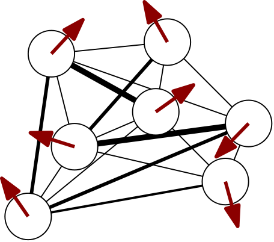
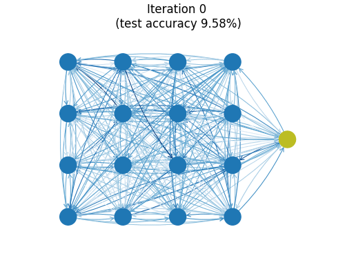
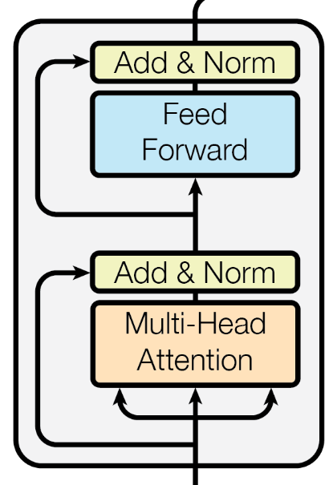

---

> **✨ Update (November 2021):** Consider reading [Transformers Are Secretly Collectives of Spin Systems](https://mcbal.github.io/post/transformers-are-secretly-collectives-of-spin-systems/) for a high-level overview of some of the ideas outlined in this post.


# Introduction

> **✨ Code: A reference PyTorch implementation of the ideas outlined in this blog post is available in the repository [`mcbal/deep-implicit-attention`](https://github.com/mcbal/deep-implicit-attention). Comments welcome.**

To explore progress beyond the cage of softmax attention, we have previously looked at energy-based perspectives on attention mechanisms:

- [An Energy-Based Perspective on Attention Mechanisms in Transformers](https://mcbal.github.io/post/an-energy-based-perspective-on-attention-mechanisms-in-transformers/)
- [Transformer Attention as an Implicit Mixture of Effective Energy-Based Models](https://mcbal.github.io/post/transformer-attention-as-an-implicit-mixture-of-effective-energy-based-models/)
- [Attention as Energy Minimization: Visualizing Energy Landscapes](https://mcbal.github.io/post/attention-as-energy-minimization-visualizing-energy-landscapes/)

The main take-away so far has been that you can think of softmax attention as implementing a single, big gradient step of some energy function and that training transformers is akin to meta-learning how to best tune a stack of attention and feed-forward modules to perform well on some auxiliary (meta-)task(s). But what can an energy-based perspective actually provide beyond quaint and hand-wavy statements like _implicit energy landscapes are sculpted every time you train a transformer_?

In this post, we approach attention in terms of the _collective response of a statistical-mechanical system_. Attention is interpreted as an inner-loop fixed-point optimization step which returns the approximate response of a system being probed by data. This response is a differentiable compromise between the system's internal dynamics and the data it's being exposed to. To better respond to incoming data, outer-loop optimization steps can nudge the interactions and the self-organizing behaviour of the system.

To implement our proposal, we combine old ideas and new technology to construct a family of attention mechanisms based on fixed points. We use [deep equilibrium models](https://arxiv.org/abs/1909.01377) to solve a set of self-consistent mean-field equations of a vector generalization of the random Ising spin-model. By approximating these equations, we arrive at simplified update steps which mirror the vanilla transformer architecture. We conclude by showing how transformers can be understood from a mean-field theory perspective.


# Mean-field theory for disordered systems

In physics, [mean-field theory](https://en.wikipedia.org/wiki/Mean-field_theory) is an approximation method to study models made up of many individual degrees of freedom that interact with each other. Mean-field theory approximates the effect of the environment on any given individual degree of freedom by a single, averaged effect, and thus reduces a many-body problem to an (effective) one-body problem. This is a drastic approximation. Whether mean-field theory a sensible thing to do depends on the problem and the properties of your variational ansatz.

> **Mean-field theory & variational methods:** From the point of view of variational methods, mean-field theory tries to approximate a complicated object (like a partition function of a statistical-mechanical system) by wiggling around the parameters of a tractable variational ansatz to get as close as possible to the real thing. You can picture this process as projecting down a complicated object living in a high-dimensional space to its shadow in an easier-to-handle subspace (_I can hear a mathematician fainting in the background_). This effectively reduces the problem to optimizing for the best possible approximation within your variational class. A lot of mean-field machinery also shows up in probability theory, statistics, and machine learning where it appears in belief propagation, approximate variational inference, expectation propagation, etc.

In the next two subsections, we introduce random Ising models and sketch a physics-inspired approach to deal with disordered models using mean-field theory. In [Section 3](#attention-as-a-fixed-point-method) we will then generalize these results to vector spin degrees of freedom and propose two flavours of attention models.

## Random Ising models (or Boltzmann machines or ...)

The random Ising model is a prototypical model in the study of spin glasses and disordered random systems, where it is often referred to as the [Sherrington–Kirkpatrick model](https://en.wikipedia.org/wiki/Spin_glass#The_model_of_Sherrington_and_Kirkpatrick), famous for its replica-method solution by Giorgio Parisi in 1979. Its energy function with external field for $N$ classical, binary spin variables looks like

\begin{equation}
  E = \sum_{i,j} J_{ij} S_{i} S_{j} + \sum_{i} x_{i} S_{i}, \label{eq:randomising}
\end{equation}

where the couplings $J_{ij}$ between degrees of freedom are randomly distributed according to some probability distribution and self-interactions are absent ($J_{ii} = 0$). The external magnetic fields $x_{i}$ provide a preferential direction of alignment at every local site. Since the elements in the coupling matrix can have both negative and positive signs, the system is said to have both frustrated ferro- as well as antiferromagnetic couplings. The model defined by \eqref{eq:randomising} is also known as a [Boltzmann machine](https://en.wikipedia.org/wiki/Boltzmann_machine) or a [Hopfield network](https://en.wikipedia.org/wiki/Hopfield_network).

In contrast with disordered systems, we expect the couplings in the context of artificial neural networks to no longer be randomly drawn from a distribution but to reflect structure and organization between spins after being exposed to data. The system should self-organize in order to better respond to incoming data.

A cartoon of a spin configuration of a 7-spin system looks something like

where we have only drawn the connections strongest in absolute value. It's helpful to think of classical spin degrees of freedom as arrows. For vector spins, we can imagine lifting the up/down restriction and letting the arrows rotate freely.


## Adaptive Thouless--Anderson--Palmer mean-field theory

One of the approaches physicists have come up with to tackle disordered random systems with pairwise interactions like those in Eq. \eqref{eq:randomising} is [Thouless--Anderson--Palmer (TAP) mean-field theory (1977)](https://doi.org/10.1080/14786437708235992). The TAP equations improve mean-field theory results by adding a so-called _Onsager self-correction term_ calculated from the couplings' distribution.

[Opper and Winther (2001)](https://link.aps.org/doi/10.1103/PhysRevE.64.056131) adapted this method to probabilisic modeling to be able to deal with scenarios where the distribution of the couplings between spins is not known a priori. To compensate for the lack of knowledge of the couplings distribution, they introduced a self-consistent computation to adapt the Onsager correction to the _actual_ couplings using the cavity method and linear response relations. We will sketch the adaptive TAP approach below but refer to [Opper and Winther (2001)](https://link.aps.org/doi/10.1103/PhysRevE.64.056131) and [Raymond, Manoel, and Opper (2014)](https://arxiv.org/abs/1409.6179) for more details and derivations.

### Single-site partition function from cavity method

The adaptive TAP equations can be derived using the cavity method, where a cavity field distribution is introduced to rewrite the marginal distributions of the spins. The cavity corresponds to the "hole" left by removing a single spin. By assuming a Gaussian cavity distribution in the large connectivity limit, one can show that the single-site partition function looks like

\begin{equation}
    Z_{0}^{(i)} = \int \mathrm{d} S \ \rho_{i}\left(S\right) \exp \left[ S \left( a_{i} + x_{i} \right) + \frac{V_{i} S^2}{2}  \right]
\end{equation}

where the $a_i$ denote _cavity means_ and the $V_i$ _cavity variances_. The single-site partition function can be integrated to yield an explicit expression after choosing well-behaved priors $\rho_{i}(S)$ for the spins. For binary spins $S=\pm 1$, we can pick $\rho_{i}(S)=\frac{1}{2}\left( \delta(S-1) + \delta(S+1) \right)$ to find

\begin{equation}
    Z_{0}^{(i)} = \cosh \left( a_{i} + x_{i} \right). \label{eq:partfunbinaryspins}
\end{equation}

### Cavity means and Onsager correction term
The cavity means can be shown to be given by
\begin{equation}
    a_{i} = \sum_{j} J_{ij} \langle S_{j} \rangle - V_{i} \langle S_{i} \rangle. \label{eq:cavitymean}
\end{equation}

where the last term is the _Onsager correction term_, a self-correction term for every spin which depends on the cavity variances.

### Cavity variances and linear response
The cavity variances are determined self-consistently, i.e. by calculating the same quantity in two different ways and demanding the obtained expressions to be equal. To do this, we introduce the matrix of susceptibilities

\begin{equation}
    \chi_{ij} = \langle S_{i} S_{j} \rangle - \langle S_{i} \rangle \langle S_{j} \rangle  = \frac{\partial^2}{\partial x_{i}\partial x_{j}} \log Z_{0}^{(i)} 
\end{equation}

> The susceptibility matrix $\chi_{ij}$ is a covariance matrix and should thus be positive semi-definite, which is criterion for the mean-field solution be consistent. As soon this property is lost, the fixed-point procedure will no longer be stable.

Its diagonal elements $\chi_{ii}$ can be obtained both from the explicit calculation of the spin variances from the partition function

\begin{equation}
    \chi_{ii} = \langle S_{i}^2 \rangle - \langle S_{i} \rangle^2 = \frac{\partial^2}{\partial x_{i}^2} \log Z_{0}^{(i)} \label{eq:chiii}
\end{equation}

but also from a linear response calculation assuming fixed $V_i$,

\begin{align}
\chi_{ij} = \frac{\partial \langle S_{i} \rangle}{\partial x_{j}} = \frac{\partial \langle S_{i} \rangle}{\partial x_{i}} \left( \delta_{ij} + \sum_{k} \left( J_{ik} - V_{k} \delta_{ik} \right) \chi_{kj} \right)  \label{eq:chiijlinrespexp}
\end{align}

which can be solved for $\chi_{ij}$ to yield
\begin{equation}
    \chi_{ij} =  \left[ \left( \boldsymbol{\Lambda} - \boldsymbol{J} \right)^{-1} \right]_{ij} \label{eq:chiijlinresp}
\end{equation}
where
\begin{align}
    \boldsymbol{\Lambda} = \mathrm{diag} \left( \Lambda_1, \ldots, \Lambda_{N} \right),\\\\
    \Lambda_i = V_i + \left( \frac{\partial \langle S_{i} \rangle}{\partial x_{i}} \right)^{-1}.
\end{align}

The cavity variances $V_i$ are then determined by equating \eqref{eq:chiii} to the diagonal elements of \eqref{eq:chiijlinresp} and solving the following consistency condition for $V_i$
\begin{equation}
    \frac{1}{\Lambda_i - V_i} =  \left[ \left( \boldsymbol{\Lambda} - \boldsymbol{J} \right)^{-1} \right]_{ii}.  \label{eq:viselfcons}
\end{equation}

Given updated values for the cavity means $a_i$ and the cavity variances $V_i$, spin means and spin variances can then be updated as follows:

\begin{align}
    \langle S_{i} \rangle &= \frac{\partial}{\partial x_{i}} \log Z_{0}^{(i)} (x_{i}, a_{i}, V_{i}),\\\\
    \langle S_{i}^2 \rangle - \langle S_{i} \rangle^2 &= \frac{\partial^2}{\partial x_{i}^2} \log Z_{0}^{(i)} (x_{i}, a_{i}, V_{i}),
\end{align}

These equations reduce to explicit expressions given an explicit expression for $Z_{0}^{(i)}$. For the binary-spin partition function \eqref{eq:partfunbinaryspins} where $S=\pm 1$, we get a set of fixed-point equations for the spin means that look like

\begin{equation}
    \langle S_{i} \rangle = \tanh \left( \sum_{j} J_{ij} \langle S_{j} \rangle - V_{i} \langle S_{i} \rangle + x_{i} \right)
\end{equation}

with spin variances $\chi_{ii} = 1 - \langle S_{i} \rangle^2$.

# Attention as a fixed-point method
In this section, we attempt to generalize the mean-field equations obtained in the previous section to random Ising-like models with vector spin degrees of freedom. We then recognize the physical system as an attention model and provide both a slow, explicit implementation and a faster, neural one.

## Generalizing spin models to vector degrees of freedom

Let's return to our Ising model cartoon and replace the scalar spin degrees of freedom $S_i$ at every site with vectors $\boldsymbol{S}_i \in \mathbb{R}^d$, which we visualize using arrows below



Let's consider a system of $N$ $d$-dimensional spins and let's label site indices with $i,j,\ldots$ and internal vector-space indices with Greek letters $\alpha,\beta,\ldots$. We let the coupling weight matrix become a tensor $\boldsymbol{J}_{ij} = J_{ij}^{\alpha\beta}$ (matrices coupling every pair of sites) and remove self-couplings by enforcing the couplings' block-diagonal to be zero. Additionally, we can symmetrize both the internal dimension and the sites to end up with $N(N-1)/2$ times $d(d+1)/2$ effective free parameters for the couplings. If we also turn the external fields into vectors, we obtain a vector generalization of Eq. \eqref{eq:randomising}:

\begin{equation}
  E = \sum_{i,j} \boldsymbol{S}_{i}^{T} \boldsymbol{J}_{ij} \boldsymbol{S}_{j} + \sum_{i} \boldsymbol{X}_{i} \cdot \boldsymbol{S}_{i}. \label{eq:vectrandomising}
\end{equation}


## Deep implicit attention: attention as a collective response

Remember that our goal is to understand attention as the collective response of a statistical-mechanical system. Let's now relate vector models like Eq. \eqref{eq:vectrandomising} to attention models by treating the external magnetic fields $\boldsymbol{X}_{i}$ as input data. Batches of sequences applied to every site act as probes for the system, pushing its behaviour into a certain direction. The system's mean-field average magnetizations $\langle \boldsymbol{S}_{i} \rangle$ are an approximation of the collective response at every site: what is the expected value of this particular vector spin? We interpret solving mean-field equations for $\langle \boldsymbol{S}_{i} \rangle$ in the presence of input injections $\boldsymbol{X}_{i}$ as an attention operation. If the whole system is differentiable, we can tune the couplings $\boldsymbol{J}_{ij}$ in an outer-loop optimization to steer the system's behaviour to better[^fn:better] respond to future incoming data.

## Slow and explicit: solving the adaptive TAP equations

What changes do we have to make to the adaptive TAP mean-field equations to turn them into a vector-based attention module and how can we implement them? Let's explicitly enumerate the objects introduced in [Section 2.2](#adaptive-thouless--anderson--palmer-mean-field-theory) together with their (generalized) tensor shapes:

- Iteratively determined fixed-point variables

    - Spin means $\langle \boldsymbol{S}_{i} \rangle = \left[ \langle \boldsymbol{S}_{i} \rangle \right]^{\alpha}$ `(batch_size, N, d)`
    - Cavity variances $\boldsymbol{V}_{i} = V_{i}^{\alpha\beta}$ `(N, d, d)`

- Other variables calculated during fixed-point iteration

    - Cavity means $\boldsymbol{a}_{i} = a_{i}^{\alpha}$ `(batch_size, N, d)`
    - Spin variances $\langle \boldsymbol{S}_{i}^2 \rangle - \langle \boldsymbol{S}_{i} \rangle^2 = \boldsymbol{\chi}_{ii} = \chi_{ii}^{\alpha\beta}$ `(N, d, d)`

For every site, the scalar spin and cavity variances have turned into $d \times d$ (inverse) covariance matrices on the level of the local dimension. Note that the "system properties" in the above list have no batch size: their values are identical across all examples and capture the properties of the system irrespective of the input injections $\boldsymbol{X}_i$.

The vector translation of the single-site partition function looks like

\begin{equation}
    Z_{0}^{(i)} = \int \mathrm{d}^{d} \boldsymbol{S} \  \rho_{i}\left(\boldsymbol{S}\right) \exp \left[ \boldsymbol{S} \cdot \left( \boldsymbol{a}_{i} + \boldsymbol{X}_{i} \right) + \frac{1}{2} \boldsymbol{S}^T  \boldsymbol{V}_{i} \boldsymbol{S} \right]
\end{equation}

where

\begin{equation}
    \boldsymbol{a}_{i} = \sum_{j} \boldsymbol{J}_{ij} \langle \boldsymbol{S}_{j} \rangle - \boldsymbol{V}_{i}\langle \boldsymbol{S}_{i} \rangle. \label{eq:veccavmeans}
\end{equation}

Spin means and variances are then computed from

\begin{equation}
    \langle \boldsymbol{S}_{i} \rangle = \frac{\partial}{\partial\boldsymbol{X}_{i}} \log Z_{0}^{(i)} (\boldsymbol{X}_{i}, \boldsymbol{a}_{i}, \boldsymbol{V}_{i})
\end{equation}

\begin{equation}
    \langle \boldsymbol{S}_{i}^2 \rangle - \langle \boldsymbol{S}_{i} \rangle^2 = \frac{\partial^2}{\partial\boldsymbol{X}_{i}^2} \log Z_{0}^{(i)} (\boldsymbol{X}_{i}, \boldsymbol{a}_{i}, \boldsymbol{V}_{i})
\end{equation}

As a spin prior $\rho_{i}\left(\boldsymbol{S}\right)$, we pick a simple diagonal multivariate Gaussian $\mathcal{N} \left( \boldsymbol{\mu} = \boldsymbol{0}_{d}, \boldsymbol{\Sigma}= \boldsymbol{1}_{d \times d} \right)$ at every site, leading to the explicit equations:

\begin{equation}
    \langle \boldsymbol{S}_{i} \rangle = \left( \boldsymbol{\Sigma}^{-1} - \boldsymbol{V}_{i} \right)^{-1} \left( \boldsymbol{a}_{i} + \boldsymbol{X}_{i} \right)
\end{equation}

\begin{equation}
    \langle \boldsymbol{S}_{i}^2 \rangle - \langle \boldsymbol{S}_{i} \rangle^2 = \left( \boldsymbol{\Sigma}^{-1} - \boldsymbol{V}_{i} \right)^{-1}
\end{equation}


### Generalizing the cavity variance calculation

The cavity variance computation can be done by generalizing Eqs. \eqref{eq:chiijlinrespexp}--\eqref{eq:chiijlinresp} and solving the following system of equations for $\boldsymbol{\chi}_{ij}$,

\begin{equation}
    \left( \delta_{ik} \otimes \boldsymbol{1}_{d} - \boldsymbol{\Sigma}_{i} \boldsymbol{J}_{ik} + \boldsymbol{\Sigma}_{i} \boldsymbol{V}_{i} \delta_{ik} \right)\boldsymbol{\chi}_{kj} = \boldsymbol{\Sigma}_{i} \delta_{ij}
\end{equation}

The generalization of the self-consistency condition Eq \eqref{eq:viselfcons} is then obtained by solving $\boldsymbol{\chi}_{ii} \boldsymbol{V}_{i} = \boldsymbol{\chi}_{ii} \boldsymbol{\Lambda}_{i} - \boldsymbol{1}_{N \times d \times d}$ for $\boldsymbol{V}_{i}$, where $ \boldsymbol{\Lambda}_{i} = \boldsymbol{V}_{i} + \boldsymbol{\Sigma}^{-1}$ is computed using the current values of $\boldsymbol{V}_{i}$. The price to pay for this added complexity is a computational cost of $O(N^3d^3)$ and an excruciatingly slow backward pass. The algorithm works, but it ain't pretty.

> **Implementation:** To avoid `torch.solve` crashing on singular matrices during the fixed-point calculation, we found it crucial for stability and learning behaviour to initialize the couplings $J_{ij}^{\alpha\beta} \sim \mathcal{N}(0, \sigma^2)$ with small values $\sigma^2 = 1 / (N*d^2)$ to ensure $|J| \sim \mathcal{O}(1)$. It's also beneficial if the sources satisfy $|\boldsymbol{X}_{i}| \sim \mathcal{O}(1)$ so that terms are balanced in the update step, all together adding up to $\mathcal{O}(1)$.

## Fast and neural: parametrizing the Onsager self-correction term

Can we somehow approximate the slow and explicit calculation of the cavity variances? Since $\boldsymbol{z}^{*} = \left( \langle \boldsymbol{S}_{i}^{*} \rangle, \boldsymbol{V}_{i}^{*} \right)$ at the fixed point, the Onsager self-correction term in Eq. \eqref{eq:veccavmeans} converges to a constant vector $\boldsymbol{V}_{i}^{*}\langle \boldsymbol{S}_{i}^{*} \rangle$ for every site. We propose to make a bold move by getting rid of the cavity variables altogether and reducing the equations for the fixed-point update step to

\begin{equation}
    \langle \boldsymbol{S}_{i} \rangle = \sum_{j} \boldsymbol{J}_{ij} \langle \boldsymbol{S}_{j} \rangle - f_{\theta} \left( \langle \boldsymbol{S}_{i} \rangle \right) + \boldsymbol{X}_{i}, \label{eq:diaupdate}
\end{equation}

where $f_{\theta}$ is a neural network parametrizing the action of the cavity variances on the spin means. Since the parameters $\theta$ stay fixed during the inner-loop fixed-point calculation, we have effectively lifted the optimization of the self-correction term to the outer-loop, which also optimizes the weights $\boldsymbol{J}_{ij}$.

All of this starts to look an awful lot like a transformer module. Before discussing an explicit comparison in [Section 4](#a-mean-field-theory-perspective-on-transformers), let's finish this section with a simple example model.

### Simple example: MNIST

A simple image classification model for MNIST using a convolutional feature extractor and a deep implicit attention layer could look something like

```python
class MNISTNet(nn.Module):
    def __init__(self, dim=10, dim_conv=32, num_spins=16):
        super(MNISTNet, self).__init__()

        self.to_patch_embedding = nn.Sequential(
            nn.Conv2d(1, dim_conv, kernel_size=3),  # -> 26 x 26
            nn.ReLU(),
            nn.MaxPool2d(3, stride=2),  # -> 12 x 12
            nn.Conv2d(dim_conv, dim_conv, kernel_size=3),  # -> 10 x 10
            nn.ReLU(),
            nn.MaxPool2d(3, stride=2),  # -> 4 x 4
            Rearrange(
                'b c h w -> b (h w) c'
            ),
            nn.Linear(dim_conv, dim)
        )
        self.cls_token = nn.Parameter(torch.randn(1, 1, dim))
        self.deq_atn = nn.Sequential(
            DEQFixedPoint(
                DEQMeanFieldAttention(
                    num_spins=num_spins+1,
                    dim=dim,
                    weight_sym_internal=True,
                    weight_sym_sites=False,
                    lin_response=True,
                ),
                anderson,
                solver_fwd_max_iter=40,
                solver_fwd_tol=1e-4,
                solver_bwd_max_iter=40,
                solver_bwd_tol=1e-4,
            ),
        )
        self.final = nn.Linear(dim, 10)

    def forward(self, x):
        x = self.to_patch_embedding(x)
        cls_tokens = self.cls_token.repeat(x.shape[0], 1, 1)
        x = torch.cat((cls_tokens, x), dim=1)
        x = self.deq_atn(x)
        return self.final(x[:, 0, :])
```

The ViT-style classification token is interpreted as an additional site in the system, which is probed with a learnable input injection that is shared across examples. The model uses the classification token's output response to do the final classification. The system has to self-organize its behaviour so that the classification token gets all the information it needs.



You can [train](https://github.com/mcbal/deep-implicit-attention/blob/549ef3c76ccd1a7b7df6af3eeebb540abb7f7f31/examples/mnist.py) this small model (26k parameters) on MNIST to find a test set accuracy hovering around 99.1%. The animation above shows a graph reflecting the (directed) connection strengths between spins during training as measured by the Frobenius norms of the matrices $\boldsymbol{J}_{ij}$. Almost all major organization of connections is seen to happen in the first few iterations. One imagines the model getting frustrated at zeros which _really_ look like nines and just flat-out refusing to remember edge cases out of spite.


# A mean-field theory perspective on transformers

Let's conclude this post by applying the mean-field theory perspective on attention to the transformer architecture. Schematically, a vanilla transformer module looks like



which consists of an attention module acting on all vectors in the sequence input followed by a feed-forward layer acting "locally" across individual vectors in the sequence, mixed with some residual connections and layer normalizations.

## Parametrizing the couplings: sparse graph structure from inputs

Transformers can be interpreted as fully-connected graph neural networks acting on sets of vectors. Inside an attention module, the row-stochastic attention matrix corresponds to a particular parametrization of the couplings

\begin{equation}
  J_{ij} = \left[\mathrm{softmax}\left( \frac{\boldsymbol{X} \boldsymbol{W}_{\boldsymbol{Q}} \boldsymbol{W}_{\boldsymbol{K}}^{T} \boldsymbol{X}^{T}}{\sqrt{d}} \right)\right]_{ij}. \label{eq:softmaxcouplings}
\end{equation}

which swaps storing explicit coupling weights for parameters of linear query-key transformations. By dynamically determining the connectivity of the sites based on the inputs $\boldsymbol{X}$ according to Eq. \eqref{eq:softmaxcouplings}, the coupling weights are no longer completely free parameters. The introduction of queries and keys can be seen as a neural network approach to "amortizing" the coupling tensor while the softmax temperature promotes sparsity. Multiple attention heads correspond to imposing a block-diagonal structure in the hidden dimensions of the couplings: the dot product gets cut into disjoint pieces, one for each attention head.

## Softmax attention does a single, naive mean-field update step

Looking at the update step \eqref{eq:diaupdate} and the softmax couplings \eqref{eq:softmaxcouplings}, we observe that the softmax attention module does a single, naive mean-field update step without a self-correction term. Ignoring layer normalizations, the attention update step for every input vector looks like

\begin{equation}
\boldsymbol{X}'_{i} = \sum_{j} \left[ \mathrm{softmax} \left( \frac{\boldsymbol{X} \boldsymbol{W}_{\boldsymbol{Q}} \boldsymbol{W}_{\boldsymbol{K}}^{T} \boldsymbol{X}^{T}}{\sqrt{d}} \right) \right]_{ij} \left[ \boldsymbol{X} \boldsymbol{W}_{\boldsymbol{V}} \right]_{j} + \boldsymbol{X}_{i}, \nonumber
\label{eq:vanilla-attention}
\end{equation}

where, crucially, the residual connection is responsible for adding the source term to the update step. Without a residual connection, the applied magnetic field is effectively turned off and the signal would only be able to propagate via the coupling term.

## Feed-forward layer corrects naive mean-field update

Looking at the Onsager self-correction term $f_{\theta} \left( \langle \boldsymbol{S}_{i} \rangle \right)$ in the update step \eqref{eq:diaupdate}, we observe that the full transformer attention module emerges when we substitute $\langle \boldsymbol{S}_{i} \rangle$ for its naive mean-field value, leading to

\begin{equation}
\mathrm{Attention}(\boldsymbol{X})_{i} = \boldsymbol{X}'_{i} + \mathrm{FeedForward}\left( \boldsymbol{X}'_{i} \right),
\end{equation}

with $\boldsymbol{X}'_{i}$ defined above. Again, the residual connection appears to be crucial for the structure of the mean-field theory equations to match the vanilla transformer module's architecture. As previously discussed in [Section 3.4](#fast-and-neural-parametrizing-the-onsager-self-correction-term), we hypothesize that feed-forward networks in transformer modules "amortize" the linear response self-corrections.

## Mean-field theory framework for transformer architectures
Within the general mean-field (or [approximate message-passing](https://arxiv.org/abs/2105.02180)) structure outlined above, there is considerable freedom in parametrizing the interaction and self-correction terms. Most transformer papers parametrize the self-correction terms with a feed-forward layer, i.e. some variation of an MLP. In [MLP-Mixer: An all-MLP Architecture for Vision](https://arxiv.org/abs/2105.01601) the authors went even further and dropped the softmax parametrization of the interaction term to approximate the full action of summing over couplings with an MLP as well. Related papers like [Pay Attention to MLPs](https://arxiv.org/abs/2105.08050), [ResMLP: Feedforward networks for image classification with data-efficient training](https://arxiv.org/abs/2105.03404), and [FNet: Mixing Tokens with Fourier Transforms](https://arxiv.org/abs/2105.03824) can all be considered as explorations of different parametrizations of the mean-field interaction terms. In the large-scale regime, it seems like the softmax attention module can be swapped for just about any function which mixes tokens as long as the structure of residual connections and self-correction terms is preserved.

## Comparison with energy-based perspective
In a previous post on [An Energy-Based Perspective on Attention Mechanisms in Transformers](https://mcbal.github.io/post/an-energy-based-perspective-on-attention-mechanisms-in-transformers/), we introduced a picture of attention modules in transformers as stacks of energy functions which are defined dynamically at every layer depending on the outputs of the previous layer (so ultimately on the inputs of the first layer). Looking back, this interpretation feels kind of forced and is also unable to explain the presence of skip connections and fully-connected layers surrounding the attention modules. The mean-field perspective seems more interesting since it (1) relies on just one layer (one energy function) whose fixed-point (an infinite amount of "layers") gets calculated, and (2) explains the presence of skip connections (source terms) and fully-connected layers (amortized self-correction terms).


# Conclusion and outlook

We have shown how attention can be understood as the mean-field response of Ising-like spin systems being probed by data. By thinking of incoming data as applied magnetic fields and the output of attention modules as spin expectation values, attention can be interpreted as a fixed-point optimization process solving for a compromise between a system's internal dynamics and the data it's being exposed to. Since the whole system is differentiable, we can optimize the interaction weights in an outer loop to nudge the system's behaviour.

We have also seen how transformers fit into the mean-field theory framework. For scalability, transformers introduce two additional constraints/approximations on top of the mean-field approximation: (1) replacing explicit couplings with parametrized couplings that are dynamically computed from the input via linear transformations (softmax query-key-value attention), and (2) replacing the expensive self-consistent computation of Onsager self-correction terms with a neural network (feed-forward layer).

Looking ahead, the methods introduced in this post could provide ways to implicitly train mean-field approximations of Boltzmann machines and have them serve as distributed attention modules in larger interconnected systems. To go beyond mean-field approaches, it could be interesting to look at tensor network approaches. Conceptually, the physical interpretation of attention as an interacting many-body system modulating its behaviour by _learning to respond to being driven in particular ways_ is fun to think about.


# Related work

A non-exhaustive list of references and inspiration includes:

- On deep equilibrium models: [Deep Equilibrium Models](https://arxiv.org/abs/1909.01377) (2019) by Shaojie Bai, Zico Kolter, Vladlen Koltun and [Chapter 4: Deep Equilibrium Models](https://implicit-layers-tutorial.org/deep_equilibrium_models/) of the [Deep Implicit Layers - Neural ODEs, Deep Equilibrium Models, and Beyond workshop (NeurIPS 2020)](http://implicit-layers-tutorial.org/) by Zico Kolter, David Duvenaud, and Matt Johnson
- On the adaptive Thouless-Anderson-Palmer (TAP) mean-field approach in disorder physics: [Adaptive and self-averaging Thouless-Anderson-Palmer mean-field theory for probabilistic modeling](https://link.aps.org/doi/10.1103/PhysRevE.64.056131) (2001) by Manfred Opper and Ole Winther
- On variational inference, iterative approximation algorithms, expectation propagation, mean-field methods and belief propagation: [Expectation Propagation](https://arxiv.org/abs/1409.6179) (2014) by Jack Raymond, Andre Manoel, Manfred Opper
- On Boltzmann machines and mean-field theory: [Efficient Learning in Boltzmann Machines Using Linear Response Theory](https://doi.org/10.1162/089976698300017386) (1998) by H. J. Kappen and
F. B. Rodríguez and [Mean-field theory of Boltzmann machine learning](https://link.aps.org/doi/10.1103/PhysRevE.58.2302) (1998) by Toshiyuki Tanaka
- On approximate message passing (AMP) methods in statistics: [A unifying tutorial on Approximate Message Passing](https://arxiv.org/abs/2105.02180) (2021) by Oliver Y. Feng, Ramji Venkataramanan, Cynthia Rush, Richard J. Samworth: the example on page 2 basically describes how transformers implement approximate message passing: an iterative algorithm with a "denoising" step (attention) followed by a "memory term" or Onsager correction term (feed-forward layer)

# References & footnotes

If you happen to find this work useful, please consider citing it as:

```
@article{bal2021deepimplicitattention,
  title   = {Deep Implicit Attention: A Mean-Field Theory Perspective on Attention Mechanisms},
  author  = {Bal, Matthias},
  year    = {2021},
  month   = {May},
  url     = {https://mcbal.github.io/post/deep-implicit-attention-a-mean-field-theory-perspective-on-attention-mechanisms/},
}
```

[^ref:aiayn]: _Ashish Vaswani, Noam Shazeer, Niki Parmar, Jakob Uszkoreit, Llion Jones, Aidan N. Gomez, Lukasz Kaiser, and Illia Polosukhin, [Attention Is All You Need](https://arxiv.org/abs/1706.03762) (2017)_

[^fn:tensornetworknotation]: This diagram to represent tensor contractions is an example of tensor network notation: contracted indices are connected while open indices correspond to indices which "survive" the contraction. Drawing tensor network diagrams (1) avoids writing annoying summations and keeping track of dummy indices and (2) provides a visual representation of equations that directly maps to `einsum` code.

[^fn:better]: Whatever "better" means depends on the system's (meta-)loss function, e.g. predicting corrupted tokens BERT-style or aligning representations to a teacher BYOL/DINO-style.