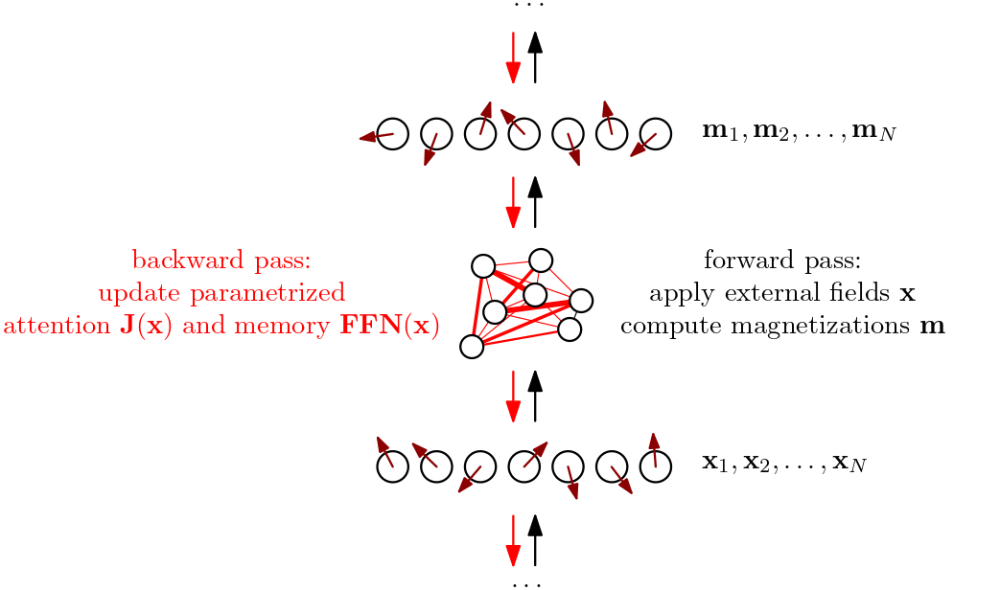

<a title="Walter Baxter / A murmuration of starlings at Gretna" href="https://commons.wikimedia.org/wiki/File:Starling_murmuration.jpg"></a>

---


## Introduction

> **This project is an open research work in progress.**

> **✨ GitHub repository: [`mcbal/neqnn`](https://github.com/mcbal/neqnn)**

Modern large-scale autoregressive language models are impressive system engineering artifacts. Yet they are frozen, with no apparent notion of dynamics unfolding over time. Surfacing in-context learning at inference time through prompt, harness, and environment engineering mitigates the fact that these models are temporal only in so far as information inside their context windows matches patterns observed during consecutive batched offline training stages. Time, and its dynamic memory affordances, is in a sense amortized or compressed away, incentivizing models to overrely on storing relevant patterns into parametric memory instead of sculpting latent low-dimensional shapes supporting stable dynamic computation. This has implications for online continual learning, adaptive model deployment, and real-time closed-loop interaction with live systems.

In this post, we take the notion of treating neural networks as non-equilibrium thermodynamic systems seriously. We design a physics-inspired transformer module with adaptable couplings and memory parameters based on the naive mean-field dynamics of a class of vector-spin models introduced in [Spin-Model Transformers (2023)](https://mcbal.github.io/post/spin-model-transformers/). The underlying mean-field spin-model interpretation enables us to write down an expression for [_entropy production_](https://en.wikipedia.org/wiki/Entropy_production#Entropy_production_in_stochastic_processes), a thermodynamic quantity measuring "instantaneous" irreversibility by quantifying the asymmetry between forward and backward time steps.

Since every operation in our spin-transformer module is differentiable, entropy production can be made into a loss function. For example, maximizing entropy production incentivizes the system to _lean into the external drive_ by nudging its parameters to dump entropy as fast as possible given constraints. Internally, we imagine the system reshaping itself into ordered structures to enable more efficient dissipation of the internal tension caused by the incoming data stream.


## Background and intuitions

We [yet again](https://byorgey.wordpress.com/2009/01/12/abstraction-intuition-and-the-monad-tutorial-fallacy/) consider transformer modules as differentiable driven disordered vector-spin systems whose mean-field collective behavior we can control through training, and refer to [previous posts](https://mcbal.github.io/#posts) going back to [Deep Implicit Attention: A Mean-Field Theory Perspective on Attention Mechanisms (2021)](https://mcbal.github.io/post/deep-implicit-attention-a-mean-field-theory-perspective-on-attention-mechanisms/) for earlier instantiations of this intuition. According to our correspondence, the forward pass of a transformer module implements a spin system's response to getting probed, where _inputs_ map to time-varying applied external fields, _asymmetric, sparse attention matrices_ can be identified with fully-connected spin-spin interactions, and _outputs_ map to spin expectation values or magnetizations. Practically, the forward pass of a spin-transformer module can be designed to mimic that of a vanilla transformer module.

In contrast to physics-oriented literature, we do not specify explicit probability distributions for the external fields and couplings of the disordered many-body system, nor are we interested in Nobel-prize-winning ways to average out the disorder. We instead focus on the very specific quenched disorder realizations induced by a dataset or environment of interest (encoded as sequences of vector embeddings), whose examples we use to drive the system. In this framing, training a transformer module corresponds to sculpting the underlying system's collective response by tuning the parametrized distributions of its external fields and couplings.



In [Spin-Model Transformers (2023)](https://mcbal.github.io/post/spin-model-transformers/), we observed that these systems tend to settle into non-equilibrium steady states as dynamic sweet spots where the "continuous kicking" of the inputs (applied external fields) "sustains" the outputs (magnetizations). This negotiation process tends to happen after just a few iterations. The first iteration already gives a decent guess, which might explain why (1) transformers can get away with just stacking modules whose forward passes take just one time step, and (2) why doing a few time steps can improve performance, as done in looping and recursive reasoning approaches. Indeed, repeating the same module can be seen as allowing the underlying non-equilibrium system to settle more snuggly into its steady state for that particular configuration of inputs and parameters. However, as soon as the input sequence changes, or the parameters change, the system has to renegotiate a different steady state compatible with what its new configuration dictates the response should be. 

...


## Non-equilibrium neural networks

When designing neural networks around mean-field vector-spin models, there is a lot of architectural freedom. First of all, we must decide on what mean-field approximation to use to approximate the time-dependent behavior of our vector-spin system. Projecting the dynamics to different ansatz distributions leads to different mean-field equations, which take into account more or less correlations at different time steps.

### Example model

Mindful of the importance of locality and scaling, we pick the simplest option: a first-order `Plefka[t-1,t]` approximation. From [Spin-Model Transformers (2023)](https://mcbal.github.io/post/spin-model-transformers/), we all remember

\begin{equation}
\mathbf{m}_{i,t} = \frac{\beta \left( \mathbf{x}_{i,t} + \sum_{j} J_{ij} \mathbf{m}_{j,t-1} \right)}{1+\sqrt{1+\beta^2 \lVert \mathbf{x}_{i,t} + \sum_{j} J_{ij} \mathbf{m}_{j,t-1} \rVert^2 / R^2 }},
\end{equation}

where $\mathbf{m}_{i,t} \in \mathbb{R}^{D}$ denote the magnetizations (outputs) at time $t$, $\mathbf{x}_{i,t} \in \mathbb{R}^{D}$ denote the applied external fields (inputs) at time $t$, $J_{ij}$ are the couplings, $\beta$ is an inverse temperature, and $R=\sqrt{D/2 -1}$ is a natural hyperspherical length scale resulting from the large-$D$ approximation we used to get rid of dealing with Bessel functions. The large-$D$ approximation should be fine since the embedding dimensions in modern neural networks are large.

If we now consider some kind of _parametrized input-dependent couplings_

\begin{equation}
  \mathbf{J} (\mathbf{x}) = \mathrm{softmax}\left( \mathbf{x} \boldsymbol{Q} \boldsymbol{K}^{T} \mathbf{x}^{T} \right), \label{eq:softmax}
\end{equation}

and augment the applied external fields with some kind of _parametrized input-dependent local drive or memory_,

\begin{equation}
  \mathbf{x}_{i,t} \to \mathbf{x}_{i,t} + \mathrm{FFN}\left( \mathbf{x}_{i,t} \right),
\end{equation}

then our forward pass looks like

\begin{equation}
  \mathbf{m}_{i,t} = \frac{\beta \left( \mathbf{x}_{i,t} + \mathrm{FFN}\left( \mathbf{x}_{i,t} \right) + \sum_{j} J_{ij} (\mathbf{x}_{t}) \mathbf{m}_{j,t-1} \right)}{1+\sqrt{1+\beta^2 \lVert \mathbf{x}_{i,t} + \mathrm{FFN}\left( \mathbf{x}_{i,t} \right) + \sum_{j} J_{ij} (\mathbf{x}_{t}) \mathbf{m}_{j,t-1} \rVert^2 / R^2 }},
\end{equation}

which resembles a parallel transformer block, with the notable difference that the "values" here correspond to the outputs (magnetizations) of the previous time step instead of some linear transformation applied to the inputs at the current time step.

Making the applied external fields as well as the couplings input-dependent leads to a _highly adaptive system_ where the interaction landscape itself is dynamically shaped by the inputs. Each vector spin effectively experiences a local mean-field that is the sum of a residual stream, a feed-forward-like drive, and attention-like couplings.

We can choose to have our module keep track of the previous state so that one forward pass corresponds to taking a single time step. If we care more about the steady state, we can also immediately compute the fixed point of the time evolution using a differentiable fixed-point solver, so that one forward pass corresponds to jumping to the time-evolution fixed point. The latter approach is reminiscent of deep equilibrium models and recent loopy recursive reasoning approaches, but arguably less _ad hoc_ in this case since we are solving self-consistent mean-field equations.


### Mean-field proxy for entropy production

Following [Aguilera et al. (2020)](https://arxiv.org/abs/2002.04309), the entropy production for the kinetic Ising model, assuming a non-equilibrium steady state, is given by

\begin{equation}
  \sigma_{t} = \sum_{ij} \left(J_{ij} - J_{ji}\right) D_{ij,t} \geq 0,
\end{equation}

where $J_{ij}$ corresponds to the couplings and $D_{ij,t}$ denotes the time-delayed correlations. If we write this down for the vector-spin case,

\begin{equation}
  D_{ij,t} = \int \mathrm{d} \mathbf{s}_{t} \int \mathrm{d} \mathbf{s}_{t-1} \; \left( \mathbf{s}_{i,t} - \mathbf{m}_{i,t} \right) \cdot \left( \mathbf{s}_{j,t-1} - \mathbf{m}_{j,t-1}\right) \; P( \mathbf{s}_{t}, \mathbf{s}_{t-1} ),
\end{equation}

we can compute a first-order `Plefka[t-1,t]` mean-field approximation for the time-delayed correlations, similar to the computations we did previously for the magnetizations in [Spin-Model Transformers (2023)](https://mcbal.github.io/post/spin-model-transformers/), leading to something like

\begin{align}
  D_{ij,t} = &\frac{\beta J_{ij}}{1+\gamma_{i,t}} \left(R^2 - \mathbf{m}_{j,t-1}^2 \right) \nonumber\\\\
  &- \frac{\beta J_{ij}}{R^2 \gamma_{i,t} \left( 1 + \gamma_{j,t-1} \right)} \mathbf{m}_{i,t}^2 \nonumber\\\\
  &+ \frac{\beta J_{ij}}{R^4 \gamma_{i,t} \gamma_{j,t-1}} \left( \mathbf{m}_{i,t} \cdot \mathbf{m}_{j,t-1} \right)^2,
\end{align}

where

\begin{align}
  \gamma_{i,t} &= \sqrt{1 + \beta^2 \lVert \boldsymbol{\theta}_{i,t} \rVert^2 / R^2 } \\\\
  \boldsymbol{\theta}_{i,t} &= \mathbf{x}_{i,t} + \sum_{j} J_{ij} \mathbf{m}_{j,t-1}.
\end{align}

The first-order time-delayed correlations $D_{ij,t}$ is a mean-field estimate of how much a fluctuation in one vector spin is transmitted one time step later into another spin. Or, put differently, when spin $j$ fluctuates away from its mean at the previous time step $t-1$, how much of that fluctuation shows up as a fluctuation of spin $i$ at the current time step $t$? The asymmetric part of the couplings says whether that propagation is directionally biased. The full sum rewards directed, temporally effective, embedding-aligned information flow.


### Vibe check

Let us try to get a feel for what the entropy production looks like for vector-spin models using some rough back-of-the-envelope estimations. Assume both vectors $\mathbf{m}_{i,t}$ and $\mathbf{m}_{j,t-1}$ have a norm $\mathcal{O}(R)$, then the time-delayed correlations behave approximately like

\begin{align}
  D_{ij,t} \sim J_{ij} \cos^2 \alpha_{(i,t)(j,t-1)},
\end{align}

where $\alpha_{(i,t)(j,t-1)}$ denotes the angle between the magnetization vectors. So the entropy production looks approximately like

\begin{equation}
  \sigma_{t} \sim \sum_{ij} \left(J_{ij}^2 - J_{ij} J_{ji}\right) \cos^2 \alpha_{(i,t)(j,t-1)},
\end{equation}

which, in general, is minimized for symmetric coupling matrices or orthogonal embeddings and maximized for fully-asymmetric couplings or (anti-)parallel embeddings.

But for the softmax attention matrix Eq. \eqref{eq:softmax}, we have additional constraints $J_{ij} \geq 0$ as well as a Frobenius norm of $\mathcal{O}(\sqrt{N})$ preventing unbounded growth under maximization. Additionally, imposing a causal mask on the couplings to do autoregressive modeling leads to even more constraints since then the upper triangular part of $J_{ij}$ is fixed to zero. So it feels like maximizing entropy production for causal softmax couplings promotes some kind of compromise between _sparse attention_ (intuitively, if the upper-triangular part is zero then it is favorable to push the lower-triangular elements close to zero as well) and _clustering of embeddings_ (weighted maximization of cosine similarity).

...

### Local-learning and sparse credit assignment rules

...
We define useful irreversible flow as directed state change that remains coupled to structured environmental feedback under stable closed-loop dynamics. A closed-loop agent cannot maximize useful irreversible flow for long unless its internal dynamics remain coupled to controllable structure in a sufficiently complex environment. If the agent's internal flow stops aligning the world, the consequences of actions become uninformative and unstable and the agent is trapped. But in a sufficiently rich action-observation loop, prediction-error reduction might emerge as a way to sustain high-quality useful local irreversible flows. A structured environment acts as a regularizer and determines which flows remain useful. Prediction might not be the objective, but building an internal model of the environment through prediction can keep local irreversible flows useful.


...


## Experiments

...

### Model behavior in a noisy environment

Cybernetics, interfaces, environments, sensors, controllers, and effectors.

...

### Global coherence from local backpropagation

We test a stack of spin-transformer modules in a toy femtoscale online learning setup and try to see if we can make [synchronization happen between the spin-transformer modules](https://en.wikipedia.org/wiki/Synchronization_(alternating_current)) when maximizing per-layer entropy-production losses _independently_. If we detach module outputs after applying each layer, we end up with systems communicating via their input/output interfaces but without gradients backpropagating through the whole stack. (Pretty unlikely that the entropy-production losses on their own provide enough signal though.)

...

### Growing network topologies

...

## Discussion and related work

...


## References

A non-exhaustive list of references and inspiration includes:

- [A unifying framework for mean-field theories of asymmetric kinetic Ising systems](https://arxiv.org/abs/2002.04309) by 
Miguel Aguilera, S. Amin Moosavi, and Hideaki Shimazaki
- [Self-organized fine-tuned response in a driven spin glass](https://dspace.mit.edu/handle/1721.1/130835?show=full) by Jacob Mitchell Gold
- [Bootstrapping Life-Inspired Machine Intelligence: The Biological Route from Chemistry to Cognition and Creativity](https://arxiv.org/abs/2602.08079) by Giovanni Pezzulo and Michael Levin


If you happen to find this work useful, please consider citing it as:

```
@article{bal2026,
  title   = {Entropy Production in Non-Equilibrium Neural Networks},
  author  = {Bal, Matthias},
  year    = {2026},
  month   = {?},
  url     = {https://mcbal.github.io/post/entropy-production-in-non-equilibrium-neural-networks/}
}
```
---

# Footnotes

