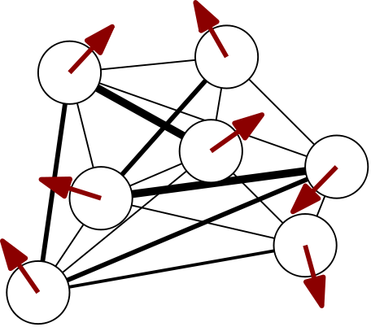

<a title="Walter Baxter / A murmuration of starlings at Gretna" href="https://commons.wikimedia.org/wiki/File:Starling_murmuration.jpg"></a>

---

# Introduction

> **✨ GitHub repository:  [`mcbal/neqnn`](https://github.com/mcbal/neqnn) (work in progress)**

Transformers are powerful driven dynamical systems, yet their internal computation is rarely discussed in terms of nonequilibrium thermodynamics. Building on the dynamical mean-field theory for vector-spin models introduced in [Spin-Model Transformers (2023)](https://mcbal.github.io/post/spin-model-transformers/), we design a minimal parallel transformer-like module whose forward pass implements a controllable quench-and-relax process.

We characterize its dynamical regimes to elucidate a design space of stateless and stateful variations of transformer-like and deep-equilibrium-like architectures and leverage its physics-based architecture to compute differentiable proxies for housekeeping entropy production and post-quench relaxation mismatch. Our framework provides both a scalable laboratory for nonequilibrium many-body dynamics on hardware accelerators and a testable learning hypothesis.

We explore whether a module-local combination of (1) maximizing a housekeeping entropy-production proxy, (2) predicting the next observation-conditioned steady state before the observation arrives, and (3) relaxing locally under the actual observation to correct the prediction and generate a rich teaching signal, can lead a system to acquire structure-sensitive, predictive dynamics without an externally supplied task loss or end-to-end credit assignment. Interestingly, the same neural network can be used as a teacher and as a predictor.

The risk is that the system finds local dissipative shortcuts: asymmetric attention collapse, self-exciting cycles, or coupling to noise. The bet is that, once trivial dissipative shortcuts are bounded or exhausted, latching onto persistent temporal structure while anticipating the next drive-conditioned response to relax to provides an informative local learning signal. We readily admit that the main motivation for this bet is aesthetic. To move beyond aesthetics, we run numerical experiments.


# Driving a spin-transformer module

In this section we design a minimal spin-transformer module whose forward pass implements a controllable nonequilibrium quench-and-relax process. We identify three timescales and two dynamical regimes, leading to a natural categorization of the design space into stateless and stateful variations of transformer-like and deep-equilibrium-like architectures.

## A minimal controllable drive-conditioned system

In [Spin-Model Transformers (2023)](https://mcbal.github.io/post/spin-model-transformers/) we showed how to apply dynamical mean-field theory to approximate the time-dependent behavior of asymmetric vector-spin models. We started from a spin system of $N$ vector spins $\mathbf{s}_{i,t} \in \mathbb{R}^{D}$ talking to each other via an $N \times N$ pairwise coupling matrix $J_{ij}$ with the underlying parallel-updates stochastic dynamics characterized by a discrete-time Markov chain transition probability $P(\mathbf{s}_{t} | \mathbf{s}_{t-1})$. External magnetic fields $\mathbf{x}_{i,t} \in \mathbb{R}^{D}$ bias the vector spins and act as local drives. We use the notation $\mathbf{x}_{t} = \{ \mathbf{x}_{i,t} \}^{N}_{i=1}$ to refer to the full-drive matrix instead of the local drive at a single position.



Using a simple first-order `Plefka[t-1,t]` mean-field approximation, we calculated a closed expression for updating the spin expectation values in the large-vector-dimension limit,

\begin{equation}
\mathbf{m}_{i,t} = \frac{\beta \left( \mathbf{x}_{i,t} + \sum_{j} J_{ij} \mathbf{m}_{j,t-1} \right)}{1+\sqrt{1+\beta^2 \lVert \mathbf{x}_{i,t} + \sum_{j} J_{ij} \mathbf{m}_{j,t-1} \rVert^2 / R^2 }},
\end{equation}

where the magnetization vectors $\mathbf{m}_{i,t} \in \mathbb{R}^{D}$ capture the mean-field influence of the spins on each other. Additionally, $\beta$ denotes the inverse temperature and $R=\sqrt{D/2 -1}$ is the natural hyperspherical length scale resulting from the large-vector-dimension approximation[^fn:largedlim].

If we now consider some kind of _parameterized drive-dependent couplings_

\begin{equation}
  \mathbf{J} (\mathbf{x}_{t}) = \mathrm{softmax}\left( \mathbf{x}_{t} \boldsymbol{W}_{Q} \boldsymbol{W}_{K}^{T} \mathbf{x}_{t}^{T} \right), \label{eq:softmax}
\end{equation}

then we turn the fixed-size $N \times N$ coupling matrix into a parameterized rule that supports variable system size, drive-dependent routing, and a way to scale system size without learning new explicit parameters[^fn:couplings]. If we also augment the local drives with some kind of _parameterized non-linear drive-dependent field_,

\begin{equation}
  \mathbf{x}_{i,t} \to \mathbf{x}_{i,t} + \mathbf{FFN}\left( \mathbf{x}_{i,t} \right),
\end{equation}

where $\mathbf{FFN}$ denotes a position-wise feed-forward network, then our earlier recurrence relation becomes

\begin{equation}
  \mathbf{m}_{i,t,k+1} = \frac{\beta \left( \mathbf{x}_{i,t} + \mathbf{FFN}\left( \mathbf{x}_{i,t} \right) + \sum_{j} J_{ij} (\mathbf{x}_{t}) \mathbf{m}_{j,t,k} \right)}{1+\sqrt{1+\beta^2 \lVert \mathbf{x}_{i,t} + \mathbf{FFN}\left( \mathbf{x}_{i,t} \right) + \sum_{j} J_{ij} (\mathbf{x}_{t}) \mathbf{m}_{j,t,k} \rVert^2 / R^2 }}, \label{eq:paralleltransformer}
\end{equation}

where we have pushed down the recurrence into an internal relaxation index $k$ as we reserve $t$ for changes in the external drive. By making the effective drive as well as the couplings depend on the drive $\mathbf{x}_{t}$, a sudden shift $\mathbf{x}_{t} \to \mathbf{x}_{t+1}$ changes both the local fields as well as the interactions and quenches the module into a new instantaneous dynamics[^fn:protocol]. During internal relaxation updates $k$, the drive $\mathbf{x}_{t}$ and the parameters $\boldsymbol{\theta} = \{ \mathbf{W}_{Q}, \mathbf{W}_{K}, \mathbf{FFN} \}$, and therefore the transition rule, are held fixed. (At the stochastic level, the process looks something like $P_{\boldsymbol{\theta}, \mathbf{x}_{t}}(\mathbf{s}_{t, k+1} | \mathbf{s}_{t, k})$.)

We end up with a _highly reconfigurable system_ that is _dynamically shaped by the drive_. Each vector spin effectively experiences a local mean-field that is the sum of a residual stream drive, a feed-forward-like drive, and attention-like couplings. Importantly, these terms are _parameterized_ and can be _shaped through training_: we can control how the system responds, fluctuates, and relaxes after getting quenched. Slow parameter updates then make this responsive system adaptive.


## Building modules: three clocks, slow plasticity, and two relaxation limits

Looking at Eq. \eqref{eq:paralleltransformer} we already notice its close resemblance to the forward pass of a [parallel transformer block](https://xn--rss.to/parallel-transformer-blocks.html). To make this more precise, we need to specify _how to implement_ spin-transformer modules in practice. What is up with this weird internal state and internal relaxation dimension? How can this system even serve as a neural network module?

Let us begin by writing the forward pass Eq. \eqref{eq:paralleltransformer} more generally as

\begin{equation}
  \mathbf{m}^{(l)}_{t, k+1} = F_{\boldsymbol{\theta}^{(l)}_{n}} \left( \mathbf{x}^{(l)}_{t}, \mathbf{m}^{(l)}_{t, k} \right)
\end{equation}

and clearly state the clocks involved:

- $k$ indexes fast internal relaxation within the module
- $t$ indexes changes in the environmental drive or input context
- $n$ indexes slow parameter updates $\boldsymbol{\theta}^{(l)}_{n+1} = \boldsymbol{\theta}^{(l)}_{n} + \eta \nabla_{\boldsymbol{\theta}^{(l)}} \mathcal{L}^{l}_{t}$ for some learning rate $\eta \ll 1$ and (potentially layer-dependent) loss function $\mathcal{L}^{l}_{t}$ where slow here actually means small parameter changes since the optimizer clock $n$ often tracks the drive clock $t$ in practice
- $l$ indexes network depth (number of stacked layers)

> A deep network is a stack of parameterized modules, which, in our framework, make up a collective of _different_ driven spin systems driving each other sequentially. The layer index does not (have to) correspond to external time nor to internal relaxation time; it is an additional axis labeling the simple feed-forward topology (depth) of the computational graph. For clarity, we drop it in the remainder of this section.

The three clocks define three characteristic rates: $\tau_{\mathrm{relax}}$, $\tau_{\mathrm{drive}}$, and $\tau_{\mathrm{learn}}$. Throughout, we assume slow plasticity $\tau_{\mathrm{drive}} \ll \tau_{\mathrm{learn}}$. The relative size of $\tau_{\mathrm{relax}}$ and $\tau_{\mathrm{drive}}$, or, equivalently, the number of internal updates allocated before the next quench, determines the computational regime.

We frame our module-design intuition around a _quench-and-relax scenario_: when the input drive switches, _i.e._ $\mathbf{x}_{t-1} \to \mathbf{x}_{t}$, the spin system has to adapt to the sudden change. A general post-quench module then looks like

\begin{equation}
  \mathbf{m}_{t, K} = F^{K}_{\boldsymbol{\theta}_{n}} \left( \mathbf{x}_{t}, \mathbf{m}_{t, 0} \right),
\end{equation}

with two independent design choices: the number of internal relaxation steps $K$ (relaxation horizon) and the choice of $\mathbf{m}_{t, 0}$ (initialization policy), leading to the following design space:

| | Reset or amortized initialization           | Carried initialization                        |
| -- | --------------------------------- | ----------------------------------------- |
| **Finite-step regime with $K < \infty$** | finite-depth, stateless, transformer-like module | recurrent stateful module |
| **Fixed-point regime where $K \to \infty$** | implicit or deep-equilibrium-like (DEQ) module   | identical if the fixed point is unique; path-dependent if mean-field branches coexist                   |

### Finite-step regime

In this regime, only $K < \infty$ internal updates are allocated before the next quench, which may reflect genuine competition between relaxation and drive timescales, or simply deliberate computational truncation as in recent looped and recursive-reasoning approaches. The intuition here is that the system tracks a moving family of instantaneous stationary marginals with potentially nonzero lag. In this regime, there can be no strong separation between drive and relaxation if approaching the steady state takes more than $K$ steps. But, since the module is controllable, the outer loop can nudge the system's parameters $\boldsymbol{\theta}_{n}$ towards more efficient and useful relaxation.

The initialization $\mathbf{m}_{t, 0} = \mathbf{m}_{t-1, K}$ makes the module architecture genuinely recurrent and stateful, but with a full context window of hidden states, situating it somewhere in between recurrent neural networks and transformers. Another option is to warm-start with a learned amortized initializer $\mathbf{m}_{t, 0} = \mathbf{x}_{t}\mathbf{W}_{V}$ for the post-quench relaxation, which estimates the drive-conditioned response to which the module should relax. If we call these initializations _values_, then, for $K=1$, the forward pass pretty much matches that of a parallel transformer block.

### Fixed-point regime

In this regime, $\tau_{\mathrm{relax}} \ll \tau_{\mathrm{drive}}$ so we consider $\mathbf{x}_{t}$ clamped and let $K \to \infty$ until the deterministic mean-field equations converge to fixed-point magnetizations $\mathbf{m}^{*}_{t}(\mathbf{x}_{t})$ compatible with the frozen drive $\mathbf{x}_{t}$. These values approximate the stationary marginals of an underlying instantaneous frozen-drive nonequilibrium steady state (NESS). The intuition here is that the clamped input fixes an instantaneous stochastic transition rule. Although its one-point marginals become stationary, asymmetric couplings can sustain probability currents and positive entropy production beneath those stationary marginals.

In case of a unique fixed point, the initial values $\mathbf{m}_{t, 0}$ are erased, and the module is stateless. But the deterministic mean-field equations may admit multiple stable fixed-point branches or basins. Warm-starting with $\mathbf{m}_{t, 0} = \mathbf{m}^{*}_{t-1}$ can then produce path-dependent branch selection and hysteresis behavior.

## On the connection to transformers

Let us step back for a bit and emphasize that this close resemblance between forward passes acts as a _plausibility bridge_ at this point. It is _not evidence_ that trained transformers literally implement the approximated nonequilibrium thermodynamics scenarios we will cover in the next sections. But the proximity in module architecture space of a minimal spin-transformer to a class of transformers known to scale does at least suggest that transformers may also admit module-level nonequilibrium interpretations.

> **A nonequilibrium picture of autoregressive inference from a quench-and-relax perspective:** a freshly generated token changes the context window and therefore quenches the stack of modules beginning at the bottom, the module relaxes and then drives the next module consecutively all the way to the top where the final magnetizations get mapped to a probability distribution to sample the next token from. The parameters of the stack of modules have been carefully optimized during successive stages of training to implement useful finite-step relaxation.

Even on their own, spin-transformer modules have merit since they turn transformer-like neural networks into computational laboratories for nonequilibrium dynamics that can be executed on modern accelerators at scale. This makes it possible to study large, high-dimensional systems with structured input-dependent couplings, nonstationary data streams, and slowly adapting parameters rather than staying close to analytically tractable toy models. The resulting observables remain mean-field approximations, and must be calibrated against exact stochastic systems at small scale. But once calibrated, the framework offers a route to computational experiments on collective adaptation and irreversible organisation in regimes that are otherwise difficult to access.

We end this section with a cheat sheet mapping concepts between spin-transformer modules and transformer modules.

| Spin-transformer module           | Transformer module                        |
| --------------------------------- | ----------------------------------------- |
| Local drives $\mathbf{x}_{i,t}$   | Input embeddings and latent embeddings    |
| "The drive" $\mathbf{x}_{t}$      | Current context window                    |
| Parameterized couplings $J_{ij}$  | Attention matrix                          |
| Magnetizations $\mathbf{m}_{i,t}$ | Latent embeddings and output embeddings   |


# Computing differentiable entropy-production proxies

We could stop here, pretrain a spin-transformer model using next-token prediction on chunks of text, and compare evaluation metrics to those of compute-matched vanilla transformers. But let us focus instead on what our framework enables that feels hard to come up with _without_ having access to a nonequilibrium spin-model perspective.

In this section, we show how the quench-and-relax process behind the forward pass of a spin-transformer module relates to notions of _irreversibility_. We add just[^fn:lit] enough physical context to introduce differentiable entropy production proxies that we can compute at the same mean-field level as the spin system.

## Two ways to be irreversible

During the quench-and-relax process we hold the input drive $\mathbf{x}_{t}$ fixed and let the spin system settle. Its average magnetizations $\mathbf{m}_{t}$ may stop changing, but its microscopic dynamics need not become reversible. Asymmetric couplings can sustain circulating probability currents when forward sequences of spin configurations remain more likely than their backward step reversals. We call this source of irreversibility _steady-state irreversibility_. Its entropy-production rate is the running cost of maintaining a nonequilibrium steady state under the current input drive. We can estimate this "housekeeping" entropy production from asymmetric couplings and delayed correlations,

\begin{equation}
  \sigma^{*}_{\mathrm{hk},t} = \beta \sum_{ij} \left(J_{ij}(\mathbf{x}_{t}) - J_{ji}(\mathbf{x}_{t})\right) D^{*}_{ij,t} , \label{eq:sigma_hk}
\end{equation}

where $D^{*}_{ij,t}$ denote the one-step delayed correlations evaluated under the stationary one-step joint law. Intuitively, this is like

\begin{equation}
  \sigma^{*}_{\mathrm{hk},t} = \sum_{ij} \left[\operatorname{directionality}\right]_{ij} \times \left[\operatorname{delayed\ flow}\right]_{ij,t}.
\end{equation}

The couplings provide a directional bias; the delayed correlations report whether fluctuations actually propagate along that direction. A fixed point of the magnetizations therefore does not imply equilibrium: it describes stationary averages, not the absence of microscopic currents.

Now we quench again! After changing the input drive abruptly, $\mathbf{x}_{t} \to \mathbf{x}_{t+1}$, the system is still distributed approximately according to its old steady state $\pi_{t}$, while the new transition rule $P_{\boldsymbol{\theta}, \mathbf{x}_{t+1}}(\mathbf{s}_{t+1, k+1} | \mathbf{s}_{t+1, k})$ induced by the new input drive actually favors another steady state $\pi_{t+1}$. The mismatch
\begin{equation}
M_{t+1, k} = D_{\mathrm{KL}}\left(p_{t+1,k} \lVert \pi_{t+1} \right),
\end{equation}
where $p_{t+1,0} = \pi_{t}$ for a fully relaxed carried-state quench, is a relaxation-irreversibility proxy measuring how far the old response lies from the response required by the new dynamics. The new housekeeping part remains after relaxation while $M_{t+1, k} \to 0$ as the actual distribution relaxes to the new stationary distribution.

> A driven spin-transformer module with asymmetric couplings can thus be irreversible in two ways: by **running a nonequilibrium steady state** and by **catching up after its input drive changes**.

## Mean-field proxy for housekeeping entropy production

To evaluate Eq. \eqref{eq:sigma_hk}, we need stationary one-step delayed correlations $D^{*}_{ij,t}$. To this end, let us first compute a first-order `Plefka[t-1,t]` mean-field approximation of the _transient_ one-step delayed correlations $D_{ij,t,k}$,

\begin{equation}
  D_{ij,t,k} = \mathbb{E}_{(\mathbf{s}, \mathbf{s}') \sim p_{t,k-1}(\mathbf{s}) P_{\boldsymbol{\theta}, \mathbf{x}_{t}}(\mathbf{s}' | \mathbf{s})} \left[ \left( \mathbf{s}'_{i} - \mathbf{m}_{i,t,k} \right) \cdot \left( \mathbf{s}_{j} - \mathbf{m}_{j,t,k-1}\right) \right] ,
\end{equation}

Evaluating this expression as we did for the magnetizations in [Spin-Model Transformers (2023)](https://mcbal.github.io/post/spin-model-transformers/), we end up with the mean-field approximation

\begin{align}
  D_{ij,t,k} \approx \beta J_{ij}(\mathbf{x}_{t}) \operatorname{Tr} \left( \Sigma_{i,t,k} \Sigma_{j,t,k-1} \right),
\end{align}

where $\Sigma_{i,t,k} = \operatorname{Cov} \left[ s_{i,t,k} \right]$ denotes the single-site covariance / susceptibility. The trace captures which directions on the vector-spin sphere are still available to fluctuate. If a spin is weakly magnetized, it has many soft directions. If it is strongly magnetized, many directions are suppressed because the spin is pinned close to its mean direction.

At stationarity, $p_{t,k-1} \to \pi_{t}$ and $\mathbf{m}_{i,t,k} \to \mathbf{m}^{*}_{i,t}$ so that

\begin{align}
  D^{*}_{ij,t} = \lim_{k\to\infty} D_{ij,t,k} = \mathbb{E}_{\mathbf{s} \sim \pi_{t}, \mathbf{s'} \sim P_{\boldsymbol{\theta}, \mathbf{x}_{t}}(\cdot | \mathbf{s})} \left[ \left( \mathbf{s'}_{i} - \mathbf{m}^{*}_{i,t} \right) \cdot \left( \mathbf{s}_{j} - \mathbf{m}^{*}_{j,t}\right) \right]
\end{align}

and the mean-field approximation becomes

\begin{align}
  D^{*}_{ij,t} \approx \beta J_{ij}(\mathbf{x}_{t}) \operatorname{Tr} \left( \Sigma^{*}_{i,t} \Sigma^{*}_{j,t} \right),
\end{align}

Substituting the large-$D$ approximation from [Spin-Model Transformers (2023)](https://mcbal.github.io/post/spin-model-transformers/),

\begin{align}
  \Sigma_{i,t} \approx \frac{\mathbf{1}_{D}}{1+\gamma_{i,t}} - \frac{\mathbf{m}_{i,t} \mathbf{m}_{i,t}^{T}}{R^2 \gamma_{i,t}},
\end{align}

we end up with the explicit expression

\begin{align}
  D^{*}_{ij,t} = &\frac{\beta J_{ij}(\mathbf{x}_{t}) D}{(1+\gamma^{*}_{i,t})(1+\gamma^{*}_{j,t})} \nonumber\\
  &- \frac{\beta J_{ij}(\mathbf{x}_{t})}{R^2 \gamma^{*}_{j,t} \left( 1 + \gamma^{*}_{i,t} \right)} \lVert \mathbf{m}^{*}_{j,t} \rVert^2 \nonumber\\
  &- \frac{\beta J_{ij}(\mathbf{x}_{t})}{R^2 \gamma^{*}_{i,t} \left( 1 + \gamma^{*}_{j,t} \right)} \lVert \mathbf{m}^{*}_{i,t} \rVert^2 \nonumber\\
  &+ \frac{\beta J_{ij}(\mathbf{x}_{t})}{R^4 \gamma^{*}_{i,t} \gamma^{*}_{j,t}} \left( \mathbf{m}^{*}_{i,t} \cdot \mathbf{m}^{*}_{j,t} \right)^2,
\end{align}

where

\begin{align}
  \gamma^{*}_{i,t} &= \sqrt{1 + \beta^2 \lVert \mathbf{h}^{*}_{i,t} \rVert^2 / R^2 },\\
  \mathbf{h}^{*}_{i,t} &= \mathbf{x}_{i,t} + \mathbf{FFN}\left( \mathbf{x}_{i,t} \right) + \sum_{l} J_{ij} (\mathbf{x}_{t}) \mathbf{m}^{*}_{l,t}.
\end{align}

...

## Mean-field proxy for nonadiabatic entropy production

Apply von Mises-Fisher KL divergence expressions...


# A local self-supervised learning rule

In this section, we show how the quench-and-relax picture also point to a local self-supervised learning rule. Instead of adding a separate prediction network, we use the same relaxation dynamics of the spin-transformer module forward pass both to anticipate the next response and to incorporate the next observation. Prediction and then correcting-the-prediction are two runs of the same spin dynamics under different clamping patterns, only the source and timing of the drives change.


## A module-local prediction-and-relaxation protocol

Assume that the module has relaxed under the current drive \(\mathbf{x}_t\), producing fixed-point magnetizations

\begin{equation}\mathbf{m}^{*}_{t}=\lim_{K\rightarrow\infty}F^{K}_{\boldsymbol{\theta}_{n}}\left(\mathbf{x}_{t},\mathbf{m}_{t,0}\right).\end{equation}

Before the next observation is available, we construct a predictive drive

\begin{equation}\mathbf{x}^{-}_{t+1\mid t},\end{equation}

containing only information available at time \(t\). For a rolling context window, this could be the shifted current context with the not-yet-observed positions masked, nulled, or left unclamped. In a closed-loop setting, it may additionally contain the action applied at time \(t\). Constructing this drive is an interface protocol, not a separate learned predictor.

Starting from the current response \(\mathbf{m}^{*}_{t}\), we apply the same module dynamics for a finite prediction horizon \(K_{\mathrm{pred}}\):

\begin{equation}\mathbf{m}^{-}_{t+1}=F^{K_{\mathrm{pred}}}_{\boldsymbol{\theta}_{n}}\left(\mathbf{x}^{-}_{t+1\mid t},\mathbf{m}^{*}_{t}\right).\end{equation}

The superscript \({-}\) indicates that this state is computed before observing the new drive \(\mathbf{x}_{t+1}\). It is the response that the existing spin dynamics predict from the information available at time \(t\).

When the next observation arrives, it supplies the actual drive \(\mathbf{x}_{t+1}\) and quenches the system again. Starting from the predictive state, the module relaxes according to

\begin{align}\mathbf{m}^{+}_{t+1,k+1}&=F_{\boldsymbol{\theta}_{n}}\left(\mathbf{x}_{t+1},\mathbf{m}^{+}_{t+1,k}\right),\\\mathbf{m}^{+}_{t+1,0}&=\mathbf{m}^{-}_{t+1},\end{align}

until it reaches

\begin{equation}\mathbf{m}^{*}_{t+1}=\lim_{K\rightarrow\infty}F^{K}_{\boldsymbol{\theta}_{n}}\left(\mathbf{x}_{t+1},\mathbf{m}^{-}_{t+1}\right).\end{equation}

The same parameterized couplings, feed-forward field, and mean-field response function are therefore used in both phases. Prediction and correction differ only in the drive presented to the system and in the number of internal relaxation steps allocated.

At the stochastic level, let \(\widehat{p}_{t+1\mid t}\) denote the distribution represented by the predictive state \(\mathbf{m}^{-}_{t+1}\), and let \(\pi_{t+1}\) denote the instantaneous stationary distribution selected after the actual drive \(\mathbf{x}_{t+1}\) is applied. A natural predictive mismatch is then

\begin{equation}M^{-}_{t+1}=D_{\mathrm{KL}}\left(\widehat{p}_{t+1\mid t}\,\middle\|\,\pi_{t+1}\right).\end{equation}

This is the same kind of mismatch used to characterize post-quench relaxation, except that the initial distribution is no longer simply the previous steady state \(\pi_t\). It is now a learned prediction generated by the module's own finite-step dynamics:

\begin{equation}p_{t+1,0}=\widehat{p}_{t+1\mid t}\qquad\text{rather than}\qquad p_{t+1,0}=\pi_t.\end{equation}

At the mean-field level, the corresponding local learning objective can be approximated using the single-site von Mises--Fisher marginals associated with the predictive and corrected magnetizations:

\begin{equation}\mathcal{L}^{\mathrm{pred}}_{t}=\sum_iD_{\mathrm{KL}}\left[q_i\left(\mathbf{s}_i;\mathbf{m}^{-}_{i,t+1}\right)\,\middle\|\,\operatorname{sg}q_i\left(\mathbf{s}_i;\mathbf{m}^{*}_{i,t+1}\right)\right].\end{equation}

Here, \(\operatorname{sg}\) denotes stop-gradient. The fixed-point response under the newly observed drive acts as a self-supervised target, while gradients are applied only through the finite-step prediction computed before that drive was available.

Because the mean-field approximation factorizes over sites, the objective supplies a local teaching signal for every spin position or module:

\begin{equation}\mathcal{L}^{\mathrm{pred}}_{i,t}=D_{\mathrm{KL}}\left[q_i\left(\mathbf{s}_i;\mathbf{m}^{-}_{i,t+1}\right)\,\middle\|\,\operatorname{sg}q_i\left(\mathbf{s}_i;\mathbf{m}^{*}_{i,t+1}\right)\right].\end{equation}

The target is local in module index and in external time: a module is trained using its own corrected response at the next drive step, without propagating gradients through a long sequence of earlier drive changes. Nevertheless, the corrected target may contain the result of globally coupled relaxation through the other spin positions.

The resulting protocol is

\begin{align}\text{current response:}\qquad\mathbf{m}^{*}_{t}&=\operatorname{sg} \left( \operatorname{FP}_{\boldsymbol{\theta}_{n}}\left(\mathbf{x}_{t},\mathbf{m}_{t,0}\right)\right),\\[1mm]\text{finite-step prediction:}\qquad\mathbf{m}^{-}_{t+1}&=F^{K_{\mathrm{pred}}}_{\boldsymbol{\theta}_{n}}\left(\mathbf{x}^{-}_{t+1\mid t},\mathbf{m}^{*}_{t}\right),\\[1mm]\text{observation-conditioned correction:}\qquad\mathbf{m}^{*}_{t+1}&=\operatorname{sg}\left(\operatorname{FP}_{\boldsymbol{\theta}_{n}}\left(\mathbf{x}_{t+1},\mathbf{m}^{-}_{t+1}\right)\right),\\[1mm]\text{local learning:}\qquad\mathcal{L}^{\mathrm{pred}}_{t}&=\sum_iD_{\mathrm{KL}}\left[q_i\left(\mathbf{m}^{-}_{i,t+1}\right)\,\middle\|\,\operatorname{sg}q_i\left(\mathbf{m}^{*}_{i,t+1}\right)\right].\end{align}

The outer optimizer then updates the parameters on the slow clock,

\begin{equation}\boldsymbol{\theta}_{n+1}=\boldsymbol{\theta}_{n}-\eta\nabla_{\boldsymbol{\theta}_{n}}\mathcal{L}^{\mathrm{pred}}_{t}.\end{equation}

This objective does more than train the module to reach its own same-drive fixed point quickly. The predictive state is computed before \(\mathbf{x}_{t+1}\) is known, while the target is generated after the environment supplies genuinely new information. The module is therefore trained to use its existing state and dynamics to anticipate the effect of the next drive.

There is one important design constraint. If the prediction phase holds the drive fixed at \(\mathbf{x}_t\), then

\begin{equation}F_{\boldsymbol{\theta}_{n}}\left(\mathbf{x}_{t},\mathbf{m}^{*}_{t}\right)=\mathbf{m}^{*}_{t},\end{equation}

and the system cannot evolve because it is already at a fixed point. Prediction therefore requires releasing, masking, shifting, or otherwise changing some part of the drive before \(\mathbf{x}_{t+1}\) arrives. This change is not an additional neural network; it specifies which environmental variables are clamped and which variables the spin system is being asked to predict.

The prediction phase should generally remain finite-step rather than itself being taken to a fixed point. Finite-step evolution retains information about the carried state and gives the external clock a computational role. By contrast, relaxing to a unique prediction-phase fixed point could erase temporal information and reduce the predictor to a stationary input-conditioned response.


## A collective prediction-and-relaxation protocol

A module's boundary is its gradient boundary.


# Numerical experiments

## Mean-field proxy fidelity

## Structure-sensitive learned irreversibility

## Closed-loop adaptive behavior


# Conclusion and outlook

...

# Acknowledgements

We acknowledge interesting back-and-forth discussions with Claude Opus 4.8, GPT 5.5, and GPT 5.6. Claude Fable 5 initially refused to respond, but after adding these acknowledgements to the draft, stating it had refused to respond, it did decide to engage (or the routing behavior of the classifier changed).


# References

A non-exhaustive list of references and inspiration includes:

- [A unifying framework for mean-field theories of asymmetric kinetic Ising systems](https://arxiv.org/abs/2002.04309) by 
Miguel Aguilera, S. Amin Moosavi, and Hideaki Shimazaki
- [The thermodynamics of prediction](https://arxiv.org/abs/1203.3271) by Susanne Still, David A. Sivak, Anthony J. Bell, and Gavin E. Crooks
- [Three detailed fluctuation theorems](https://arxiv.org/abs/0911.2666v2) by Massimiliano Esposito and Christian Van den Broeck
- [Self-organized fine-tuned response in a driven spin glass](https://dspace.mit.edu/handle/1721.1/130835?show=full) by Jacob Mitchell Gold

If you happen to find this work useful, please consider citing it as:

```
@article{bal2026,
  title   = {Entropy Production in Nonequilibrium Neural Networks},
  author  = {Bal, Matthias},
  year    = {2026},
  month   = {?},
  url     = {https://mcbal.github.io/post/entropy-production-in-nonequilibrium-neural-networks/}
}
```

---

# Footnotes

[^fn:largedlim]: The large-$D$ approximation gets rid of dealing with the modified Bessel functions originating from the [von Mises-Fisher distribution](https://en.wikipedia.org/wiki/Von_Mises%E2%80%93Fisher_distribution) used in the ansatz for the decoupled mean magnetizations. It is mainly motivated by the empirical fact that the embedding dimensions in modern neural networks _are_ large. See [Spin-Model Transformers (2023)](https://mcbal.github.io/post/spin-model-transformers/#magnetizations-and-limit-of-large-vector-dimension) for full details.

[^fn:couplings]: Softmax attention is a convenient choice for a bounded positive row-stochastic coupling rule. Other possible choices include additive or multiplicative combinations with slower base coupling parameters $\mathbf{J}^{0}$ that are drive-independent, leading to a system with persistent interactions in the absence of a drive.

[^fn:protocol]: In this case, it is more accurate to call the drive $\mathbf{x}_{t}$ an external protocol parameter configuring the instantaneous dynamics.

[^fn:lit]: We deliberately focus on our quench-and-relax use case because the nonequilibrium thermodynamics literature is, frankly, quite confusing at times and a terminological minefield.