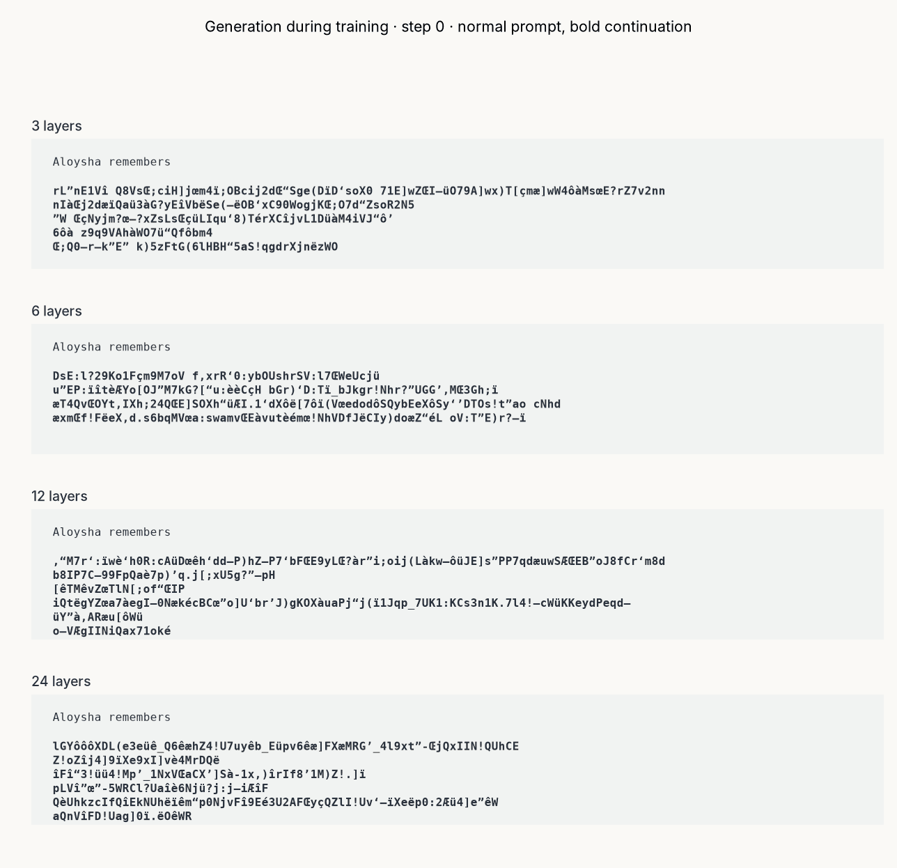

<a title="Walter Baxter / A murmuration of starlings at Gretna" href="https://commons.wikimedia.org/wiki/File:Starling_murmuration.jpg"></a>

---

# Introduction

> **✨ GitHub repository:  [`mcbal/neqnn`](https://github.com/mcbal/neqnn)**

Transformers are powerful driven dynamical systems, yet their internal computation is not often discussed in terms of nonequilibrium thermodynamics. Building on the dynamical mean-field theory framework developed for vector-spin models in [Spin-Model Transformers (2023)](https://mcbal.github.io/post/spin-model-transformers/), we design a minimal parallel transformer-like module whose forward pass performs one or more mean-field update steps following a drive quench, separating out the processes of fast state relaxation, changing external drive, and slow parameter learning. We characterize the module's quench-and-relax regimes to map out a design space of stateless and stateful variations of transformer-like and deep-equilibrium-like architectures.

Leveraging the spin-model interpretation, we compute differentiable proxies for housekeeping entropy production and post-quench relaxation mismatch at the same mean-field level as the spin-model dynamics. A spin-model transformer module thus acts as a nonequilibrium laboratory where mean-field dynamics, irreversibility diagnostics, and candidate (online) local learning protocols can be explored simultaneously. Modules patched together into models enable complex, time-dependent collective computation where the outputs (magnetizations) of one module serve as boundary conditions (drives) for another. We run numerical experiments to (1) validate the mean-field approximation, (2) train a toy autoregressive language model, and (3) explore a family of recurrent stateful architectures suggested by the framework.


# Driving a spin-model transformer module

In this section we design a minimal spin-model transformer module whose forward pass implements a controllable nonequilibrium quench-and-relax process. We identify three timescales and two dynamical regimes, leading to a natural categorization of the design space into stateless and stateful variations of transformer-like and deep-equilibrium-like architectures.

## A minimal controllable drive-conditioned system

> In [Spin-Model Transformers (2023)](https://mcbal.github.io/post/spin-model-transformers/) we showed how to apply dynamical mean-field theory to approximate the time-dependent behavior of asymmetric vector-spin models. We started from a spin system of $N$ vector spins $\mathbf{s}_{i,t} \in \mathbb{R}^{D}$ talking to each other via an $N \times N$ pairwise coupling matrix $J_{ij}$ with the underlying synchronous parallel-updates stochastic dynamics characterized by a discrete-time Markov chain transition probability. External magnetic fields $\mathbf{x}_{i,t} \in \mathbb{R}^{D}$ bias the vector spins and act as local drives. We use the notation $\mathbf{A} \in \mathbb{R}^{N \times D}$ to refer to matrices of stacked vectors $\mathbf{a}_{i} \in \mathbb{R}^{D}$.


Our vector-spin system of interest is defined by a first-order `Plefka[t-1,t]`[^fn:plefka] mean-field recurrence relation for its spin expectation values, or magnetizations

\begin{equation}
  \mathbf{m}_{i,t,k+1} = \varphi_{\beta} \left( \mathbf{h}_{i,t,k} \right) = \frac{\beta \mathbf{h}_{i,t,k}}{1+\sqrt{1+\beta^2 \lVert \mathbf{h}_{i,t,k} \rVert^2 / R^2 }}, \label{eq:paralleltransformer}
\end{equation}

where $\beta$ denotes the inverse temperature and $R^2=D/2 -1$ is a length scale choice in the large-$D$ approximation[^fn:largedlim]. The effective field

\begin{equation}
\mathbf{h}_{i,t,k} = \mathbf{x}_{i,t} + f_{\boldsymbol{\theta}_{\mathrm{FFN}}}\left( \mathbf{x}_{i,t} \right) + \sum_{j} J_{ij} (\mathbf{X}_{t}) \mathbf{m}_{j,t,k}
\end{equation}

contains a _parameterized drive-dependent coupling rule_[^fn:couplings]

\begin{equation}
  \mathbf{J} (\mathbf{X}_{t}) = \mathrm{softmax}\left( \mathbf{X}_{t} \boldsymbol{W}_{Q} \boldsymbol{W}_{K}^{T} \mathbf{X}_{t}^{T} \right), \label{eq:softmax}
\end{equation}

and a _parameterized position-wise non-linear drive-dependent field_ $f_{\boldsymbol{\theta}_{\mathrm{FFN}}}\left( \mathbf{x}_{i,t} \right)$ added to the local drive $\mathbf{x}_{i,t}$. Each vector spin effectively experiences a local mean-field that is the sum of a residual stream drive, a feed-forward-like drive, and attention-like couplings. The time index $t$ tracks changes in the external drive while $k$ indexes an internal relaxation step.

By making the effective drive as well as the couplings depend on the drive $\mathbf{X}_{t}$, a sudden shift $\mathbf{X}_{t} \to \mathbf{X}_{t+1}$ changes both the local fields as well as the interactions and quenches the system into a new instantaneous dynamics[^fn:protocol]. During internal relaxation iterations, the drive $\mathbf{X}_{t}$ and the parameters $\boldsymbol{\theta} = \{ \mathbf{W}_{Q}, \mathbf{W}_{K}, \boldsymbol{\theta}_{\mathrm{FFN}} \}$ are held fixed.

> **Approximation stack:** At the stochastic level, the process looks something like $P_{\boldsymbol{\theta}, \mathbf{X}_{t}}(\mathbf{S}_{t, k+1} | \mathbf{S}_{t, k}) = \prod^{N}_{i=1} \frac{\operatorname{exp}\left[\beta \mathbf{s}_{i,t,k+1} \cdot \mathbf{h}_{i,t,k} \right]}{Z\left(\mathbf{h}_{i,t,k}\right)}$ with effective field $\mathbf{h}_{i,t,k} = \mathbf{x}_{i,t} + f_{\boldsymbol{\theta}_{\mathrm{FFN}}}\left( \mathbf{x}_{i,t} \right) + \sum_{j} J_{ij} (\mathbf{X}_{t}) \mathbf{s}_{j,t,k}$ and single-site normalization constant $Z\left(\mathbf{h}\right)$. The product-form kernel assumes parallel, conditionally independent site updates. An asynchronous spin process would need a different kernel and should not be conflated with this one. The stochastic process is the thermodynamic object, and the magnetization recurrence used as the neural-network module is a Plefka mean-field approximation to its one-point dynamics. In the next sections, we will, among other quantities, discuss deterministic mean-field fixed-point magnetizations $\mathbf{M}^{\star}_{t}(\mathbf{X}_{t})$ which approximate one-point marginals of the stochastic steady state $\pi_{\mathbf{X_{t}}}$. It is useful to keep these levels of approximation in the back of your mind.

We end up with a _highly reconfigurable system_ that is _dynamically shaped by the drive_. These drive dependencies enable the mean-field system to encode subtle correlational structures. The system's _parameters_ can be _shaped through training_ in an outer optimization loop to make an already responsive system adaptive by controlling how the system responds, fluctuates, and relaxes after a quench.


## Building modules: three clocks, slow plasticity, and two relaxation limits

Looking at Eq. \eqref{eq:paralleltransformer} we notice its close resemblance to the forward pass of a [parallel transformer block](https://xn--rss.to/parallel-transformer-blocks.html). To make this more precise, we need to specify _how to implement_ spin-model transformer modules in practice. What is up with this weird internal state and internal relaxation dimension? How can this system even serve as a neural network module?

Let us begin by writing the forward pass Eq. \eqref{eq:paralleltransformer} more generally as

\begin{equation}
  \mathbf{M}^{(\ell)}_{t, k+1} = F_{\boldsymbol{\theta}^{(\ell)}_{n}} \left( \mathbf{X}^{(\ell)}_{t}, \mathbf{M}^{(\ell)}_{t, k} \right)
\end{equation}

and clearly state the clocks involved:

- $k$ indexes fast internal relaxation within the module
- $t$ indexes changes in the environmental drive or input context
- $n$ indexes slow parameter updates $\boldsymbol{\theta}^{(\ell)}_{n+1} = \boldsymbol{\theta}^{(\ell)}_{n} - \eta \nabla_{\boldsymbol{\theta}^{(\ell)}} \mathcal{L}^{\ell}_{t}$ for some learning rate $\eta \ll 1$ and (potentially layer-dependent) loss function $\mathcal{L}^{\ell}_{t}$ where slow here actually means small parameter changes since the optimizer clock $n$ often tracks the drive clock $t$ in practice

The layer index $\ell$ indexes network depth (number of stacked layers), which, in our framework, identifies members of a collective of _different_ driven spin systems driving each other. The layer index does not (have to) correspond to external time nor to internal relaxation time; it is an additional axis labeling the simple feed-forward topology (depth) of the computational graph. For clarity, we drop it in the remainder of this section.

The three clocks define three characteristic timescales: $\tau_{\mathrm{relax}}$, $\tau_{\mathrm{drive}}$, and $\tau_{\mathrm{learn}}$. Throughout, we assume slow plasticity $\tau_{\mathrm{drive}} \ll \tau_{\mathrm{learn}}$. The relative size of $\tau_{\mathrm{relax}}$ and $\tau_{\mathrm{drive}}$, or, equivalently, the number of internal updates allocated before the next quench, determines the computational regime.

We frame our module-design intuition around a _quench-and-relax scenario_: when the input drive switches, _i.e._, $\mathbf{X}_{t-1} \to \mathbf{X}_{t}$, the spin system has to adapt to the sudden change. A general post-quench module then looks like

\begin{equation}
  \mathbf{M}_{t, K} = F^{K}_{\boldsymbol{\theta}_{n}} \left( \mathbf{X}_{t}, \mathbf{M}_{t, 0} \right),
\end{equation}

with two independent design choices: the number of internal relaxation steps $K$ (relaxation horizon) and the choice of $\mathbf{M}_{t, 0}$ (initialization policy), leading to the following design space:

| | Reset or amortized initialization           | Carried initialization                        |
| -- | --------------------------------- | ----------------------------------------- |
| **Finite-step regime with $K < \infty$** | finite-depth, stateless, **transformer-like** module | **recurrent stateful module** |
| **Fixed-point regime where $K \to \infty$** | implicit or **deep-equilibrium-like** (DEQ) module   | identical if the fixed point is unique; path-dependent if mean-field branches coexist                   |

### Finite-step regime

In this regime, only $K < \infty$ internal updates are allocated before the next quench, which may reflect genuine competition between relaxation and drive timescales, or simply deliberate computational truncation as in recent looped and recursive-reasoning approaches. The intuition here is that the system tracks a moving family of instantaneous stationary marginals with potentially nonzero lag. In this regime, there can be no strong separation between drive and relaxation if approaching the steady state takes more than $K$ steps. But, since the module is controllable, the outer loop can nudge the module's parameters $\boldsymbol{\theta}_{n}$ towards more efficient and useful relaxation.

The initialization $\mathbf{M}_{t, 0} = \mathbf{M}_{t-1, K}$ makes the module architecture genuinely recurrent and stateful, but with a full context window of hidden states, situating it somewhere in between recurrent neural networks and transformers. Another option is to warm-start with a learned amortized initializer $\mathbf{M}_{t, 0} = \mathbf{X}_{t}\mathbf{W}_{V}$ for the post-quench relaxation, which estimates the drive-conditioned response to which the module should relax. If we interpret these initializations as a _value stream_, then, for $K=1$, the forward pass looks like a parallel transformer block.

### Fixed-point regime

In this regime, $\tau_{\mathrm{relax}} \ll \tau_{\mathrm{drive}}$ so we consider $\mathbf{X}_{t}$ clamped and let $K \to \infty$ until the deterministic mean-field equations converge to fixed-point magnetizations $\mathbf{M}^{\star}_{t}(\mathbf{X}_{t})$ compatible with the frozen drive $\mathbf{X}_{t}$. These values approximate the mean-field marginals of the frozen-drive nonequilibrium steady state (NESS). The intuition here is that the clamped input fixes an instantaneous stochastic transition rule. Although its one-point marginals become stationary, asymmetric couplings can sustain probability currents and positive entropy production beneath those stationary marginals.

In case of a unique fixed point, the initial values $\mathbf{M}_{t, 0}$ are erased, and the module is stateless. But the deterministic mean-field equations may admit multiple stable fixed-point branches or basins. Warm-starting with $\mathbf{M}_{t, 0} = \mathbf{M}^{\star}_{t-1}$ can then produce path-dependent branch selection and hysteresis behavior.

> The fixed-point regime has a simple sufficient stability condition that is directly related to the module's fluctuations. One can show that the Jacobian eigenvalues of the radial mean-field update map $\phi_{\beta}$ introduced in Eq. \eqref{eq:paralleltransformer} reveal that the map is globally contractive whenever $\rho_{t} = \beta J_{t} /2<1$ with $J_{t} = \operatorname{max}_{i}\sum_{j}\left|J_{ij,t}\right|$. (For row-stochastic positive softmax attention, we have $rho_{t} = \beta / 2$. For non-scalar couplings, an operator coupling norm factor appears instead.) In this regime the frozen drive selects a unique fixed point. For $\rho_{t} \geq 1$, convergence may still occur, but uniqueness, absence of cycles, and initialization independence are no longer guaranteed.


## On the connection to transformers

The resemblance to a transformer forward pass should be understood as a _plausibility bridge_, not as evidence that trained transformers literally implement the nonequilibrium thermodynamics picture developed in this post. In a spin-model transformer module, a change in context quenches a drive-dependent transition rule, then one or a few relaxation steps give a finite-depth transformer-like computation, while convergence gives an implicit or deep-equilibrium-like module. The practical value of this correspondence is that it turns transformer-shaped architectures into accelerator-friendly laboratories for driven many-body dynamics with structured, learnable couplings. Their mean-field observables must first be calibrated against exact stochastic systems at small scale, but the architectural mapping provides a route to controlled experiments beyond analytically tractable toy models.

We end this section with a cheat sheet mapping concepts between spin-model transformer modules and transformer modules.

| Spin-model analogue           | Transformer component                        |
| --------------------------------- | ----------------------------------------- |
| Local drives $\mathbf{x}_{i,t}$   | Module inputs    |
| "The drive" $\mathbf{X}_{t}$      | Current context window                    |
| Saturation of magnetization map $\varphi_{\beta}$   | Bounded response nonlinearity; analogous to normalization or gating                    |
| Parameterized couplings $J_{ij}$  | Attention matrix                          |
| Learned amortized initializer $\mathbf{M}_{t, 0} = \mathbf{X}_{t}\mathbf{W}_{V}$  | Amortized initial state analogous to _values_ in QKV attention                         |
| Head-specific coupling matrices $J^{(h)}(\mathbf{X}_{t})$ acting on separate subspaces or parallel vector-spin systems  | Multihead attention                          |
| Magnetizations $\mathbf{m}_{i,t}$ | Internal state and module outputs   |


# Steady-state circulation and post-quench mismatch

In this section, we show how the quench-and-relax process behind the forward pass of a spin-model transformer module relates to notions of _irreversibility_. We provide just[^fn:lit] enough physical context to introduce and motivate differentiable proxies for housekeeping entropy production and post-quench relaxation mismatch, both of which we can compute at the same mean-field level as the spin-model dynamics.

## Quench-and-relax protocol

During relaxation after a quench we hold the input drive $\mathbf{X}_{t}$ fixed and let the spin system settle. The average magnetizations $\mathbf{M}_{t}$ may stop changing, but its microscopic dynamics need not become reversible. Indeed, asymmetric couplings can sustain circulating probability currents when forward sequences of spin configurations remain more likely than their backward step reversals. We call this source of irreversibility _steady-state irreversibility_. Its entropy-production rate is the running cost of maintaining a nonequilibrium steady state under the current input drive. For our system, we can estimate this "housekeeping" entropy production from asymmetric couplings and delayed correlations (a vector-spin generalization of [Aguilera et al., 2020](https://arxiv.org/abs/2002.04309)),

\begin{equation}
  \sigma^{\star}_{\mathrm{hk},t} = \beta \sum_{ij} \left(J_{ij}(\mathbf{X}_{t}) - J_{ji}(\mathbf{X}_{t})\right) D^{\star}_{ij,t} , \label{eq:sigma_hk}
\end{equation}

where $D^{\star}_{ij,t}$ denote the one-step delayed correlations evaluated under the stationary one-step joint law. Intuitively, this is like

\begin{equation}
  \sigma^{\star}_{\mathrm{hk},t} = \sum_{ij} \left[\operatorname{directionality}\right]_{ij} \times \left[\operatorname{delayed\ flow}\right]_{ij,t}.
\end{equation}

The couplings provide a directional bias; the delayed correlations report whether fluctuations actually propagate along that direction.

Now we quench again. After changing the input drive abruptly, $\mathbf{X}_{t} \to \mathbf{X}_{t+1}$, the system is still distributed approximately according to its old steady state $\pi_{t}$, while the new transition rule $P_{\boldsymbol{\theta}, \mathbf{X}_{t+1}}(\mathbf{s}_{t+1, k+1} | \mathbf{s}_{t+1, k})$ induced by the new input drive actually favors another steady state $\pi_{t+1}$. The relative-entropy distance to the new frozen-drive steady state

\begin{equation}
\Delta_{t+1, k} = D_{\mathrm{KL}}\left(p_{t+1,k} \lVert \pi_{t+1} \right),\label{eq:vmfkl}
\end{equation}

measures how far the current distribution remains from the stationary distribution selected by the new frozen drive. The new housekeeping part remains after relaxation while $\Delta_{t+1, k} \to 0$ as the actual distribution relaxes to the new stationary distribution. At the exact Markov-process level, its decrease under a fixed transition rule is associated with _nonadiabatic entropy production_. Below, we replace both distributions by factorized mean-field approximations and use the resulting KL-divergence as a diagnostic of post-quench lag.

A driven spin-model transformer module with asymmetric couplings can thus be approximately measured in two ways during the quench-and-relax process: the cost of **"running"** a nonequilibrium steady state after relaxation and the **"catching up"** during relaxation after its input drive changes. Housekeeping entropy production measures sustained asymmetric circulation under a fixed drive while mismatch measures the relaxation still required after a drive change.

> **An exercise in handwaving and allocating entropy budgets:** Intuitively (at the level of the exact dynamics, not necessarily at the mean-field level), every quench-and-relax cycle has an "entropy budget"
\begin{equation}
\Sigma_{\mathrm{cycle}} \approx \sum^{K}_{k=1} \sigma_{\mathrm{tot},t,k} = \underbrace{\sum^{K}_{k=1} \sigma_{\mathrm{hk},t,k}}_{\text{rent, transient rate}} +  \underbrace{\left( \Delta_{t,0} - \Delta_{t,K} \right)}_{\text{moving costs}}
\end{equation}
where the transient housekeeping $\sigma_{\mathrm{hk},t,k} = \sigma_{\mathrm{tot},t,k} - (\Delta_{t,k} - \Delta_{t,k+1})$ can be obtained from the transient delayed correlations $D_{ij,t,k}$ (see Appendix A). The neural-network modules defined in the corners of the design space of the previous section allocate this "entropy budget" differently depending on the number of internal relaxation steps. The DEQ corner ($K \to \infty$) fully pays off the "moving costs" every cycle and then just pays rent. The transformer corner ($K=1$ with amortized initialization) barely pays rent and then carries residual mismatch into the next drive change. Looping layers pays off moving costs. With a carried state or a well-tuned amortized initializer, we can potentially reduce the opening balance of the next cycle.


## Mean-field proxy for housekeeping entropy production

Evaluating Eq. \eqref{eq:sigma_hk} at the mean-field level (see [Appendix A](#appendix-a-mean-field-delayed-correlations-and-housekeeping-entropy-production)) leads to

\begin{equation}
  \sigma^{\star}_{\mathrm{hk},t} \approx \frac{\beta^2}{2} \sum_{ij} \left(J_{ij}(\mathbf{X}_{t}) - J_{ji}(\mathbf{X}_{t})\right)^2 C^{\star}_{ij,t} ,
\end{equation}

where $C^{\star}_{ij,t} = \operatorname{Tr} \left( \Sigma^{\star}_{i,t} \Sigma^{\star}_{j,t} \right) \geq 0$ with $\Sigma_{i,t,k} = \operatorname{Cov} \left[ s_{i,t,k} \right]$ denoting the single-site covariances / susceptibilities. The latter is dominated by a $O(D)$ contribution that is angle-independent, so the proxy reflects mostly coupling magnitudes and susceptibility rather than representational geometry, which is captured in subleading $O(1)$ terms. For unconstrained couplings, the proxy measures squared coupling nonreciprocity, weighted by how strongly the fluctuation spaces of the two sites overlap. Under strict _causal masking_, however, _pairwise nonreciprocity is largely enforced by the architecture_. The proxy then behaves more like a susceptibility-weighted attention-concentration statistic rather than a measurement of learned asymmetry.


## Mean-field proxy for post-quench relaxation mismatch

To evaluate Eq. \eqref{eq:vmfkl}, we use the fact that the mean-field vector-spin model machinery is built on the von Mises-Fisher distribution (see [Appendix B](#appendix-b-the-von-mises-fisher-distribution-kullback-leibler-divergence)), leading to the full factorized mean-field mismatch

\begin{equation}\Delta_{t,k}^{\mathrm{MF}}\approx\sum_i\left[R^2\log\frac{R^2-\lVert\mathbf m_{i,t}^{\star}\rVert^2}{R^2-\lVert\mathbf m_{i,t,k}\rVert^2}+\frac{2R^2\left(\lVert\mathbf m_{i,t}^{\star}\rVert^2-\mathbf m_{i,t,k}\cdot\mathbf m_{i,t}^{\star}\right)}{R^2-\lVert\mathbf m_{i,t}^{\star}\rVert^2}\right],\end{equation}

where $\mathbf m_{i,t,k}$ is the current magnetization and $\mathbf m_{i,t}^{\star}$ is the target instantaneous fixed-point magnetization. The expression vanishes when $\mathbf m_{i,t,k}=\mathbf m_{i,t}^{\star}$ at every site and penalizes both differences in magnetization norm and angular misalignment with the frozen-drive fixed-point response.


# Numerical experiments

In this section, we implement and test our framework in toy scenarios. First, we delineate where the mean-field approximation can be trusted by comparing mean-field quantities to their respective sampled estimates from simulations of the stochastic dynamics of the vector-spin model. Next, we probe and measure the behavior of a transformer-like spin-model transformer module to make sure its forward and backward passes are robust in terms of signal propagation and run a toy autoregressive language modeling training experiment. Finally, we take a look at the recurrent stateful flavor of the architecture in a toy online learning setup, where at every external timestep $t$ the model can make use of a context window full of hidden states.

## Mean-field approximation and proxy fidelity

We simulate $N=64$ vector spins wobbling about on spheres of radius $R=\sqrt{D/2-1}$, using a dense asymmetric coupling matrix obtained by applying a row-wise softmax to Gaussian random entries[^fn:fidelityquench]. The external fields have independent, random orientations but equal norm at every site. To control the overal strength of the drive, we introduce the parameter $u=\beta\lVert x\rVert/R$ as a homogeneous dimensionless drive amplitude. We stress that both of these random initializations do not reflect the couplings and external fields actually observed when the system would be exposed to structured data and trained as as neural network module. But they give a useful estimate of what happens at the stationary point.

We sweep the symmetric grid $(u,\beta)\in[0.5,0.75,1,1.5,2]$ for a few values of the vector dimension $D$ to obtain steady-state "phase diagrams" for the magnetizations, the one-step delayed correlations, and the housekeeping entropy production. Each heatmap cell below reports the larger of the noise-corrected relative mean-field error and its Monte Carlo sampling[^fn:mcsampling] floor. Let us first compare the mean-field approximation to the exact stochastic dynamics.



We observe that steady-state magnetizations are accurately captured, while the one-step delayed correlations have upwards of a $10\%$ discrepancy, as expected for a simple `Plefka[t-1,t]` approximation. Yet the housekeeping entropy production is remarkably accurate, which is strange since it is computed from the delayed correlations. We suspect that this is due to the fact that the entropy production projects the delayed-correlation matrix onto essentially the direction aligned with $J-J^{T}$, where the signal lives but the error largely does not.

As expected for a high-temperature expansion, the Plefka approximation deteriorates as $\beta$ increases for fixed $u$, while stronger pinning (larger drive strength $u$) partially stabilizes it. Put differently, this is the competition between the drive and the interactions. If the drive dominates, then we are in an easy regime and responses are pretty much aligned with the drive. If the drive is small and interactions dominate, then mean-field will start struggling. This balancing act might be familiar to practitioners who have tuned the relative strength of residuals in neural networks.

Let us now check the next rung in the approximation ladder and compare the mean-field quantities to the large-$D$ approximations[^fn:largedlim] we use in practice.



We observe that the closed-form large-$D$ approximation quickly converges to the exact finite-$D$ mean-field quantities, with errors roughly scaling as $O(1/D)$. The temporal-factorization error of the simple `Plefka[t-1,t]` mean-field closure persists, as expected. Near $(u,\beta)=(1,1)$, the delayed-correlation discrepancy converges to approximately $11\%$, while magnetization remains accurate at the percent level.


## Toy autoregressive language-model training

Having convinced ourselves that we can more or less trust the mean-field equations, let us now train a small autoregresssive language model to do character-level next-token prediction on _The Brothers Karamazov_. This exercise should feel very familiar, and that is exactly the point: if we claim that the transformer-like architecture in the design space (one-step update + amortized initializer) looks pretty much like a parallel transformer block, it also better behave like one in real training scenarios.

We build a simple autoregressive language by stacking causal finite-step modules with a linear readout on top to map final-layer magnetizations to logits.

```python
class LanguageModel(nn.Module):
    def __init__(
        self,
        vocab: int,
        dim: int,
        depth: int,
        heads: int,
    ):
        super().__init__()
        self.embedding = nn.Embedding(vocab, dim)
        self.layers = nn.ModuleList(
            SpinModelTransformerModule(
                dim=dim,
                num_heads=heads,
                num_steps=1,          # K=1 (finite-step relaxation, no steady state)
                init="amortized",     # amortized initializer (~ values)
                input_mode="field" if layer_index == 0 else "magnetization",
                beta=1.0,
                causal=True,
                qk_bias=True,
                rope=True,
            )
            for layer_index in range(depth)
        )
        self.readout = nn.Sequential(nn.RMSNorm(dim), nn.Linear(dim, vocab, bias=False))
        # make sure the initial embeddings are sensibly scaled
        with torch.no_grad():
            vectors = self.embedding.weight.view(vocab, heads, dim // heads)
            vectors.copy_(self.layers[0].radius_head * F.normalize(vectors, dim=-1))

    def forward(self, token_ids: Tensor):
        x = self.embedding(token_ids)
        for layer_index, layer in enumerate(self.layers):
            x = layer(x).magnetizations
        return self.readout(x)

```

> **On stability and depth:** An interesting implementation detail is the module's `input_mode`, which is related to pre-norm normalization conventions and the stability of the forward and backwards passes. We treat token embeddings presented to the first layer as physical fields added as residuals to the update step. In subsequent layer, the inputs are instead the conjugate fields corresponding to the magnetizations of the previous layer. Why do we do this? Because the residual stream is a shared communication bus, and we should try to keep it open. If we would pass magnetizations $\mathbf{m}_{\mathrm{out}} = \varphi_{\beta} \left( \mathbf{m}_{in} + \Delta_{\mathbf{h}} \right)$ between modules, then the contractiveness of the response map $\varphi_{\beta}$ would lead to signal attenuation with depth and its Jacobian to gradients dying, even for $\Delta_{\mathbf{h}}=\mathbf{0}$. If we instead propagate $\mathbf{m}_{\mathrm{out}} = \varphi_{\beta} ( \varphi^{-1}_{\beta} (\mathbf{m}_{in}) + \Delta_{\mathbf{h}} )$ then $\mathbf{m}_{\mathrm{out}} = \mathbf{m}_{in}$ for $\Delta_{\mathbf{h}}=\mathbf{0}$, where $\varphi^{-1}_{\beta} (\mathbf{m}_{in})$ denotes the conjugate field required to sustain $\mathbf{m}_{in}$. For the large-$D$ response the inverse is analytic inside the open magnetization ball:
\begin{equation}
\varphi^{-1}_{\beta}\left(\mathbf{m}\right) = \frac{2 \mathbf{m}}{\beta \left(1 - \lVert m \rVert^2 / R^2\right)},   \quad \lVert m\rVert < R.
\end{equation}


We trained 3-, 6-, 12-, and 24-layer versions[^fn:layers] of the model with of `dim=128` and `num_heads=4` to test stability, and observed smooth convergence.



During training, we generated fixed-seed top-k samples. _Alyosha remembers love_.



We checked the competition between terms in the update equation after training. Feed-forward and attention terms remain competitive, and the residual grows with depth like in pre-norm transformers. This input-norm growth is not felt by the feed-forward and attention terms since they see normalized inputs. Recall from the stability-and-depth sidestep above that these growing residuals are harmless effective fields $\mathbf{h}$ associated to bounded magnetizations $\mathbf{m} = \varphi_{\beta} \left(\mathbf{h}\right)$ whose norms never exceed $R$. These could saturate, but we did not observe that during these runs. We verified that later layers kept on contributing significant directional changes to the vectors in anticipation of the logits readout.



We also logged the evolution of average housekeeping entropy production associated to the instantaneous steady-state fixed points at every layer and a one-step relaxation mismatch variation between the initial guess $\mathbf{M}_{t, 0} = \mathbf{X}_{t}\mathbf{W}_{V}$ and the $K=1$ relaxed state as target instead of the instantaneous steady-state fixed point. We observe that the average housekeeping entropy production gradually rises during training after an initial drop. The relaxation mismatch shows, among many other things probably, the $\mathbf{W}_{V}$ parameters adapting: the Dostoevsky drive quickly shapes the initial random couplings, leading to an increased mismatch between the initial guess and the relaxed state. The gap then shrinks but starts growing again, with different trends for the first layer, middle layers, and last layer. More work is needed to develop and stress test these proxies and determine their value (if any).



Finally, we studied the effect of increasing the final-layer relaxation time $K$ post-training from $1$ to $2$, $4$, and $\infty$ (fixed point) and observed significant positive cross-entropy penalties. This suggests that, at least for the final layer, the amortized initializers (_values_) can be understood as _learned transient control states specifically targeting the one-step relaxation_. The cross-entropy loss does not push the state to move close to the instantaneous steady-state fixed point of the module nor does the relaxation mismatch between the relaxed state and the instantaneous steady state go to zero. Instead, the modules are incentivized to learn a useful finite-step nonequilibrium transient. Transformers are comfortably _away from equilibrium_.


## Toy recurrent stateful application

Having verified that the transformer-like architecture behaves as expected, let us focus on the recurrent stateful quadrant of the design space.

...


# Conclusion and outlook

In this post, we have further refined the connection between mean-field vector-spin models and transformer-like neural networks as introduced in [Deep Implicit Attention: A Mean-Field Theory Perspective on Attention Mechanisms (2021)](https://mcbal.github.io/post/deep-implicit-attention-a-mean-field-theory-perspective-on-attention-mechanisms/). We have shown how to build neural-network modules around a quench-and-relax protocol applied to driven nonequilibrium spin systems.

We discussed two measurable aspects of its dynamics: sustained circulation under a fixed drive and relaxation following a change in the drive. Neither quantity, by itself, specifies a unique or useful learning rule. Many different prediction, clamping, and parameter-update protocols could be built around these dynamics. Do these dynamical quantities reveal anything useful about how such a system learns or adapts under a changing drive? Does memory require transient states and finite-step relaxation? Do we really have to restrict ourselves to a sequential stack of layers? Does mismatch drop because the module anticipates the response to new boundary conditions, or because the response landscape becomes dull and easy to predict? Can we use the mismatch proxy as a halting signal for adaptive test-time compute? Or maybe something else entirely?


# References

If you happen to find this work useful, please consider citing it as:

```
@article{bal2026neqnn,
  title   = {Nonequilibrium Dynamics in Spin-Model Transformers},
  author  = {Bal, Matthias},
  year    = {2026},
  month   = {August},
  url     = {https://mcbal.github.io/post/nonequilibrium-dynamics-in-spin-model-transformers/}
}
```

**Relevant literature:** stochastic thermodynamics of driven steady states; dynamical mean-field theory for asymmetric spin systems; recurrent-depth and implicit neural computation; prediction, physical learning, and driven adaptation


**A non-exhaustive list of references and inspiration includes:**

- [A unifying framework for mean-field theories of asymmetric kinetic Ising systems](https://arxiv.org/abs/2002.04309) by 
Miguel Aguilera, S. Amin Moosavi, and Hideaki Shimazaki
- [Three detailed fluctuation theorems](https://arxiv.org/abs/0911.2666v2) by Massimiliano Esposito and Christian Van den Broeck
- [Self-organized fine-tuned response in a driven spin glass](https://dspace.mit.edu/handle/1721.1/130835?show=full) by Jacob Mitchell Gold
- [The thermodynamics of prediction](https://arxiv.org/abs/1203.3271) by Susanne Still, David A. Sivak, Anthony J. Bell, and Gavin E. Crooks


# Appendices

## Appendix A: Mean-field delayed correlations and housekeeping entropy production

To evaluate Eq. \eqref{eq:sigma_hk}, we need stationary one-step delayed correlations $D^{\star}_{ij,t}$. To this end, let us first compute a first-order `Plefka[t-1,t]` mean-field approximation of the _transient_ one-step delayed correlations $D_{ij,t,k}$,

\begin{equation}
  D_{ij,t,k} = \mathbb{E}_{(\mathbf{s}, \mathbf{s}') \sim p_{t,k-1}(\mathbf{s}) P_{\boldsymbol{\theta}, \mathbf{X}_{t}}(\mathbf{s}' | \mathbf{s})} \left[ \left( \mathbf{s}'_{i} - \mathbf{m}_{i,t,k} \right) \cdot \left( \mathbf{s}_{j} - \mathbf{m}_{j,t,k-1}\right) \right] ,
\end{equation}

Evaluating this expression as we did for the magnetizations in [Spin-Model Transformers (2023)](https://mcbal.github.io/post/spin-model-transformers/), we end up with the mean-field approximation

\begin{align}
  D_{ij,t,k} \approx \beta J_{ij}(\mathbf{X}_{t}) \operatorname{Tr} \left( \Sigma_{i,t,k} \Sigma_{j,t,k-1} \right),
\end{align}

where $\Sigma_{i,t,k} = \operatorname{Cov} \left[ s_{i,t,k} \right]$ denotes the single-site covariance / susceptibility. The trace captures which directions on the vector-spin sphere are still available to fluctuate. If a spin is weakly magnetized, it has many soft directions. If it is strongly magnetized, many directions are suppressed because the spin is pinned close to its mean direction.

At stationarity, $p_{t,k-1} \to \pi_{t}$ and $\mathbf{m}_{i,t,k} \to \mathbf{m}^{\star}_{i,t}$ so that

\begin{align}
  D^{\star}_{ij,t} = \lim_{k\to\infty} D_{ij,t,k} = \mathbb{E}_{\mathbf{s} \sim \pi_{t}, \mathbf{s'} \sim P_{\boldsymbol{\theta}, \mathbf{X}_{t}}(\cdot | \mathbf{s})} \left[ \left( \mathbf{s'}_{i} - \mathbf{m}^{\star}_{i,t} \right) \cdot \left( \mathbf{s}_{j} - \mathbf{m}^{\star}_{j,t}\right) \right]
\end{align}

and the mean-field approximation becomes

\begin{align}
  D^{\star}_{ij,t} \approx \beta J_{ij}(\mathbf{X}_{t}) \operatorname{Tr} \left( \Sigma^{\star}_{i,t} \Sigma^{\star}_{j,t} \right),
\end{align}

Substituting the large-$D$ approximation from [Spin-Model Transformers (2023)](https://mcbal.github.io/post/spin-model-transformers/),

\begin{align}
  \Sigma_{i,t} \approx \frac{\mathbf{I}_{D}}{1+\gamma_{i,t}} - \frac{\mathbf{m}_{i,t} \mathbf{m}_{i,t}^{T}}{R^2 \gamma_{i,t}},
\end{align}

we end up with the $(i \leftrightarrow j)$-symmetric explicit expression

\begin{align}
  C^{\star}_{ij,t} &= \operatorname{Tr} \left( \Sigma^{\star}_{i,t} \Sigma^{\star}_{j,t} \right) \geq 0 \nonumber \\
  &= \frac{D}{(1+\gamma^{\star}_{i,t})(1+\gamma^{\star}_{j,t})} \nonumber\\
  &- \frac{\lVert \mathbf{m}^{\star}_{j,t} \rVert^2}{R^2 \gamma^{\star}_{j,t} \left( 1 + \gamma^{\star}_{i,t} \right)} \nonumber\\
  &- \frac{\lVert \mathbf{m}^{\star}_{i,t} \rVert^2}{R^2 \gamma^{\star}_{i,t} \left( 1 + \gamma^{\star}_{j,t} \right)} \nonumber\\
  &+ \frac{\left( \mathbf{m}^{\star}_{i,t} \cdot \mathbf{m}^{\star}_{j,t} \right)^2}{R^4 \gamma^{\star}_{i,t} \gamma^{\star}_{j,t}},
\end{align}

where

\begin{align}
  \gamma^{\star}_{i,t} &= \sqrt{1 + \beta^2 \lVert \mathbf{h}^{\star}_{i,t} \rVert^2 / R^2 },\\
  \mathbf{h}^{\star}_{i,t} &= \mathbf{x}_{i,t} + f\left( \mathbf{x}_{i,t} \right) + \sum_{l} J_{il} (\mathbf{X}_{t}) \mathbf{m}^{\star}_{l,t}.
\end{align}

Since $\gamma^{\star} \sim O(1)$, the one-step delayed correlations $D^{\star}_{ij,t}$ are dominated by a large angle-independent isotropic contribution $O(D)$ with the other three terms being $O(1)$. The housekeeping entropy production proxy in the `Plefka[t-1,t]` approximation becomes

\begin{equation}
  \sigma^{\star}_{\mathrm{hk},t} \approx \beta^2 \sum_{ij} \left(J_{ij}(\mathbf{X}_{t}) - J_{ji}(\mathbf{X}_{t})\right) J_{ij}(\mathbf{X}_{t}) C^{\star}_{ij,t} ,
\end{equation}

or, using the symmetry of $C^{\star}_{ij,t}$,

\begin{equation}
  \sigma^{\star}_{\mathrm{hk},t} \approx \frac{\beta^2}{2} \sum_{ij} \left(J_{ij}(\mathbf{X}_{t}) - J_{ji}(\mathbf{X}_{t})\right)^2 C^{\star}_{ij,t} .
\end{equation}


## Appendix B: The von Mises-Fisher distribution: Kullback-Leibler divergence

The natural distribution for a directional variable $\mathbf u$ on the unit hypersphere $S^{D-1}$ is the von Mises–Fisher distribution,

\begin{equation}q(\mathbf u\mid\boldsymbol\mu,\kappa)=C_D(\kappa)\exp\left(\kappa\boldsymbol\mu^\top\mathbf u\right),\end{equation}

where $\boldsymbol\mu$ is a unit vector giving the mean direction and $\kappa\geq 0$ is the concentration. For two such distributions $q_a=q(\boldsymbol\mu_a,\kappa_a)$ and $q_b=q(\boldsymbol\mu_b,\kappa_b)$, the KL divergence is

\begin{equation}D_{\mathrm{KL}}(q_a\Vert q_b)=\log\frac{C_D(\kappa_a)}{C_D(\kappa_b)}+A_D(\kappa_a)\left(\kappa_a-\kappa_b\boldsymbol\mu_a^\top\boldsymbol\mu_b\right),\end{equation}

with

\begin{equation}A_D(\kappa)=\frac{I_{D/2}(\kappa)}{I_{D/2-1}(\kappa)}.\end{equation}

The divergence therefore measures both a mismatch in concentration and a mismatch in direction.

In the vector-spin model, the spins have fixed radius $R$, so we write $\mathbf s=R\mathbf u$. The single-site conditional distribution under an effective field $\mathbf h$ is

\begin{equation}q(\mathbf s\mid\mathbf h)\propto\exp\left(\beta\mathbf h \cdot \mathbf s\right)=\exp\left(\beta R\lVert\mathbf h\rVert \times \left(\frac{\mathbf h}{\lVert\mathbf h\rVert} \cdot \mathbf u\right)\right).\end{equation}

Its vMF parameters are therefore

\begin{equation}\boldsymbol\mu_{\mathbf h}=\frac{\mathbf h}{\lVert\mathbf h\rVert},\qquad \kappa_{\mathbf h}=\beta R\lVert\mathbf h\rVert.\end{equation}

Thus $\boldsymbol\mu$ is not the effective field itself, but its normalized direction. Likewise, the concentration is not generally $\beta$: it combines inverse temperature, spin radius, and field magnitude. Only in the special case $R=1$ and $\lVert\mathbf h\rVert=1$ do we obtain $\boldsymbol\mu=\mathbf h$ and $\kappa=\beta$. The corresponding mean magnetization is

\begin{equation}\mathbf m(\mathbf h)=R A_D(\kappa_{\mathbf h})\boldsymbol\mu_{\mathbf h}.\end{equation}

For the spin-model transformer module, the effective field at site $i$, external step $t$, and internal relaxation step $k$ is

\begin{equation}\mathbf{h}_{i,t,k} = \mathbf{x}_{i,t} + f_{\boldsymbol{\theta}_{\mathrm{FFN}}}\left( \mathbf{x}_{i,t} \right) + \sum_{j} J_{ij} (\mathbf{X}_{t}) \mathbf{m}_{j,t,k}.\end{equation}

Each mean-field state therefore defines a factorized vMF approximation,

\begin{equation}q_{t,k}(\mathbf s)=\prod_i q\left(\mathbf s_i\mid\boldsymbol\mu_{i,t,k},\kappa_{i,t,k}\right),\end{equation}

with

\begin{equation}\boldsymbol\mu_{i,t,k}=\frac{\mathbf h_{i,t,k}}{\lVert\mathbf h_{i,t,k}\rVert},\qquad \kappa_{i,t,k}=\beta R\lVert\mathbf h_{i,t,k}\rVert.\end{equation}

If $q_t^\star$ denotes the corresponding frozen-drive fixed-point distribution, the post-quench mean-field mismatch can be monitored through

\begin{equation}\Delta_{t,k}^{\mathrm{MF}}=D_{\mathrm{KL}}\left(q_{t,k}\Vert q_t^\star\right)=\sum_i D_{\mathrm{KL}}\left(q_{i,t,k}\Vert q_{i,t}^\star\right).\end{equation}

This quantity compares the system’s current directional and concentration state with the stationary mean-field response associated with the current drive. It approaches zero as the mean-field state relaxes to that fixed point. In the zero-field case, $\kappa=0$ and the vMF distribution is uniform, so its mean direction is irrelevant.

Explicitly, the single-site contribution comparing the current state $q_{i,t,k}$ with the frozen-drive fixed-point state $q_{i,t}^{\star}$ is given by

\begin{equation}D_{\mathrm{KL}}\left(q_{i,t,k}\Vert q_{i,t}^{\star}\right)=\log\frac{C_D(\kappa_{i,t,k})}{C_D(\kappa_{i,t}^{\star})}+A_D(\kappa_{i,t,k})\left(\kappa_{i,t,k}-\kappa_{i,t}^{\star}\boldsymbol\mu_{i,t,k}\cdot\boldsymbol\mu_{i,t}^{\star}\right).\end{equation}

Substituting $\boldsymbol\mu_{\mathbf h}=\mathbf h/\lVert\mathbf h\rVert$ and $\kappa_{\mathbf h}=\beta R\lVert\mathbf h\rVert$ gives the equivalent effective-field expression

\begin{equation}D_{\mathrm{KL}}\left(q_{\mathbf h_a}\Vert q_{\mathbf h_b}\right)=\log\frac{C_D(\beta R\lVert\mathbf h_a\rVert)}{C_D(\beta R\lVert\mathbf h_b\rVert)}+\beta R A_D(\beta R\lVert\mathbf h_a\rVert)\left(\lVert\mathbf h_a\rVert-\frac{\mathbf h_a\cdot\mathbf h_b}{\lVert\mathbf h_a\rVert}\right).\end{equation}

Here $\mathbf h_a$ parameterizes the distribution in the first argument of the KL divergence and $\mathbf h_b$ parameterizes the reference distribution in the second argument. The original vMF form above remains well defined when $\mathbf h_a=\mathbf 0$, in which case $\kappa_a=0$ and its mean direction is irrelevant.

In the large-vector-dimension limit, we again set $R^2=D/2-1$ and introduce

\begin{equation}\gamma_{\mathbf h}=\sqrt{1+\frac{\beta^2\lVert\mathbf h\rVert^2}{R^2}}.\end{equation}

Using the leading large-$D$ magnetization response $\mathbf m_{\mathbf h}\approx\beta\mathbf h/(1+\gamma_{\mathbf h})$, the KL divergence becomes

\begin{equation}D_{\mathrm{KL}}^{D\to\infty}\left(q_{\mathbf h_a}\Vert q_{\mathbf h_b}\right)\approx\frac{\beta^2\left(\lVert\mathbf h_a\rVert^2-\mathbf h_a\cdot\mathbf h_b\right)}{1+\gamma_{\mathbf h_a}}+R^2\left(\gamma_{\mathbf h_b}-\gamma_{\mathbf h_a}-\log\frac{1+\gamma_{\mathbf h_b}}{1+\gamma_{\mathbf h_a}}\right).\end{equation}

The same expression can be written entirely in terms of the corresponding magnetizations. The large-$D$ response can be inverted as

\begin{equation}
\mathbf{h}\approx\frac{2R^2}{\beta\left(R^2-\lVert\mathbf{m}\rVert^2\right)}\mathbf{m},\qquad \lVert\mathbf{m}\rVert < R. \end{equation}

Substitution gives the magnetization-only form

\begin{equation}D_{\mathrm{KL}}^{D\to\infty}\left(q_{\mathbf m_a}\Vert q_{\mathbf m_b}\right)\approx R^2\log\frac{R^2-\lVert\mathbf m_b\rVert^2}{R^2-\lVert\mathbf m_a\rVert^2}+\frac{2R^2\left(\lVert\mathbf m_b\rVert^2-\mathbf m_a\cdot\mathbf m_b\right)}{R^2-\lVert\mathbf m_b\rVert^2}.\end{equation}

For the post-quench relaxation considered here, $\mathbf m_a=\mathbf m_{i,t,k}$ is the current magnetization and $\mathbf m_b=\mathbf m_{i,t}^{\star}$ is the instantaneous fixed-point magnetization. The full factorized mean-field mismatch is therefore

\begin{equation}\Delta_{t,k}^{\mathrm{MF}}\approx\sum_i\left[R^2\log\frac{R^2-\lVert\mathbf m_{i,t}^{\star}\rVert^2}{R^2-\lVert\mathbf m_{i,t,k}\rVert^2}+\frac{2R^2\left(\lVert\mathbf m_{i,t}^{\star}\rVert^2-\mathbf m_{i,t,k}\cdot\mathbf m_{i,t}^{\star}\right)}{R^2-\lVert\mathbf m_{i,t}^{\star}\rVert^2}\right].\end{equation}

This expression is asymmetric, as required for a KL divergence. It vanishes when $\mathbf m_{i,t,k}=\mathbf m_{i,t}^{\star}$ at every site and penalizes both differences in magnetization norm and angular misalignment with the frozen-drive fixed-point response.


# Footnotes

[^fn:plefka]: A first-order expansion around the non-interacting system between consecutive (internal relaxation) time slices. See [Spin-Model Transformers (2023)](https://mcbal.github.io/post/spin-model-transformers/).

[^fn:largedlim]: The large-$D$ approximation gets rid of dealing with the modified Bessel functions originating from the [von Mises-Fisher distribution](https://en.wikipedia.org/wiki/Von_Mises%E2%80%93Fisher_distribution) used in the ansatz for the decoupled mean magnetizations. It is mainly motivated by the empirical fact that the embedding dimensions in modern neural networks _are_ large. See [Spin-Model Transformers (2023)](https://mcbal.github.io/post/spin-model-transformers/#magnetizations-and-limit-of-large-vector-dimension) for full details.

[^fn:couplings]: A drive-dependent coupling rule turns a fixed-size $N \times N$ coupling matrix into a parameterized rule that supports variable system size, drive-dependent routing, and a way to scale system size without learning new explicit parameters. Softmax attention is a convenient choice for a bounded positive row-stochastic coupling rule. Other possible choices include additive or multiplicative combinations with slower base coupling parameters $\mathbf{J}^{0}$ that are drive-independent, leading to a system with persistent interactions in the absence of a drive.

[^fn:protocol]: In this case, it is more accurate to call the drive $\mathbf{X}_{t}$ an external protocol parameter configuring the instantaneous dynamics.

[^fn:lit]: We deliberately focus on our simple quench-and-relax use case because the nonequilibrium thermodynamics literature is very nuanced and, quite frankly, a daunting terminological minefield.

[^fn:fidelityquench]: In the spirit of this post, this corresponds to one quenched coupling realization rather than a disorder-averaged result.

[^fn:mcsampling]: At every sampled point, we ran five independent replicates, each containing 32 Markov chains initialized uniformly on the spin sphere. After 120 burn-in updates, we collected 300 synchronous updates per chain using the exact von Mises-Fisher conditional distribution. Thus, each replicate pooled 9,600 post-burn-in observations per site. Magnetizations and connected one-step delayed correlations were accumulated online without storing trajectories.

[^fn:layers]: A deeper version with 48 layers was also tried and remained stable, but was obviously overkill for this task.
