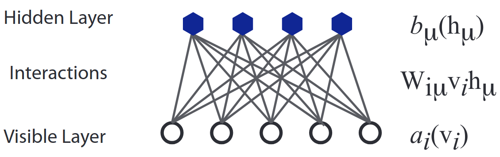

---

**✨ Update (November 2021):** _Please consider reading [Transformers Are Secretly Collectives of Spin Systems](https://mcbal.github.io/post/transformers-are-secretly-collectives-of-spin-systems/) for an arguably more comprehensive approach towards understanding transformers from a physics perspective._


<!-- In this post, I will try to partly address the concerns of the following critic:

> _In your [previous post](https://mcbal.github.io/post/an-energy-based-perspective-on-attention-mechanisms-in-transformers/), you introduced the energy function of modern Hopfield networks without explanation. Where does it come from? What's up with the logarithm? Is there actually any other interpretation then it being reverse-engineered from the Transformers' attention step? Is this all a desperate attempt to make Hopfield networks cool again? Also, I cannot see the value of looking at attention from an energy-based perspective if it doesn't help me achieve SOTA. Weak reject._ -->

# Introduction

In a [previous post](https://mcbal.github.io/post/an-energy-based-perspective-on-attention-mechanisms-in-transformers/), I provided an overview of attention in Transformer models and summarized its connections to modern Hopfield networks. We saw that the energy-based model
\begin{equation}
  E(\boldsymbol{\Xi}; \boldsymbol{X}) = \frac{1}{2} \boldsymbol{\Xi}^T \boldsymbol{\Xi} -\mathrm{logsumexp} \left( \boldsymbol{X}^T \boldsymbol{\Xi} \right).
  \label{eq:mhnenergy}
\end{equation}
enables fast pattern storage and retrieval through its simple and robust dynamics, leading to rapid convergence
\begin{align}
  \boldsymbol{\Xi}_{n+1}  = \boldsymbol{X} \ \mathrm{softmax} \left( \boldsymbol{X}^T \boldsymbol{\Xi}_{n}\right)
  \label{eq:mhnupdate}
\end{align}
of input queries $\boldsymbol{\Xi}_{n}$ to updated queries $\boldsymbol{\Xi}_{n+1}$ lying in the convex hull of stored patterns $\boldsymbol{X}$. I also argued by means of handwaving that optimizing a Transformer looks like meta-learning from the point of view of its attention modules, sculpting energy landscapes to accommodate statistical patterns found in data.

The main goal of this post is to build on these insights and highlight how an energy-based perspective can be a useful, complementary approach towards improving attention-based neural network modules. Parallel to scaling compute and making (self-)attention more efficient, it might be worthwhile to try to scale learning itself by experimenting with radically different attention mechanisms.

To this end, we will first revisit ancient ideas at the boundary of statistical physics and machine learning and show how vanilla attention looks like a mixture of simple energy-based models. We will then argue how going beyond these simple models could benefit from thinking in terms of implicit instead of explicit attention modules, suggesting opportunities to put ideas from [Deep Implicit Layers](https://implicit-layers-tutorial.org/) to work.

# Attention from effective energy-based models
In this section, we will introduce [Restricted Boltzmann Machines](https://en.wikipedia.org/wiki/Restricted_Boltzmann_machine) as a particular class of energy-based models, focusing on their capacity to capture effective correlations. After identifying classical discrete Hopfield networks and modern discrete Hopfield networks, we will demonstrate a naive way to fit modern continuous Hopfield networks into this framework. Throughout this section, we will rely heavily on the wonderful review [A high-bias, low-variance introduction to machine learning for physicists](https://arxiv.org/abs/1803.08823) by [Mehda et al.](https://arxiv.org/abs/1803.08823)[^ref:mehda].

## Restricted Boltzmann Machines
A [Restricted Boltzmann Machine](https://en.wikipedia.org/wiki/Restricted_Boltzmann_machine) (RBM) is an [energy-based model](https://mcbal.github.io/post/an-energy-based-perspective-on-attention-mechanisms-in-transformers/#energy-based-models-a-gentle-introduction) with a bipartite structure imposed on visible and hidden degrees of freedom: visible and hidden degrees of freedom interact with each other but do not interact among themselves (this is the "restriction"). The energy function looks like

\begin{equation}
  E \left( \boldsymbol{v}, \boldsymbol{h} \right) = - \sum_{i} a_{i} (v_{i}) - \sum_{\mu} b_{\mu} (h_{\mu}) - \sum_{i \mu} W_{i \mu} v_{i} h_{\mu},
\end{equation}

where the matrix $W_{i \mu}$ encodes the coupling between hidden and visible units and where $a_{i} (\cdot)$ and $b_{\mu} (\cdot)$ are functions that can be chosen at will. Popular options are:

\begin{align}
a_{i} (\cdot) = 
  \begin{cases}
    a_{i} v_{i} & \text{if $v_{i} \in \{0,1\}$ is binary (Bernouilli)}\\\\
    \frac{v_{i}^2}{2\sigma_{i}^{2}} & \text{if $v_{i} \in \mathbb{R}$ is continuous (Gaussian)}\\
  \end{cases}    
\end{align}

and similar for $b_{\mu} (\cdot)$.

[](https://arxiv.org/abs/1803.08823)

## Why hidden units?

Introducing hidden or latent variables is a powerful technique to encode interactions between visible units. Complex correlations between visible units can be captured at the cost of introducing new degrees of freedom and letting them interact with visible units in a simpler way. Since this trick often relies on exploiting [Gaussian integral identities](https://en.wikipedia.org/wiki/Common_integrals_in_quantum_field_theory) and physicists like their Gaussians, it shows up in several places across physics, e.g. in the [Hubbard-Stratonovich transformation](https://en.wikipedia.org/wiki/Hubbard%E2%80%93Stratonovich_transformation).

> **Renormalization group**: Rather than trying to fix the interactions in the "microscopic theory" like is done in the modeling scenario above, physicists are more familiar with the "reverse" procedure of deducing what effective theory emerges at large scales from a given microscopic theory. Indeed, integrating out degrees of freedom in physical theories can lead to complex, effective interactions between remaining degrees of freedom. This insight crystallized in the development of [renormalization group](https://en.wikipedia.org/wiki/Renormalization_group) theory in the early 1970s. By focusing on theories defined at different length scales, [Kenneth G. Wilson](https://en.wikipedia.org/wiki/Kenneth_G._Wilson) and his contemporaries introduced and unified the notions of flows, fixed points, and universality in theory space to understand the behavior of physical systems under a change of scale.

As we will see in the next sections, the bipartite structure of RBMs enables pairwise and higher-order correlations to emerge between visible units after integrating out hidden units. Additionally, the conditional independence of visible and hidden units enables tractable training methods like (block) Gibbs sampling and contrastive divergence[^ref:mehda]. We will not consider explicitly training RBMs in this post but will instead reflect on the idea of implicitly training these models, which is what seems to be happening inside Transformers.

## Effective energies and correlations

Let us now consider what kind of correlations between visible degrees of freedom are supported by RBMs. The distribution of the visible degrees of freedom can be obtained by marginalizing over the hidden degrees of freedom:

\begin{equation}
  p \left( \boldsymbol{v} \right) = \int \mathrm{d} \boldsymbol{h} \  p \left( \boldsymbol{v}, \boldsymbol{h} \right) = \int \mathrm{d} \boldsymbol{h} \  \frac{\mathrm{e}^{- E \left( \boldsymbol{v}, \boldsymbol{h} \right)}}{Z}
\end{equation}

We try to find an expression for the marginalized energy $E (\boldsymbol{v})$ by defining

\begin{equation}
  p \left( \boldsymbol{v} \right) = \frac{\mathrm{e}^{- E (\boldsymbol{v})}}{Z}
\end{equation}

so that we can identify

\begin{align}
  E \left( \boldsymbol{v} \right) &= - \mathrm{log} \int \mathrm{d} \boldsymbol{h} \  \mathrm{e}^{- E \left( \boldsymbol{v}, \boldsymbol{h} \right)} \\\\
  &= - \sum_{i} a_{i} (v_{i}) - \sum_{\mu} \log \int \mathrm{d} h_{\mu}\ \mathrm{e}^{b_{\mu}(h_{\mu}) + \sum_{i} W_{i\mu} v_{i} h_{\mu}} \label{eq:effvisenergy}
\end{align}

Following [Mehda et al.](https://arxiv.org/abs/1803.08823), we can try to better understand the correlations in $p(\boldsymbol{v})$ by introducing the (prior) distribution

\begin{equation}
  q_{\mu} \left( h_{\mu} \right) = \frac{\mathrm{e}^{b_{\mu} (h_{\mu})}}{Z}
\end{equation}

for the hidden units $h_{\mu}$, ignoring the interactions between $\boldsymbol{v}$ and $\boldsymbol{h}$. Additionally, we can introduce the hidden unit's distribution's [cumulant generating function](https://en.wikipedia.org/wiki/Cumulant)

\begin{align}
  K_{\mu} (t) &= \mathrm{log}\ \mathbb{E} \left[ \mathrm{e}^{t h_{\mu}} \right] \\\\
  &= \mathrm{log} \int \mathrm{d} h_{\mu} \  q_{\mu} \left( h_{\mu} \right) \mathrm{e}^{t h_{\mu}}\\\\
  &= \sum_{n=1}^{\infty} \kappa_{\mu}^{(n)} \frac{t^{n}}{n!},
\end{align}

which is defined such that the $n^{\mathrm{th}}$ cumulant $\kappa_{\mu}^{(n)}$ of $q_{\mu} \left( h_{\mu} \right)$ can be obtained by taking derivatives $\kappa_{\mu}^{(n)} = \partial_{t}^{n} K_{\mu} \rvert_{t=0}$.

Looking back at the effective energy function \eqref{eq:effvisenergy} for the visible units, we find that the effective energy can be expressed in terms of cumulants:

\begin{align}
  E \left( \boldsymbol{v} \right) &= - \sum_{i} a_{i} \left(v_{i}\right) - \sum_{\mu} K_{\mu} \left( \sum_{i} W_{i\mu} v_{i} \right) \\\\
  &= - \sum_{i} a_{i} \left(v_{i}\right) - \sum_{\mu} \sum_{n=1}^{\infty} \kappa_{\mu}^{(n)} \frac{\left( \sum_{i} W_{i\mu} v_{i} \right)^{n}}{n!} \\\\
  &= - \sum_{i} a_{i} \left(v_{i}\right) - \sum_{i} \left( \sum_{\mu} \kappa_{\mu}^{(1)} W_{i\mu} \right) v_{i} \\\\
  &\ \ \ \ \ - \frac{1}{2} \sum_{ij} \left( \sum_{\mu} \kappa_{\mu}^{(2)} W_{i\mu} W_{j\mu} \right) v_{i} v_{j} + \ldots \label{eq:effectivenergy}
\end{align}

We see that the auxiliary, hidden degrees of freedom induce effective pairwise and higher-order correlations among visible degrees of freedom. Each hidden unit $h_{\mu}$ can encode interactions of arbitrarily high order, with the $n$-th order cumulants of $q_{\mu} \left( h_{\mu} \right)$ weighting the $n$-th order interactions. By combining many hidden units and/or stacking layers, RBMs can in principle encode complex interactions at all orders and learn them from data.

Let us now recover some known models by picking a suitable prior distribution for the hidden units:

- **Classical discrete Hopfield networks**: Consider a Bernouilli distribution for the visible units and a standard Gaussian distribution for the hidden units. For a standard Gaussian, the mean $\kappa_{\mu}^{(1)} = 0$, the variance $\kappa_{\mu}^{(2)} = 1$, and $\kappa_{\mu}^{(n)} = 0$, $\forall n\geq 3$, leading to the quadratic energy function of Hopfield networks:
\begin{align}
  E \left( \boldsymbol{v} \right) = - \sum_{i} a_{i} v_{i} - \frac{1}{2} \sum_{ij} \left( \sum_{\mu} W_{i\mu} W_{j\mu} \right) v_{i} v_{j}
\end{align}

- **Modern discrete Hopfield networks**: Consider a Bernouilli distribution for the visible units. Since it can be shown that the normal distribution is the only distribution whose cumulant generating function is a polynomial, i.e. the only distribution having a finite number of non-zero cumulants[^fn:cumulants], it looks like we cannot model a finite amount of polynomial interactions in this framework. But we can model an exponential interaction by considering a Poisson distribution $\mathrm{Pois}(\lambda)$ with rate $\lambda=1$ for the hidden units, whose cumulants are all equal to the rate, i.e. $\kappa_{\mu}^{(n)} = 1$, $\forall n\geq 1$. Up to a constant, we then obtain an exponential interaction
\begin{align}
  E \left( \boldsymbol{v} \right) = - \sum_{i} a_{i} v_{i} - \sum_{\mu} \exp \left( \sum_{i} W_{i\mu} v_{i} \right)
\end{align}

Other kinds of effective interactions can be obtained by substituting the cumulants of your favorite probability distribution. The [cumulants of hidden Bernouilli units](https://en.wikipedia.org/wiki/Bernoulli_distribution#Higher_moments_and_cumulants) induce interactions of all orders. Considering exponential or Laplacian distributions where $\kappa^{(n)} \sim (n-1)!$ seems to lead to funky logarithmic interactions.


## Modern Hopfield networks as mixtures of effective RBMs

Let us now turn to the energy function of modern Hopfield networks for a single query $\boldsymbol{\xi} \in \mathbb{R}^{d}$ and $N$ stored patterns encoded by $\boldsymbol{X} \in \mathbb{R}^{d \times N}$,
\begin{equation}
  E(\boldsymbol{\xi}; \boldsymbol{X}) = \frac{1}{2} \boldsymbol{\xi}^T \boldsymbol{\xi} -\mathrm{logsumexp} \left( \boldsymbol{X}^T \boldsymbol{\xi} \right),
\end{equation}
which we can transform into the RBM notation of the previous section by changing the names of variables and transposing the stored pattern matrix,
\begin{equation}
  E(\boldsymbol{v}; W) = \frac{1}{2} \sum_{i} v_{i}^{2} -\log \left( \sum_{\mu} \exp \left( \sum_{i} W_{\mu i} v_{i} \right) \right).
\end{equation}

Is there a simple way to interpret this energy function in terms of (effective) RBMs? Let's imagine this energy to be an effective energy $E(\boldsymbol{v})$ for the visible units with probability distribution
\begin{equation}
  p(\boldsymbol{v}) = \frac{\mathrm{e}^{-E(\boldsymbol{v})}}{Z} = \frac{1}{Z} \sum_{\mu} \mathrm{e}^{-\frac{1}{2} \sum_{i} v_{i}^{2} + \sum_{i} W_{\mu i} v_{i}},
\end{equation}
where the partition function $Z$ follows from doing a [Gaussian integral](https://en.wikipedia.org/wiki/Gaussian_integral#n-dimensional_with_linear_term)
\begin{equation}
  Z = (2\pi)^{n/2} \sum_{\mu} Z_{\mu} = (2\pi)^{n/2} \sum_{\mu} \mathrm{e}^{\frac{1}{2} \sum_{i} W_{\mu i} W_{i\mu}}
\end{equation}

We can then identify the probability distribution $p(\boldsymbol{v})$ with a mixture of effective energy-based models[^ref:trivial]
\begin{equation}
  p(\boldsymbol{v}) = \sum_{\mu} w_{\mu} \frac{\mathrm{e}^{-\frac{1}{2} \sum_{i} v_{i}^{2} + \sum_{i} \mathbf{W}_{\mu i} v_{i}}}{Z_{\mu}} = \sum_{\mu} w_{\mu} \frac{ \mathrm{e}^{ -E_{\mu}(\boldsymbol{v}) }}{Z_{\mu}}
\end{equation}
where $w_{\mu} = Z_{\mu} / Z$ so that $\sum_{\mu} w_{\mu} = 1$. During training, the model can control prior weights $w_{\mu}$ by adjusting relative norms of patterns. If the difference in norms between the stored patterns is not too wild, $w_{\mu} \approx 1/N$.

A single model in the mixture has an effective energy function derived from a joint energy function with just a single hidden unit,

\begin{equation}
  E_{\mu} \left( \boldsymbol{v}, h_{\mu} \right) = - \sum_{i} a_{i} (v_{i}) - b_{\mu} (h_{\mu}) - \sum_{i} W_{i \mu} v_{i} h_{\mu}
\end{equation}

Looking back at \eqref{eq:effectivenergy}, we see that we can recover $E_{\mu}(\boldsymbol{v})$ by picking a hidden prior distribution that is a constant random variable so that $\kappa_{\mu}^{(1)}=1$ is the only non-zero cumulant. This frozen property of hidden units seems to agree with the fast dynamics of memory neurons in the dynamical systems model proposed in [Krotov and Hopfield (2020)](https://arxiv.org/abs/2008.06996)[^ref:hopfield-new].

In conclusion, the energy-based model underlying vanilla Transformer attention is not terribly exciting.

# Attention as implicit energy minimization

Let's finish this post with some comments on how one could leverage the idea of implicit energy minimization to develop novel attention mechanisms.

## Bending the explicit architecture

A lot of work on post-vanilla Transformer architectures tries to improve softmax-attention by making it more efficient through approximations and/or modifications at the level of the architecture. Kernel-based approaches like [Rethinking Attention with Performers](https://arxiv.org/abs/2009.14794) have shown not only that softmax attention can be efficiently approximated by a generalized attention mechanism but also that generalized ReLU-based attention performed better in practice. Papers like [Normalized Attention Without Probability Cage](https://arxiv.org/abs/2005.09561) show how we can replace the softmax non-linearity in \eqref{eq:mhnupdate} with pure normalization and still end up with a competitive algorithm, noting that the updated query being restricted to lie in the convex hull of the stored patterns is a bias we might want to question.

From the above examples, it seems like at least a part of current research on attention is trying to break away from the confines of existing, explicit attention architectures but doesn't quite know how to do so in a principled way. Does an energy-based perspective help to understand these developments? 

## From explicit architectures to implicit energy minimization

We have seen in this post that the energy function behind the `softmax` attention mechanism can be understood as a mixture of simple energy-based models. But what can we actually do with this information? Especially since we know from language modeling experiments that "just scaling" these simple models to billions of parameters enables them to store enough patterns to be useful. Despite huge progress, there however remain important challenges in terms of efficiency and generalizability. Considering slightly less trivial energy-based models might address both by adding interactions in such a way that attention modules are able to return a _collective response_ rather than a sum of decoupled contributions.

To some extent, the additional linear transformations on the input patterns in the query-key-value formulation of Transformer self-attention already try to address this:
\begin{equation}
  \mathrm{Attention}\left( \mathbf{Q}, \mathbf{K}, \mathbf{V} \right) = \mathrm{softmax} \left( \frac{\mathbf{Q} \mathbf{K}^T}{\sqrt{d}} \right) \mathbf{V}
  \label{eq:vanilla-attention}
\end{equation}
These linear transformations slightly generalize the "naked" explicit gradient step of \eqref{eq:mhnupdate} and can in principle learn to cluster and direct patterns to neighborhoods in the energy landscape, parametrizing the energy function. But why stop there?

## Deep implicit layers for attention dynamics

An interesting way forward might be to integrate attention with _deep implicit layers_. Funnily enough, the authors of the NeurIPS 2020 tutorial on [Deep Implicit Layers](https://implicit-layers-tutorial.org/) list self-attention as a prime example of an explicit layer in their [introductory notebook](https://colab.research.google.com/drive/1OUVzeUh66wVOFI_Nc_rIAuO70gHimHH8?usp=sharing#scrollTo=vFlF3gTnzOpp). Approaches like [Deep Equilibrium Models](https://arxiv.org/abs/1909.01377) implicitly train DEQ-Transformers but still consider the attention module itself an explicit function.

Yet we have seen in a [previous post](https://mcbal.github.io/post/an-energy-based-perspective-on-attention-mechanisms-in-transformers/) that self-attention can --- and perhaps should --- actually be considered an implicit layer solving for a fixed point query. Because of the lack of dynamics of the current generation of attention mechanisms, this can be done in a single big gradient step, removing the need to iterate. Attention models with more complicated dynamics might benefit from a differentiable solver to find a fixed point and return the most appropriate result in a given context.

Compared to modifying explicit architectures, the implicit-layer perspective seems to act on a different "conceptual level" of neural network architecture design. This raises a lot of questions. Which families of attention architectures can be expressed in terms of implicit energy functions like softmax-attention? How many of these have efficient minimization properties with closed-form gradients? Beyond closed-form gradients, how far can we go in parametrizing more general energy-based attention models and still end up with an efficient algorithm? What does the trade-off look like between an attention model's complexity and it still being implicitly trainable?

# Conclusion

Looking back and reversing causation, one could argue that the now-famous dot-product attention module introduced in [Attention Is All You Need](https://arxiv.org/abs/1706.03762)[^ref:aiayn] could only have been arrived at because of the properties of its implicit energy function \eqref\{eq:mhnenergy}. Indeed, it is only because of the associative memory's decoupled and rather crude way of storing patterns in isolated, high-dimensional valleys that expensive, implicit energy minimization steps can be traded for a cheap, explicit one-step gradient update like \eqref\{eq:mhnupdate}. 

The obvious pitfall of continuing to hold on to the conceptual framework introduced by this shortcut is that a potentially far richer picture of (sparse) attention dynamics remains obscured. Rather than perpetually rethinking what is all you _really_ need within the confines of existing, explicit attention modules, why not opt for implicit modules built on top of an energy-based perspective to try to push things forward?

# References & footnotes

If you happen to find this work useful, please consider citing it as:

```
@article{bal2020attentionrbms,
  title   = {Transformer Attention as an Implicit Mixture of Effective Energy-Based Models},
  author  = {Bal, Matthias},
  year    = {2020},
  month   = {December},
  url     = {https://mcbal.github.io/post/transformer-attention-as-an-implicit-mixture-of-effective-energy-based-models/},
}
```

[^ref:aiayn]: _Ashish Vaswani, Noam Shazeer, Niki Parmar, Jakob Uszkoreit, Llion Jones, Aidan N. Gomez, Lukasz Kaiser, and Illia Polosukhin, [Attention Is All You Need](https://arxiv.org/abs/1706.03762) (2017)_

[^ref:hiayn]: _Hubert Ramsauer, Bernhard Schäfl, Johannes Lehner, Philipp Seidl, Michael Widrich, Lukas Gruber, Markus Holzleitner, Milena Pavlović, Geir Kjetil Sandve, Victor Greiff, David Kreil, Michael Kopp, Günter Klambauer, Johannes Brandstetter, and Sepp Hochreiter, [Hopfield Networks is All You Need](https://arxiv.org/abs/2008.02217) (2020)_

[^ref:hiayn-blog]: _Johannes Brandstetter, https://ml-jku.github.io/hopfield-layers/ (2020)_

[^ref:energy-based-perspective-attention-blog]: _Matthias Bal, https://mcbal.github.io/post/an-energy-based-perspective-on-attention-mechanisms-in-transformers/ (2020)_

[^ref:mehda]: _Pankaj Mehta, Marin Bukov, Ching-Hao Wang, Alexandre G.R. Day, Clint Richardson, Charles K. Fisher, David J. Schwab, [A high-bias, low-variance introduction to Machine Learning for physicists](https://arxiv.org/abs/1803.08823) (2019)_

[^fn:cumulants]: Proof by Marcinkiewicz (1935) according to http://www.stat.uchicago.edu/~pmcc/courses/stat306/2013/cumulants.pdf.

[^ref:hopfield-new]: _Dmitry Krotov and John Hopfield, [Large Associative Memory Problem in Neurobiology and Machine Learning](https://arxiv.org/abs/2008.06996) (2020)_

[^ref:trivial]: We are aware that this identification might be tremendously trivial when considering prior work on [Implicit Mixtures of Restricted Boltzmann Machines](https://papers.nips.cc/paper/2008/hash/e820a45f1dfc7b95282d10b6087e11c0-Abstract.html) or, more generally, mixture models in the context of [expectation-minimization optimization](https://en.wikipedia.org/wiki/Expectation%E2%80%93maximization_algorithm).
