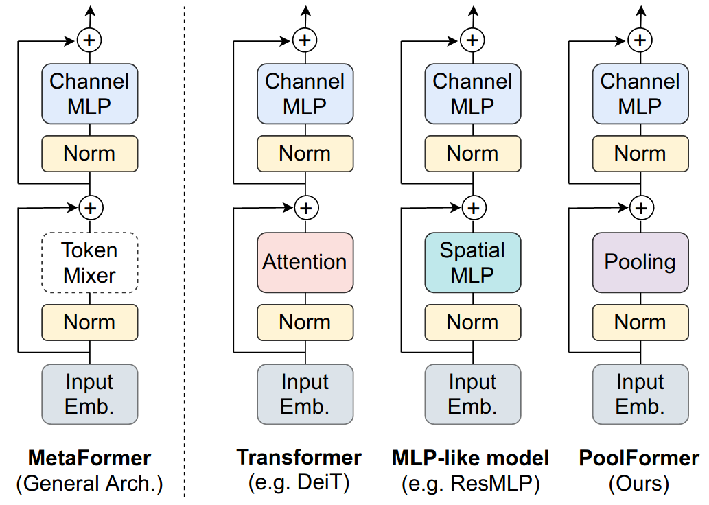
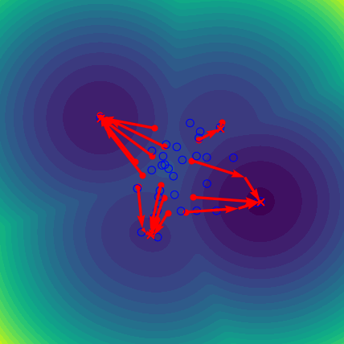
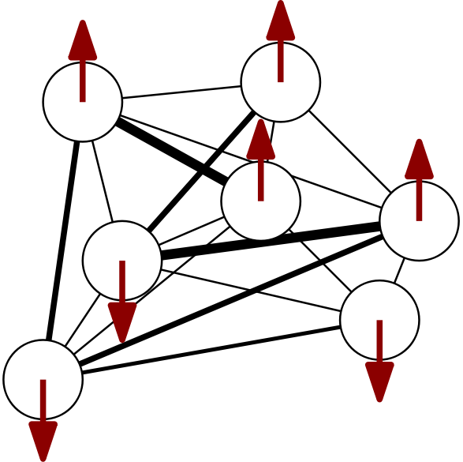
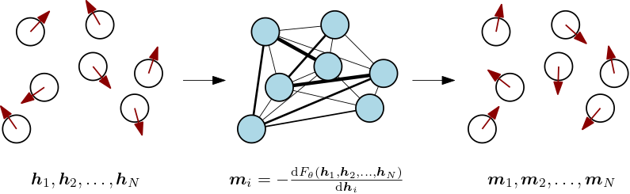
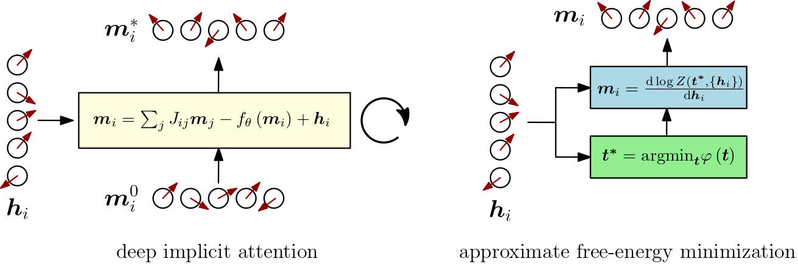
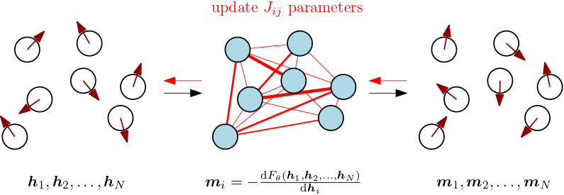
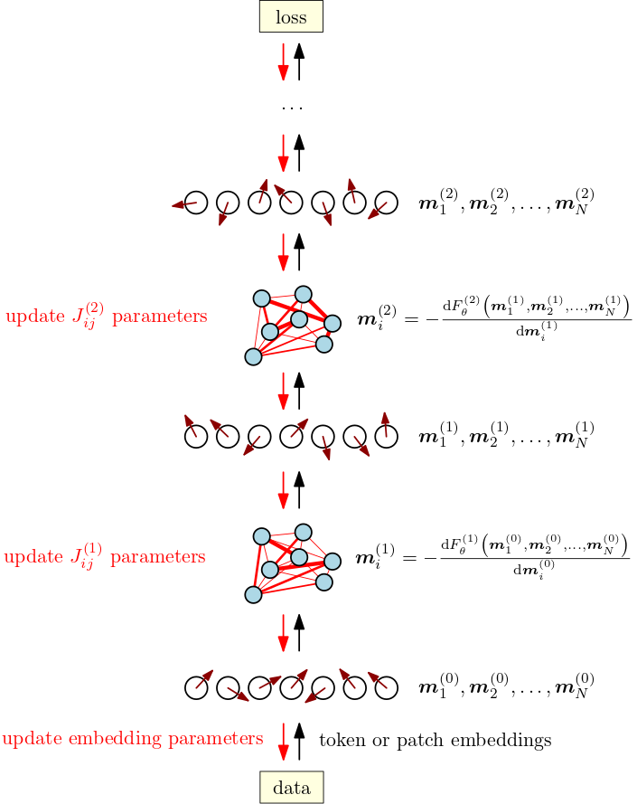

---

> **✨ Update (April 2023):** Consider reading [Spin-Model Transformers: A Physics-Inspired Class of Transformer Modules](https://mcbal.github.io/post/spin-model-transformers/) where we continue building on the intuition of probing a spin system to engineer its collective response but get rid of the assumption of symmetric coupling matrices by shifting focus from equilibrium free energies to dynamical mean-field approximations of non-equilibrium vector-spin models.


# Introduction

In this post, we try to distill a unifying perspective out of ideas developed in a series of longer posts on understanding transformers as physical systems:

- [Deep Implicit Attention: A Mean-Field Theory Perspective on Attention Mechanisms](https://mcbal.github.io/post/deep-implicit-attention-a-mean-field-theory-perspective-on-attention-mechanisms/)
- [Transformers from Spin Models: Approximate Free Energy Minimization](https://mcbal.github.io/post/transformers-from-spin-models-approximate-free-energy-minimization/)

We argue that a blueprint of the neural-network architecture of the archetypical transformer module can be derived from the structure of physical spin systems familiar from classical statistical mechanics. More specifically, we claim that the forward pass of transformer modules maps onto computing magnetizations in vector-spin models in response to incoming data. We imagine transformers as collectives of differentiable spin systems whose behavior can be shaped through training.


# Where does the transformer module architecture come from?

Taking a bird's eye view of the evergrowing zoo of transformer architectures in natural language processing and computer vision suggests that the design pattern introduced in _[Attention is All You Need (Vaswani et al., 2017)](https://arxiv.org/abs/1706.03762)_[^ref:aiayn] is still dominant. Almost all architectural variations of transformer modules published in the last four years have stuck to a successful combination of residual connections, an attention-like operation (token-mixing), normalization layers, and a feed-forward-like operation (channel-mixing).

<a href="https://arxiv.org/abs/2111.11418" target=_blank></a>

Recent work like _[MetaFormer is Actually What You Need for Vision (Yu et al., 2021)](https://arxiv.org/abs/2111.11418)_[^ref:metaformer] appropriately shifts focus to the high-level architecture of the transformer module and argues that its full structure, rather than just the token-mixing attention operation, is essential for transformers to achieve competitive performance.

So where does this archetypical design pattern come from? Why does it seem to stick around? Is there any physical intuition behind its structure?


# Deriving attention from energy functions only gets you so far

Recent papers like _[Hopfield Networks is All You Need (Ramsauer et al., 2020)](https://arxiv.org/abs/2008.02217)[^ref:hiayn]_ and _[Large Associative Memory Problem in Neurobiology and Machine Learning (Krotov and Hopfield, 2020)](https://arxiv.org/abs/2008.06996)_[^ref:hopfield-new] have looked for physical intuition behind attention mechanisms using an [energy-based perspective](https://mcbal.github.io/post/an-energy-based-perspective-on-attention-mechanisms-in-transformers/) phrased in terms of modern continuous Hopfield networks. The main idea is to derive the softmax-attention update rule

\begin{equation}
\boldsymbol{Q}' = \text{softmax}\left( \frac{\boldsymbol{Q} \boldsymbol{K}^T}{\sqrt{d}} \right) \boldsymbol{K}
\end{equation}

by taking a large gradient descent update step using the derivative with respect to input queries $\boldsymbol{Q}$ of some judiciously chosen energy function

\begin{equation}
E = \frac{1}{2} \boldsymbol{Q} \boldsymbol{Q}^T -\mathrm{logsumexp} \left( \frac{\boldsymbol{Q} \boldsymbol{K}^T}{\sqrt{d}} \right). \label{eq:logsumexp}
\end{equation}

In this way, vanilla softmax attention can be recast as taking a [large gradient step](https://mcbal.github.io/post/an-energy-based-perspective-on-attention-mechanisms-in-transformers/#modern-continuous-hopfield-networks). The energy landscape defined by Eq. \eqref{eq:logsumexp} implements an associative memory system for storing and retrieving vector patterns where queries flow towards valleys associated with their nearest keys (see [Attention as Energy Minimization: Visualizing Energy Landscapes](https://mcbal.github.io/post/attention-as-energy-minimization-visualizing-energy-landscapes/)):

<a href="https://mcbal.github.io/post/attention-as-energy-minimization-visualizing-energy-landscapes/" target=_blank></a>

But there is more to transformer modules than just attention. In practice, we know that residual connections, normalization layers, and feed-forward layers are all essential to achieve good empirical performance. 

Can we generalize this physical intuition of taking derivatives with respect to an energy function to recover the full transformer module? Yes, we can. But we have to take a step back from energy functions and focus on their underlying physical systems instead.


# Back to the roots: physical spin systems and vector-spin models

Energy functions in classical statistical mechanics are succinct descriptions encoding interactions and constraints in physical systems. Spin systems are prototypical physical systems which often serve as toy models for all kinds of phenomena[^fn:background].

The [Ising model](https://en.wikipedia.org/wiki/Ising_model) is a simple toy model describing a classical binary spin system with local spin degrees of freedom at every site pointing either up or down. The energy function of the binary random Ising model for $N$ spins in the presence of a site-dependent external magnetic field is given by

\begin{equation}
  E = - \sum_{i,j=1}^{N} J_{ij} \sigma_{i} \sigma_{j} - \sum_{i=1}^{N} h_{i} \sigma_{i}, \label{eq:binaryrandomising}
\end{equation}

where the $J_{ij}$ encode coupling strengths between all pairs of spins and the external magnetic fields $h_{i}$ act as biases by providing a preferential value of alignment at every site. The model defined by \eqref{eq:binaryrandomising} is also known as a [Boltzmann machine](https://en.wikipedia.org/wiki/Boltzmann_machine) or [Hopfield network](https://en.wikipedia.org/wiki/Hopfield_network). A cartoon of this model looks like a graph of little arrows that are pairwise coupled[^fn:cartoon]:



At thermal equilibrium, the Boltzmann probability distribution $e^{-\beta E\left( \sigma \right)} / Z$ reflects what patterns of up-down spins, or _spin configurations_, are preferred. The partition function $Z = \sum_{\sigma} e^{-\beta E\left( \sigma \right)}$ of a spin system is not only a normalization constant but also a magical object relating the microscopic world of fluctuating spins to thermodynamic, observable quantities via the free energy $F = - \beta^{-1} \log Z$. Even for simple spin systems, computing partition functions by summing over all possible configurations is a shockingly hard thing to do in most scenarios.

Binary spin models are nice but rarely excite machine learning practitioners anymore nowadays. Modern neural networks like transformers act on sequences of vectors like token embeddings or image patches. Instead of abandoning spin models altogether, we could consider _vector-spin models_. Replacing binary degrees of freedom with $d$-dimensional vector degrees of freedom, we can define a spin-model energy function

\begin{align}
E = - \sum_{i,j=1}^{N} J_{ij} \; \boldsymbol{\sigma}_{i} \cdot \boldsymbol{\sigma}_{j} - \sum_{i=1}^{N} \boldsymbol{h}_{i} \cdot \boldsymbol{\sigma}_{i}, \label{eq:vectorrandomising}
\end{align}

where the scalar products have turned into dot products. Models of this form first popped up in 1960s statistical mechanics literature as [classical $d$-vector models](https://en.wikipedia.org/wiki/N-vector_model). They also appear in recent studies on higher-dimensional generalizations of spin glass models[^fn:spinglasses]. 


Now how can we relate vector-spin systems like Eq. \eqref{eq:vectorrandomising} to modern neural networks?

# Why don’t we just probe a vector-spin system with data?

Let's pursue an intuitive idea. Imagine we want to expose our vector-spin system Eq. \eqref{eq:vectorrandomising} to a sequence of vector data. We can do this by having the sequence act as the spin system's external magnetic field $(\boldsymbol{h}_{1}, \boldsymbol{h}_{2}, \ldots, \boldsymbol{h}_{N})$. We would then like to observe how the spin system responds to this particular environment of patterns.

If all of the steps in the computation of the spin system's responses can be implemented in a differentiable way, we should be able to engineer its collective behavior by optimizing the coupling parameters to better respond to future incoming data. We propose to observe spin-system responses in terms of _magnetizations computed from free energies_.


# A slice of statistical mechanics: magnetizations and free energies

For ease of notation, let's call the model parameters $\theta \equiv \{ J_{ij} \}$, the spins $\sigma \equiv \{ \boldsymbol{\sigma}_{i} \}$, and the external magnetic fields $h \equiv (\boldsymbol{h}_{1}, \boldsymbol{h}_{2}, \ldots, \boldsymbol{h}_{N})$. We can then schematically write our spin system's partition function as

\begin{align}
  Z_{\theta} \left( h \right) = \int \mathrm{d} \sigma \ \mathrm{e}^{ - \beta E_{\theta}\left( \sigma, h \right) } \label{eq:partfun}
\end{align}

and the corresponding free energy as $F_{\theta} \left( h \right) = - \beta^{-1} \log Z_{\theta} \left( h \right)$.

Magnetizations are responses of our spin system to the external magnetic field imposed by $(\boldsymbol{h}_{1}, \boldsymbol{h}_{2}, \ldots, \boldsymbol{h}_{N})$. From standard thermodynamics, we know that we can calculate magnetizations from the free energy by differentiating with respect to the external field[^fn:giamarchinotes]

\begin{align}
\boldsymbol{m}_{i} = - \frac{\mathrm{d} F_{\theta} \left( \boldsymbol{h}_{1}, \boldsymbol{h}_{2}, \ldots, \boldsymbol{h}_{N} \right)}{\mathrm{d} \boldsymbol{h}_{i}} = \langle \boldsymbol{\sigma}_{i} \rangle , \label{eq:sigma}
\end{align}

which, in this case, boils down to calculating spin expectation values. The magnetization for every site depends on the couplings and, through the couplings between spins, on the values of the external field at all sites. Magnetizations reveal how spins will collectively tend to align themselves when we place the spin system in an environment of patterns.

Before we move on, we have to account for one more complication. If we want to draw a correspondence between transformer modules and vector-spin systems, we will have to allow for couplings that depend on the external magnetic field. For example, the attention matrix in vanilla transformers looks something like

\begin{equation}
  J_{ij} \left( \boldsymbol{h}_{1}, \boldsymbol{h}_{2}, \ldots, \boldsymbol{h}_{N} \right) = \left[\mathrm{softmax}\left( \frac{\boldsymbol{H} \boldsymbol{W}_{\boldsymbol{Q}} \boldsymbol{W}_{\boldsymbol{K}}^{T} \boldsymbol{H}^{T}}{\sqrt{d}} \right)\right]_{ij}, \label{eq:softmaxcouplings}
\end{equation}

where the matrix $\boldsymbol{H}$ denotes the stack of external magnetic field vectors. The interactions between spins are determined dynamically based on the inputs. From a physics perspective, these "amortized" couplings are very weird and highly unusual, but such is the transformer.

The potential dependency of the couplings on the external field changes the magnetization of Eq. \eqref{eq:sigma} to an expression of the form

\begin{align}
\boldsymbol{m}_{i} &= - \frac{\mathrm{d} F_{\theta} \left( \boldsymbol{h}_{1}, \boldsymbol{h}_{2}, \ldots, \boldsymbol{h}_{N} \right)}{\mathrm{d} \boldsymbol{h}_{i}} \nonumber \\\\ &= \langle \boldsymbol{\sigma}_{i} \rangle + \sum_{m,n} \langle \boldsymbol{\sigma}_{m} \cdot \boldsymbol{\sigma}_{n} \rangle \frac{\partial J_{mn} \left( \boldsymbol{h}_{1}, \boldsymbol{h}_{2}, \ldots, \boldsymbol{h}_{N} \right) }{ \partial \boldsymbol{h}_{i} } , \label{eq:sigmaweird}
\end{align}

where two-point correlation functions are seen to act as weights for the coupling contributions[^fn:overkill]. In practice, we should of course let an automatic differentiation framework keep track of dependencies so that we can get away with simply computing

\begin{align}
\boldsymbol{m}_{i} = - \frac{\mathrm{d} F_{\theta} \left( \boldsymbol{h}_{1}, \boldsymbol{h}_{2}, \ldots, \boldsymbol{h}_{N} \right)}{\mathrm{d} \boldsymbol{h}_{i}}, \label{eq:magnetization}
\end{align}

assuming we have a differentiable expression for the (approximate) free energy available.


# Turning a differentiable spin system into a neural network

Let's now use the ingredients introduced above to construct a neural network module which wraps around a vector-spin system. Given the energy function Eq. \eqref{eq:vectorrandomising} and the free energy $F_{\theta} \left( h \right) = - \beta^{-1} \log \int \mathrm{d} \sigma \ \mathrm{e}^{ - \beta E_{\theta}\left( \sigma, h \right) }$, we let incoming data play the role of the external magnetic field and return magnetizations in response. 



Nice. But didn't we mention before that partition functions (and hence free energies and thus magnetizations) are shockingly hard to compute? Why introduce all these formal expressions if we cannot compute anything?

Looking back at statistical mechanics papers from the 1950s-1970s, it turns out that physicists have already developed several tricks and approximation methods that can be applied to deal with vector-spin systems. Computational evidence that the partition function approach outlined above _is_ possible for vector-spin systems can be found in [Deep Implicit Attention](https://mcbal.github.io/post/deep-implicit-attention-a-mean-field-theory-perspective-on-attention-mechanisms/) (below, left) and [Approximate Free Energy Minimization](https://mcbal.github.io/post/transformers-from-spin-models-approximate-free-energy-minimization/) (below, right). 




In these examples, approximations of the partition function Eq. \eqref{eq:partfun} were obtained following respectively a mean-field theory and a steepest-descent approach. Our [numerical implementations](https://github.com/mcbal) of both approaches rely internally on [deep implicit layers](http://implicit-layers-tutorial.org/) to ensure that fixed-point calculations and root-solving steps are efficiently differentiable.


# An exercise in squinting: recognizing the transformer module

Computing magnetizations according to Eq. \eqref{eq:magnetization} from the (approximate) free energies obtained in [Deep Implicit Attention](https://mcbal.github.io/post/deep-implicit-attention-a-mean-field-theory-perspective-on-attention-mechanisms/)  and [Approximate Free Energy Minimization](https://mcbal.github.io/post/transformers-from-spin-models-approximate-free-energy-minimization/) reveals a high-level structure that is surprisingly familiar: a pattern of residual connections, token-mixing, normalization, and channel-mixing. Approaching the crux from the other direction, we argue that transformer modules react to inputs by implementing particular approximations to the general magnetization response Eq. \eqref{eq:sigmaweird}.

Residual connections are proportional to the inputs and arise from the presence of the external magnetic field. Token-mixing contributions emerge from the coupling terms in the energy function and mix inputs without acting on the local vector-spin dimension. Normalization follows from requiring that the energy of the spin system remain linearly proportional to the number of lattice sites and from normalizing the external magnetic field vectors. Channel-mixing contributions include terms in the magnetization that can be applied locally, like Onsager self-correction terms in mean-field approaches or (approximations to) contributions coming from input-dependent couplings in Eq. \eqref{eq:sigmaweird}.

Taken together, these observations suggest that we can picture the forward pass of a transformer module as a wrapper around a vector-spin system: module inputs are routed to the external magnetic field (and, optionally, to a parametrized couplings function) after which magnetizations are returned as outputs. The transformer module bears an uncanny resemblance to a differentiable physical system whose collective behavior we can control through training.


# Training transformer modules shapes collective behavior

Now that we can picture transformer modules as physical spin systems responding to getting probed with data, let's imagine what training them looks like.

On the level of the energy function of our spin system Eq. \eqref{eq:vectorrandomising}, we can model the training process of a transformer module by introducing a (discrete) time dimension and making the external magnetic field time-dependent, leading to[^fn:noneqdynamics]

\begin{equation}
E(t) = - \sum_{i,j=1}^{N} J_{ij} \; \boldsymbol{\sigma}_{i} \cdot \boldsymbol{\sigma}_{j} - \sum_{i=1}^{N} \boldsymbol{h}_{i}(t) \cdot \boldsymbol{\sigma}_{i} \label{eq:sloppyenergy}
\end{equation}

At every training step $t$, a sequence of incoming data $\{ \boldsymbol{h}_{1}(t), \boldsymbol{h}_{2}(t), \ldots, \boldsymbol{h}_{N}(t) \}$ takes on the role of external magnetic field. During the forward pass, magnetizations $\boldsymbol{m}_{i}$ are computed in a differentiable way according to the current model parameters and in the presence of the current external magnetic field. Physically, we consider "quenched" systems with "frozen" couplings at every training step. During the backward pass, the module's coupling parameters $J_{ij}$ get updated, nudging the interactions in the spin system so as to influence its magnetization responses to similar data in future iterations.




We can think about this training process as gradually shaping the collective behavior of a differentiable vector-spin system that is driven by data. If the couplings depend on the inputs, like in Eq. \eqref{eq:softmaxcouplings}, we should make the couplings time-dependent as well in Eq. \eqref{eq:sloppyenergy}. In that case, the external magnetic fields as well as the parametrized couplings change instantaneously at every training step.

# Training deep transformers orchestrates spin-system collectives

Training a deep transformer model corresponds to orchestrating a stack of transformer modules by building up a differentiable structure of correlations where the magnetizations of one spin system drive the next one. Wiggling (billions of) parameters during training nudges the cascading response behavior of the collective of spin systems to better adapt to the collective's (meta-)tasks as specified by the data and the loss function.



# Conclusion

In this post, we argued that the forward pass of a transformer module maps onto computing magnetizations in a vector-spin model responding to data. Generalizing previous work on understanding softmax attention modules in terms of modern continuous Hopfield networks by taking derivatives of a judiciously chosen _energy_ function, we propose to take derivatives of the _free energy_ of a general vector-spin system to get to a blueprint of the architecture of a full transformer module.

By zooming out and approaching transformers from a tangential, statistical-mechanical point of view, we arrived at a physical intuition of transformers that seems hard to obtain when restricting oneself to perpetually perturbing explicit neural network architectures. Recognizing transformer modules as spin models in disguise might not only unify architectural variations as different ways to approximately compute magnetizations but also elucidate the empirical success of transformers in deep learning.

# Acknowledgements
We would like to thank [ML Collective](https://mlcollective.org/) for hosting its research jams and providing a friendly environment to present ideas.

# References & footnotes

If you happen to find this work useful, please consider citing it as:

```
@article{bal2021isingisallyouneed,
  title   = {Transformers Are Secretly Collectives of Spin Systems},
  author  = {Bal, Matthias},
  year    = {2021},
  month   = {November},
  url     = {https://mcbal.github.io/post/transformers-are-secretly-collectives-of-spin-systems/}
}
```

[^ref:aiayn]: _Ashish Vaswani, Noam Shazeer, Niki Parmar, Jakob Uszkoreit, Llion Jones, Aidan N. Gomez, Lukasz Kaiser, and Illia Polosukhin, [Attention Is All You Need](https://arxiv.org/abs/1706.03762) (2017)_

[^ref:metaformer]: _Weihao Yu, Mi Luo, Pan Zhou, Chenyang Si, Yichen Zhou, Xinchao Wang, Jiashi Feng, and Shuicheng Yan, [MetaFormer is Actually What You Need for Vision](https://arxiv.org/abs/2111.11418) (2021)_

[^ref:hiayn]: _Hubert Ramsauer, Bernhard Schäfl, Johannes Lehner, Philipp Seidl, Michael Widrich, Lukas Gruber, Markus Holzleitner, Milena Pavlović, Geir Kjetil Sandve, Victor Greiff, David Kreil, Michael Kopp, Günter Klambauer, Johannes Brandstetter, and Sepp Hochreiter, [Hopfield Networks is All You Need](https://arxiv.org/abs/2008.02217) (2020)_

[^ref:hopfield-new]: _Dmitry Krotov and John Hopfield, [Large Associative Memory Problem in Neurobiology and Machine Learning](https://arxiv.org/abs/2008.06996) (2020)_

[^fn:giamarchinotes]: For example, see the content of Chapter 2 in the [lecture notes on statistical field theory](https://giamarchi.unige.ch/local/people/thierry.giamarchi/pdf/cours_sft.pdf) by Thierry Giamarchi.

[^fn:background]: Consider reading the Physics Today article on [Statistical Mechanics of Neural Networks (Sompolinsky, 1988)](https://www.physics.rutgers.edu/~pchandra/physics681/Sompolinsky_PhysicsToday.pdf) for an introduction to disordered systems, spin glasses, Ising spin systems, emergent collective computational abilities, associative memories, Hopfield models, and the idea of learning patterns as shaping the behavior of systems. Essentially, what we're trying to do in this post is figuring out a way to relate modern transformer models back to these old ideas.

[^fn:overkill]: In the absence of an explicit expression for the free energy, one of the feed-forward network's roles might be to try to approximate the complicated dependencies in the magnetization expression Eq. \eqref{eq:sigmaweird}, at the cost of introducing a large amount of additional free parameters beyond just the coupling parameters. It would be interesting to look into this numerically at scale using the free energy expression obtained in [Approximate Free Energy Minimization](https://mcbal.github.io/post/transformers-from-spin-models-approximate-free-energy-minimization/).

[^fn:noneqdynamics]: The time-dependence in Eq. \eqref{eq:sloppyenergy} smells of non-equilibrium statistical mechanics. Incoming data might be considered as time-dependent "probes" which inject energy (and useful information if its content is low-entropy enough) into a non-equilibrium system. By nudging its dynamical response behavior across spatiotemporal scales, the system could potentially learn how to deal with being driven by all kinds of patterns in incoming data. For an interesting toy example of such behavior, see [this talk](https://youtu.be/vSgHuErXuqk?t=2188) by Jeremy England on _Low rattling: a principle for understanding driven many-body self-organization_.

[^fn:cartoon]: We plot spin sites at random positions to emphasize that there is no spatial notion of "closeness" in a fully-connected system: every site is just a hop away. To not overload the graph, we only draw connections strongest in absolute value. 

[^fn:spinglasses]: For example, see _[The Free Energy of Spherical Vector Spin Glasses (Ko, 2018)](http://blog.math.toronto.edu/GraduateBlog/files/2020/07/ut-thesis-Ko-updated.pdf)_ and _[Free Energy in the Mixed p-spin Models With Vector Spins (Panchenko, 2015)](https://arxiv.org/abs/1512.04441)_.
