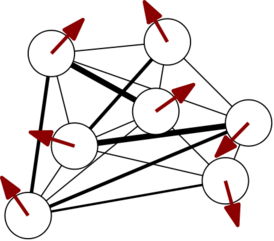
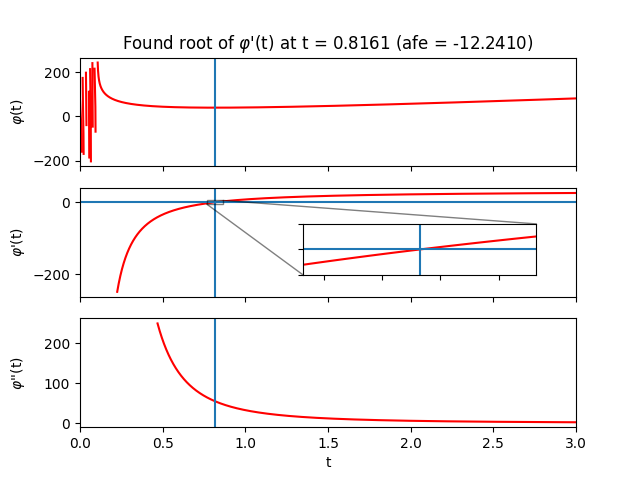
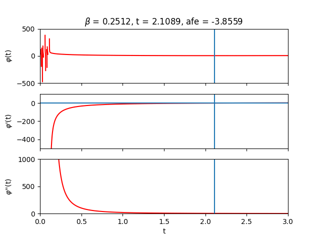
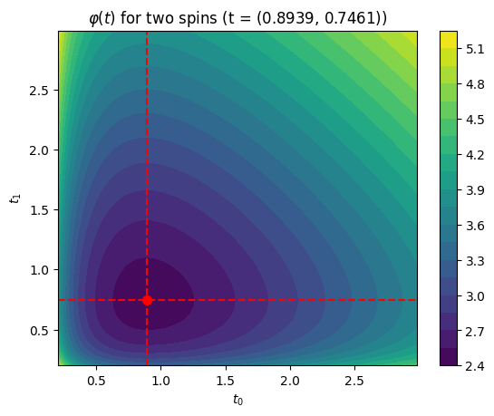
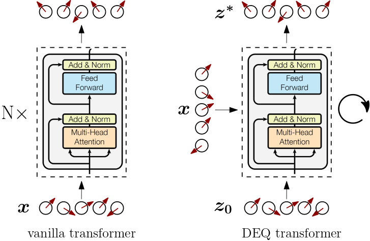
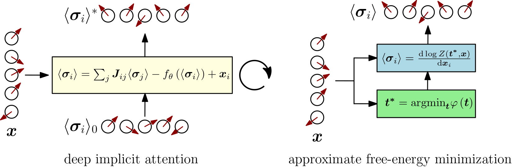

---

> **✨ Update (November 2021):** Consider reading [Transformers Are Secretly Collectives of Spin Systems](https://mcbal.github.io/post/transformers-are-secretly-collectives-of-spin-systems/) for a high-level overview of some of the ideas outlined in this post.


# Introduction

> **✨ TL;DR:** _We consider transformer modules as wrappers around a differentiable steepest-descent approximation of simple Ising-like vector-spin models familiar from statistical mechanics. We observe that a blueprint of the successful transformer-like architectural pattern of token-mixing (attention) and channel-mixing (feed-forward) naturally emerges when computing spin expectation values in vector-spin models with input-dependent couplings. Feel free to skip to the [final section](#comparison-with-vanilla-transformers) for a visual comparison of this work to vanilla transformers, deep equilibrium transformers, and deep implicit attention._

> **✨ Code: A PyTorch implementation of the ideas outlined in this blog post is available in the GitHub repository [`mcbal/afem`](https://github.com/mcbal/afem).**

In [Deep Implicit Attention: A Mean-Field Theory Perspective on Attention Mechanisms](https://mcbal.github.io/post/deep-implicit-attention-a-mean-field-theory-perspective-on-attention-mechanisms/), we introduced a mean-field theory perspective on transformer modules. We showed how their outputs can be understood as mean-field spin expectation values of simple Ising-like vector-spin systems. Physically, the process of training a transformer module can be understood as driving a classical many-body system with data and iteratively shaping its collective response behaviour through coupling-weight parameter updates. Stacking transformer modules corresponds to building up a differentiable structure of correlations by using the spin expectation values of one physical system to drive the next one.

In this post, we flesh out the idea of looking at transformer modules as physical systems. Having identified vector spin systems as plausible physical models underlying transformers, we turn to 1960s statistical-mechanics literature to look for inspiration on how to deal with their partition functions[^fn:inspiration]. We rediscover that the partition function of a particular class of vector-spin models can be approximated in the limit of large local spin dimension using steepest descent, leading to approximate yet tractable expressions for the free energy and other derived quantities.

Combining these canonical results from statistical mechanics with modern differentiable programming, we implement a differentiable vector-spin model based on an approximate free-energy minimization algorithm. Internally, the model uses an implicit layer to solve for the stationary point of the partition function in a differentiable way. We then construct a transformer-like attention module which encapsulates the spin model by routing inputs to applied magnetic fields and spin expectation values to outputs. The latter are obtained by following the familiar recipe of statistical mechanics: differentiating the spin model's $\log Z$ with respect to conjugate input variables. Finally, we contextualize our approach by comparing it to vanilla transformers, deep equilibrium transformers, and deep implicit attention.


# Massaging partition functions

In this section, we set out to derive an approximate, analytical expression for the free energy of a classical disordered vector-spin system exposed to a site-dependent external magnetic field. In deriving the results below, we found inspiration in H. E. Stanley's [Spherical Model as the Limit of Infinite Spin Dimensionality (1968)](https://doi.org/10.1103/PhysRev.176.718) and Chapter 5 of R. J. Baxter's bible on [Exactly Solved Models in Statistical Mechanics (1982)](https://physics.anu.edu.au/theophys/baxter_book.php).

## A vector-spin model and its partition function

We start from the following Hamiltonian (or energy function) of a classical vector spin system of $N$ spins in a site-dependent external magnetic field,

\begin{equation}
  E = - \sum_{i,j=1}^{N} J_{ij} \; \boldsymbol{\sigma}_{i} \cdot \boldsymbol{\sigma}_{j} - \sum_{i=1}^{N} \boldsymbol{h}_{i} \cdot \boldsymbol{\sigma}_{i}, \label{eq:vectrandomising}
\end{equation}

where both $\boldsymbol{\sigma}_{i} = \left[ \sigma_{1}(i), \sigma_{2}(i), \ldots, \sigma_{D}(i) \right]$ and $\boldsymbol{h}_{i} = \left[ h_{1}(i), h_{2}(i), \ldots, h_{D}(i) \right]$ are vectors of dimension $D$. The coupling matrix $\boldsymbol{J}$ is assumed to be traceless and symmetric but can otherwise have real elements with both negative and positive signs. We take the vector degrees of freedom $\boldsymbol{\sigma}_{i}$ to be constrained by a set of $N$ constraints

\begin{equation}
  \lVert \boldsymbol{\sigma}_{i} \rVert _{2}^{2} = \sum_{a=1}^{D} \sigma_{a}^{2}(i) = D, \quad i = 1,2,\ldots,N,
\end{equation}

so that their magnitudes equal $\sqrt{D}$. One can picture the classical spin degrees of freedom as arrows rotating along the surface of $(D-1)$-dimensional spheres at every site.

<figure class="spin-system-figure">
  
  <figcaption>Cartoon of vector-spin system</figcaption>
</figure>

In statistical mechanics, the model Eq. \eqref{eq:vectrandomising} is known as a [vector model](https://en.wikipedia.org/wiki/N-vector_model) whose familiar small-$D$ cases include the [Ising model](https://en.wikipedia.org/wiki/Ising_model) ($D=1$), the [XY model](https://en.wikipedia.org/wiki/Classical_XY_model) ($D=2$), and the [Heisenberg model](https://en.wikipedia.org/wiki/Classical_Heisenberg_model) ($D=3$). For infinite-dimensional spins $D \to \infty$, one can show that the system approaches the [spherical model](https://en.wikipedia.org/wiki/Spherical_model). The model defined by \eqref{eq:vectrandomising} can also be regarded as a vector generalization of [Boltzmann machines](https://en.wikipedia.org/wiki/Boltzmann_machine) or [Hopfield networks](https://en.wikipedia.org/wiki/Hopfield_network) or disordered [Sherrington-Kirkpatrick spin-glass models](https://en.wikipedia.org/wiki/Spin_glass#The_model_of_Sherrington_and_Kirkpatrick) (but with just a single sample of non-local couplings instead of an underlying probability distribution). Similar models also appear in recent studies on higher-dimensional generalizations of spin glass models[^fn:spinglasses]. 

The partition function for our spin system looks like:

\begin{align}
  Z_{N}^{(D)} &\left( \beta, J_{ij}, \{ \boldsymbol{h}_{i} \} \right) \nonumber \\
  &= \int_{-\infty}^{\infty} \cdots \int_{-\infty}^{\infty} \, \mathrm{d}\sigma_{1}(1) \cdots \mathrm{d}\sigma_{D}(N) \nonumber \\
  & \qquad \times \prod_{j=1}^{N} \delta \left( D - \lVert \boldsymbol{\sigma}_{j} \rVert _{2}^{2} \right) \nonumber \\
  & \qquad \times \exp \left[ \beta \sum_{i,j=1}^{N} J_{ij} \; \boldsymbol{\sigma}_{i} \cdot \boldsymbol{\sigma}_{j} + \beta \sum_{i=1}^{N} \boldsymbol{h}_{i} \cdot \boldsymbol{\sigma}_{i} \right] \label{eq:fullpartfun}
\end{align}

where we have made all dependencies explicit. This looks absolutely mental. We somehow need to find a way to do $N \times D$ integrals while taking into account all the constraints and interactions.

## Peeking into a physicist's bag of tricks

Let's first of all get rid of the explicit Dirac delta functions by substituting their complex integral representations

\begin{align}
  \delta \left( D - \lVert \boldsymbol{\sigma}_{j} \rVert _{2}^{2} \right) = \frac{\beta}{2 \pi i} \int_{-i\infty}^{i\infty} \mathrm{d} t_{j} \exp \left[ \beta t_{j} \left( D -  \lVert \boldsymbol{\sigma}_{j} \rVert _{2}^{2} \right) \right]
\end{align}

so that

\begin{align}
  Z_{N}^{(D)} &= \left(\frac{\beta}{2 \pi i}\right)^{N} \int_{-\infty}^{\infty} \cdots \int_{-\infty}^{\infty} \, \mathrm{d}\sigma_{1}(1) \cdots \mathrm{d}\sigma_{D}(N) \nonumber \\
  & \times \int_{-i\infty}^{i\infty} \cdots \int_{-i\infty}^{i\infty} \, \mathrm{d}t_{1} \cdots \mathrm{d}t_{N} \, \exp \left( \beta D \sum_{j=1}^{N} t_{j} \right)\nonumber \\
  & \times \prod_{\alpha=1}^{D} \exp \left[ -\beta \sum_{i,j=1}^{N} \left(t_{j}\delta_{ij}-J_{ij}\right) \; \sigma_{\alpha}(i) \sigma_{\alpha}(j) + \beta \sum_{i=1}^{N} h_{\alpha}(i) \sigma_{\alpha}(i) \right] \nonumber
\end{align}

Great, even more integrals. The next frustrating trick involves writing the number 1 as a judiciously chosen exponential,

\begin{align}
  \exp \left( \beta \sum_{j=1}^{N} a \left( D - \lVert \boldsymbol{\sigma}_{j} \rVert _{2}^{2} \right) \right) = 1,
\end{align}

for some arbitrary constant $a$, which, inside the integral, indeed evaluates to $\exp (0) = 1$ because of the constraints. Inserting this expression gives

\begin{align}
  &Z_{N}^{(D)} = \left(\frac{\beta}{2 \pi i}\right)^{N} \int_{-\infty}^{\infty} \cdots \int_{-\infty}^{\infty} \, \mathrm{d}\sigma_{1}(1) \cdots \mathrm{d}\sigma_{D}(N) \nonumber \\
  & \times \int_{-i\infty}^{i\infty} \cdots \int_{-i\infty}^{i\infty} \, \mathrm{d}t_{1} \cdots \mathrm{d}t_{N} \, \exp \left( \beta D \sum_{j=1}^{N} \left( t_{j} + a\right) \right)\nonumber \\
  & \times \prod_{\alpha=1}^{D} \exp \left[ -\beta \sum_{i,j=1}^{N} \left( \left( t_{j} + a \right) \delta_{ij}-J_{ij}\right) \; \sigma_{\alpha}(i) \sigma_{\alpha}(j) + \beta \sum_{i=1}^{N} h_{\alpha}(i) \sigma_{\alpha}(i) \right] \nonumber
\end{align}

Next, we'd like to swap the order of the $\mathrm{d}\sigma_{a}(j)$ and $\mathrm{d}t_{j}$ integrations to start integrating. But we are only allowed to do this if we assume $a$ to be a sufficiently large positive real number. Why? Essentially, we are deforming the contours of the complex integrals sufficiently far to the right such that the real part the quadratic form appearing in the exponential is positive definite, see e.g. [Helfand & Langer (1967)](https://doi.org/10.1103/PhysRev.160.437).

Let's go ahead and assume that everything is fine. We swap integrals and do a change of variables $t_j \to t_j + a$ so that

\begin{align}
  Z_{N}^{(D)} &= \left(\frac{\beta}{2 \pi i}\right)^{N} \int_{a-i\infty}^{a+i\infty} \cdots \int_{a-i\infty}^{a+i\infty} \, \mathrm{d}t_{1} \cdots \mathrm{d}t_{N} \\
  & \times \exp \left( \beta D \sum_{j=1}^{N} t_{j} \right)\nonumber \prod_{\alpha=1}^{D} I_{\alpha} \left( \beta, \{ t_{j} \}, \{ h_{\alpha}(i) \} \right)\nonumber
\end{align}

where

\begin{align}
  I_{\alpha} &\left( \beta, \{ t_{j} \}, \{ h_{\alpha}(i) \} \right) = \int_{-\infty}^{\infty} \cdots \int_{-\infty}^{\infty} \, \mathrm{d}\sigma_{\alpha}(1) \cdots \mathrm{d}\sigma_{\alpha}(N) \nonumber \\
  & \times \exp \left[ -\beta \sum_{i,j=1}^{N} \left( t_{j} \delta_{ij}-J_{ij}\right) \; \sigma_{\alpha}(i) \sigma_{\alpha}(j) + \beta \sum_{i=1}^{N} h_{\alpha}(i) \sigma_{\alpha}(i) \right]\nonumber
\end{align}

Notice how the integrals have kind of factorized over the vector dimension: for every $\alpha$-component we can evaluate an $N$-dimensional Gaussian integral with a linear term. The $I_{\alpha}$ functions depend on the sources $\{ \boldsymbol{h}_{i} \}$ indexed along local dimension instead of spin. Introducing the symmetric $N \times N$ matrix $V_{ij} = t_{j} \delta_{ij}-J_{ij}$, we can evaluate the Gaussian integrals and find

\begin{align}
  I_{\alpha} &\left( \beta, \{ t_{j} \}, \{ h_{\alpha}(i) \} \right) = \left( \frac{\pi}{\beta} \right)^{N/2} \left[ \det \left( \boldsymbol{V} \right) \right]^{-1/2} \exp \left(\frac{\beta}{4} \boldsymbol{h}_{\alpha}^{T} \boldsymbol{V}^{-1} \boldsymbol{h}_{\alpha} \right) \nonumber
\end{align}

where $\boldsymbol{h}_{\alpha} = \left[ h_{\alpha}(1), h_{\alpha}(2), \ldots, h_{\alpha}(N) \right]$ denote $N$-dimensional vectors. The expression for the partition function becomes

\begin{align}
  &Z_{N}^{(D)} = \left(\frac{\beta}{2 \pi i}\right)^{N} \left( \frac{\pi}{\beta} \right)^{DN/2} \int_{a-i\infty}^{a+i\infty} \cdots \int_{a-i\infty}^{a+i\infty} \, \mathrm{d}t_{1} \cdots \mathrm{d}t_{N} \nonumber \\
  & \times \exp \left( D \left( \beta \sum_{j=1}^{N} t_{j} - \frac{1}{2} \log \det \left( \boldsymbol{V} \right) \right) \right) \exp \left( \frac{\beta}{4} \mathrm{Tr} \left( \boldsymbol{H}^{T} \boldsymbol{V}^{-1} \boldsymbol{H} \right) \right) \nonumber
\end{align}

where we have introduced the matrix notation $\boldsymbol{H} \in \mathbb{R}^{N \times D}$ to group the vectors $\{ \boldsymbol{h}_{i} \}$.

## Steepest descent: hunting for the saddle

But there's still $N$ complex integrals over the auxiliary variables $\{ t_{j} \}$ left to do. Can we avoid doing them? Maybe. Let's rewrite our partition function as

\begin{align}
  Z_{N}^{(D)} = \left(\frac{\beta}{2 \pi i}\right)^{N} &\left( \frac{\pi}{\beta} \right)^{DN/2} \int_{a-i\infty}^{a+i\infty} \cdots \int_{a-i\infty}^{a+i\infty} \, \mathrm{d}t_{1} \cdots \mathrm{d}t_{N} \, \mathrm{e}^{D \varphi \left(\boldsymbol{t} \right) } \label{eq:partfunsteep}
\end{align}

with

\begin{align}
  \varphi \left(\boldsymbol{t}; \beta, J_{ij} \right) = \beta \sum_{j=1}^{N} t_{j} - \frac{1}{2} \log \det \left( \boldsymbol{V} \right) + \frac{\beta}{4D} \mathrm{Tr} \left( \boldsymbol{H}^{T} \boldsymbol{V}^{-1} \boldsymbol{H} \right) \label{eq:varphi}
\end{align}

As $D \to \infty$, the [method of steepest-descent or the saddle-point method](https://en.wikipedia.org/wiki/Method_of_steepest_descent) suggests that the partition function will be dominated by its largest contribution, i.e. in the neigbourhood of the maximum $\varphi(\boldsymbol{t^{*}})$ along the integration paths.

> **✨ Hmm, this doesn't quite seem right #1:** What does $D \to \infty$ even look like for the last term in Eq. \eqref{eq:varphi}? What does it mean for the input vectors $\{ \boldsymbol{h}_{i} \}$ to become infinite-dimensional? Good points, but let's carry on.

The saddle-point values $\boldsymbol{t^{*}}$ are obtained from the set of stationary conditions

\begin{align}
  \frac{\partial \varphi \left( \boldsymbol{t} \right)}{\partial t_j} \Biggr\rvert_{t_j = t^{*}_{j}} = 0, \qquad j=1,\ldots,N \label{eq:statcond}
\end{align}

> **✨ Hmm, this doesn't quite seem right #2:** In the single-variable case, [Baxter (1985)]() argues that $\varphi (t)$ is analytic for $\mathrm{Re}(t)>0$ and that we should consider $\varphi (t)$ first for $t$ real and positive. For positive $\beta$ and non-zero magnetic field, the function tends to plus infinity as $t$ tends to either zero or infinity. Thus in between $\varphi(t)$ must have a _minimum_ at some positive value $t^{*}$ of $t$. Since $\varphi''(t) > 0$ there is also only one such minimum. If we take the constant $a$ in the integral limits to be $t^{*}$, then along the (imaginary) integration path $\varphi (t)$ has a _maximum_ at $t=t^{*}$. We naively assume that this kind of saddle-point reasoning transfers to our case in several complex variables with $\varphi : \mathbb{C}^{N} \to \mathbb{C}$ where the equivalent of $\mathrm{Re}(t)>0$ is to try to steer clear of the singularity at $\det \left( \boldsymbol{V} \right)=0$. We will check the numerical behaviour of our $\varphi$-function in [Section 3.1](#the-algorithm-bold-moves-on-a-tricky-landscape).


Expanding $\varphi$ around $\boldsymbol{t^{*}}$ and then taking the logarithm of Eq. \eqref{eq:partfunsteep} leads to

\begin{align}
  \ln Z_{N}^{(D)} = \frac{DN}{2} \ln \left( \frac{\pi}{\beta} \right) + D \varphi \left( \boldsymbol{t^{*}} \right) + \ln R \nonumber
\end{align}

where we have collected all higher-order contributions and remaining nastiness in $R$. Following [Stanley (1968)](https://doi.org/10.1103/PhysRev.176.718), the free energy in the limit of large local dimension $D \to \infty$ then becomes

\begin{align}
  -\beta f_{N}^{(\infty)} = \lim_{D \to \infty} D^{-1} \ln \left( Z_{N}^{(D)} / Z_{N}^{(D)}(0) \right) \nonumber
\end{align}

where

\begin{align}
  Z_{N}^{(D)}(0) = \left( \left(\pi\right)^{D/2} D^{(D-1)/2} / \Gamma \left(D/2\right) \right)^{N} \nonumber
\end{align}

is a normalization factor[^fn:stanleyerror] accounting for the surface areas of the $(D-1)$-dimensional spheres with radius $\sqrt{D}$ associated to each and every spin degree of freedom. After applying [Stirling's asymptotic expansion](https://en.wikipedia.org/wiki/Stirling%27s_approximation#Stirling's_formula_for_the_gamma_function) to the $\Gamma$-function in the normalization factor and doing some algebra, we end up with

\begin{align}
  \boxed{-\beta f_{N}^{(\infty)} = - \frac{N}{2} - \frac{N}{2} \ln \left( 2\beta \right) + \varphi \left( \boldsymbol{t^{*}} \right)} \label{eq:afe}
\end{align}

where we have dropped the last term $\lim_{D \to \infty} D^{-1} \ln R$ assuming it tends to zero. Since $\varphi \left( \boldsymbol{t^{*}} \right) \propto N$, the last term actually also survives the limit $N \to \infty$.

## Taking stock of what we have done

We have derived a closed-form expression Eq. \eqref{eq:afe} for the approximate free energy of a vector-spin model in the limit of large local spin dimension. Let us take a brief moment to reflect on what we have done and touch on some tangential points.

#### Questioning steepest descent and the large-$D$ limit

The result \eqref{eq:afe} is only sensible if steepest descent is a valid thing to do, which depends on how outrageous the landscape defined by the $\varphi$-function \eqref{eq:varphi} really is. More practically, we will also never _really_ let the vector-spin dimension $D$ tend towards infinity since our goal is to implement a numerical attention-like neural network module. So large but finite vector dimensions better behave as if they were sufficiently close to infinity. We will find out in [Section 3.1](#the-algorithm-bold-moves-on-a-tricky-landscape) to what extent these assumptions are valid in practice.

#### Energy-based models and effective energy functions

Let us take another look at our model's partition function \eqref{eq:fullpartfun} from an energy-based perspective. For ease of notation, let us call the model parameters $\theta \equiv \{ J_{ij} \}$, the spins $\sigma \equiv \{ \boldsymbol{\sigma}_{i} \}$, and the external magnetic fields $h \equiv \{ \boldsymbol{h}_{i} \}$. We can schematically write our model's partition function as

\begin{align}
  Z_{\theta} \left( h \right) = \int \mathrm{d} \sigma \ \mathrm{e}^{ - E_{\theta}\left( \sigma, h \right) }
\end{align}

where $E_{\theta}\left( \sigma, h \right)$ denotes the energy function Eq. \eqref{eq:vectrandomising}. If we now introduce an energy-based model $p_{\theta} \left( \sigma, h \right) = \mathrm{e}^{-E_{\theta}\left( \sigma, h \right)} / Z_{\theta}$, we can define the marginal distribution

\begin{align}
p_{\theta} \left( h \right) = \frac{\int \mathrm{d} \sigma \  \mathrm{e}^{-E_{\theta}\left( \sigma, h \right)}}{Z_{\theta}} = \frac{\mathrm{e}^{-E_{\theta}\left( h \right)}}{Z_{\theta}} \label{eq:ph}
\end{align}

where the applied magnetic fields act as observables and the spins as latent variables. The effective energy $E_{\theta}\left( h \right)$ equals $E_{\theta}\left( h \right) = - \log \int \mathrm{d} \sigma \ \mathrm{e}^{-E_{\theta}\left( \sigma, h \right)} \approx - \log Z^{\ast}_{\theta} \left( h \right)$, where we have used the steepest-descent approximation for the integral. Taking the logarithm of Eq. \eqref{eq:ph}, we find that $\log p_{\theta} \left( h \right) \approx \log Z^{\ast}_{\theta} \left( h \right) - \log \int \mathrm{d} h \ Z^{\ast}_{\theta} \left( h \right)$.

#### Spin glasses and mean-field approximation

Ordered systems have a long history in statistical mechanics. Couplings in these models often encode a translation-invariant lattice geometry, e.g. nearest-neighbour interactions between spins living on a $d$-dimensional hypercubic lattice. One reason for this focus is practical: the regularity in these systems enables mathematical physicists to deploy all kinds of tricks and make progress towards some kind of understanding. In contrast, disordered systems, like spin glasses, are a mess and studying them is all about [finding order where there seems to be none](https://www.nobelprize.org/prizes/physics/2021/summary/). From the perspective of spin glasses, we can summarize our approach as follows: we want to arrive at an approximate yet tractable mean-field spin-glass model where its couplings are treated as parameters learned from data[^fn:bayesian].

Fully-connected models like Sherrington-Kirkpatrick spin-glass models (or Eq. \eqref{eq:vectrandomising}) naturally lead to mean-field theory because the couplings $J_{ij}$ encode long-range interactions where every other spin is just a hop away, see e.g. [Janiš (2015)](https://arxiv.org/abs/1506.07128). Intuitively, all-to-all interactions correspond to the mean-field limit of infinite spatial dimension. To see this, consider a spin in a local nearest-neighbour lattice model getting ever more neighbours as the spatial dimension grows: the notion of nearest neighbours melts away and all spins effectively become connected to each other[^fn:softmax]. Fully-connected non-local couplings and the limit of infinite spatial dimension are two sides of the same mean-field coin.


# Implementing approximate free-energy minimization

In this section, we turn the equations of the previous section into the algorithmic backbone of a differentiable vector-spin model. We begin by sketching an approximate free-energy minimization algorithm. We then show how to wrap around the spin model to turn it into an attention module.

## The algorithm: bold moves on a tricky landscape

Our goal is to compute the steepest-descent approximation of our model's partition function in a differentiable way. Essentially, we need to solve the set of equations

\begin{align}
  \frac{\partial \varphi \left( \boldsymbol{t} \right)}{\partial t_j} \Biggr\rvert_{t_j = t^{*}_{j}} = 0, \qquad j=1,\ldots,N
\end{align}

which corresponds to finding a value $\boldsymbol{t^{*}} = \mathrm{argmin}_{\boldsymbol{t}} \varphi \left( \boldsymbol{t} \right)$ for which the scalar function

\begin{align}
  \varphi \left(\boldsymbol{t}; \beta, J_{ij} \right) = \beta \sum_{j=1}^{N} t_{j} - \frac{1}{2} \log \det \left( \boldsymbol{V} \right) + \frac{\beta}{4D} \mathrm{Tr} \left( \boldsymbol{H}^{T} \boldsymbol{V}^{-1} \boldsymbol{H} \right) \nonumber
\end{align}

attains its minimum, or, equivalently, we need to solve for the root of $\nabla \varphi \left( \boldsymbol{t} \right)$.

#### Initialization and normalization

Until now we have not been explicit about the values of the couplings $\boldsymbol{J}$ and inputs $\boldsymbol{H}$. If we want to implement any of this, we have to be more careful. Recall that the energy function of our model looks like

\begin{equation}
  E = - \sum_{i,j=1}^{N} J_{ij} \; \boldsymbol{\sigma}_{i} \cdot \boldsymbol{\sigma}_{j} - \sum_{i=1}^{N} \boldsymbol{h}_{i} \cdot \boldsymbol{\sigma}_{i}
\end{equation}

where all spins $\boldsymbol{\sigma}_{i}$ are fixed to norm $\sqrt{D}$. We'd like this energy to remain linearly proportional to the the number of lattice sites. Numerically, we observe that stable root-finding is possible when initializing the couplings according to
\begin{equation}
  J_{ij} \sim \mathcal{N} (0, 1/\sqrt{ND} )
\end{equation}
The factor $1/\sqrt{N}$ can be explained from spin-glass mean-field theory[^fn:init] whereas the $1/\sqrt{D}$ factor follows from additionally normalizing with respect to the vector dimension to ensure $\sum_{i,j=1}^{N} J_{ij} \; \boldsymbol{\sigma}_{i} \cdot \boldsymbol{\sigma}_{j} \sim \mathcal{O}(N)$. One strategy to normalize the inputs $\boldsymbol{H}$ is to feed them into a layer normalization layer so that $\left\lVert \boldsymbol{h}_{i} \right\rVert \sim \mathcal{O}(\sqrt{D})$ and then explicitly dividing by $\sqrt{D}$ to make them $\mathcal{O}(1)$. A practical consequence of these initialization and normalization choices at the level of the energy function is that the $\varphi$-function changes to

\begin{align}
  \varphi \left(\boldsymbol{t}; \beta, J_{ij} \right) = \beta \sum_{j=1}^{N} t_{j} - \frac{1}{2} \log \det \left( \boldsymbol{V} \right) + \frac{\beta}{4} \mathrm{Tr} \left( \boldsymbol{H}^{T} \boldsymbol{V}^{-1} \boldsymbol{H} \right) \label{eq:varphinorm}
\end{align}

where the prefactor in the last term changed since we decided on explicitly dividing the layer-normalized $\boldsymbol{H}$ by $1/\sqrt{D}$.


#### Implicit layers for steepest-descent root-finding
Let's now find the root of the gradient of $\varphi$ in a differentiable way by combining [implicit layers](http://implicit-layers-tutorial.org/implicit_functions/) with a black-box root-finding algorithm like [Newton's method](https://en.wikipedia.org/wiki/Newton%27s_method), which requires access to both a function (the gradient of $\varphi$) and its gradient (the Jacobian of the gradient of $\varphi$). We could rely on automatic differentiation to calculate these gradients, but we just as well exploit the fact that we have an analytical expression Eq. \eqref{eq:varphinorm}. Grabbing a coffee and peeking at the [Matrix Cookbook](https://www.math.uwaterloo.ca/~hwolkowi/matrixcookbook.pdf), we can figure out what happens

- when we wiggle around $t_{i}$ (the gradient vector at $\boldsymbol{t}$)

\begin{align}
  \left[ \nabla \varphi \left( \boldsymbol{t} \right) \right]_{i} = \beta - \frac{1}{2} \left[ \boldsymbol{V}^{-1} \right]_{ii} - \frac{\beta}{4} \left[ \boldsymbol{V}^{-T} \boldsymbol{H} \boldsymbol{H}^{T} \boldsymbol{V}^{-T} \right]_{ii} \nonumber
\end{align}

- when we wiggle around both $t_{i}$ and $t_{j}$ (the symmetric Hessian matrix at $\boldsymbol{t}$)

\begin{align}
  \left[ \boldsymbol{J}(\nabla \varphi \left( \boldsymbol{t} \right)) \right]_{ij} = \frac{1}{2} &\left[ \boldsymbol{V}^{-1} \odot \boldsymbol{V}^{-T} \right]_{ij} \nonumber \\
  &+ \frac{\beta}{4} \left[ \boldsymbol{V}^{-T} \boldsymbol{H} \boldsymbol{H}^{T} \boldsymbol{V}^{-T} \boldsymbol{V}^{-T} \odot \boldsymbol{I} \right]_{ij} \nonumber \\
  &+ \frac{\beta}{4} \left[ \boldsymbol{V}^{-T} \boldsymbol{V}^{-T} \boldsymbol{H} \boldsymbol{H}^{T} \boldsymbol{V}^{-T} \odot \boldsymbol{I} \right]_{ij} \nonumber
\end{align}

Given an initial guess $\boldsymbol{t_{0}} \in \mathbb{R}^{N}_{>0}$ and input data $\boldsymbol{H} \in \mathbb{R}^{N \times D}$, we can now construct a differentiable root-solver which returns $\boldsymbol{t^{*}}$. It is important to keep in mind that the stationary value $\boldsymbol{t^{*}}$ actually depends on $\left(\beta, \boldsymbol{J}, \boldsymbol{H} \right)$ implicitly. Since we make use of implicit layers within an automatic differentation framework, these dependencies are kept track of and are included in the computational graph.

#### Fun with free energies

Let's test the algorithm by initializing a random vector-spin model and applying a random magnetic field at every site. For visualization purposes, we restrict the auxiliary variables to be effectively one-dimensional by defining $\boldsymbol{t} = t \boldsymbol{1}_{N}$ with just a single scalar parameter $t \in \mathbb{R}_{>0}$. We can probe a `VectorSpinModel` and get the approximate free energy for a given set of parameters and inputs by running the following script:

```python
  from afem.models import VectorSpinModel

  num_spins, dim = 32, 128
  model = VectorSpinModel(num_spins=num_spins, dim=dim, beta=1.0)

  x = (torch.randn(1, num_spins, dim) / np.sqrt(dim)).requires_grad_()
  t0 = torch.ones(1)

  afe = model(x, t0, return_afe=True).afe
```
Inside the forward pass, the root $\boldsymbol{t^{*}}$ is computed and then fed into Eq. \eqref{eq:afe} to calculate the approximate free energy. We can verify that our algorithm is doing something sensible by sweeping across the auxiliary $t$-values and plotting $\varphi$ and its derivatives:



The region close to $t=0$ looks terrifying. In this regime, $t$ is likely not large enough to overshadow the largest eigenvalue of the couplings so we lose positive definiteness and its nice properties. Let's try to stay away from that region by always initializing $\boldsymbol{t}_{0}$ sufficiently far from it. Depending on the parameters and initial guess provided to the solver, one can of course end up in less favourable landscapes where root-solving can become difficult due to zero gradients or extreme sensitivity to initial conditions. Fortunately, when the root-solving step fails, it tends to fail spectacularly.

Let's now sweep across inverse temperature $\beta$ to get some intuition. From the analytical expression of the free energy, we can deduce that for small $\beta$ (high temperature) the entropy term reigns while for large $\beta$ (low temperature) the energy terms take over.



Finally, let's lift the one-dimensional restriction on $\boldsymbol{t}$ and plot $\varphi (\boldsymbol{t})$ for two spins. In that case, $\boldsymbol{t}$ is also just two-dimensional so we can still visualize the optimization landscape.




## The attention module: probing spins with data

In the previous section, we showed how to numerically compute the steepest-descent approximation of a vector-spin model's partition function and hence its free energy. Since this approximation is fully differentiable, we can also take derivatives with respect to conjugate variables. Let's use this observation to construct an attention module.

#### Spin expectation values
We can calculate spin expectation values or magnetizations from our partition function approximation by differentiating with respect to the applied magnetic fields:

\begin{align}
  \langle \boldsymbol{\sigma}_{i} \rangle = \frac{\mathrm{d} \log Z \left( \boldsymbol{t}, \boldsymbol{H} \right)}{\mathrm{d} \boldsymbol{h}_{i}} = \frac{\partial \varphi}{\partial \boldsymbol{t}} \frac{\partial \boldsymbol{t}}{\partial \boldsymbol{h}_{i}} + \frac{\partial \varphi}{\partial \boldsymbol{h}_{i}} \label{eq:spinevgeneral}
\end{align}

If we evaluate the partition function approximation at the stationary point $\boldsymbol{t^{\ast}}$, the first term drops out because $\partial_{\boldsymbol{t}} \varphi \rvert_{\boldsymbol{t}=\boldsymbol{t^{\ast}}} = 0$. Assuming that the matrix $\boldsymbol{V}$ (and hence the couplings $\boldsymbol{J}$) do not depend on the inputs $\boldsymbol{H}$, the spin expectation value boils down to

\begin{align}
  \langle \boldsymbol{\sigma}_{i} \rangle = \frac{\partial \varphi}{\partial \boldsymbol{h}_{i}} = \frac{\beta}{2} \sum_{j} \boldsymbol{V}^{-1}_{ij} \boldsymbol{h}_{j} \label{eq:spinev}
\end{align}

which, for every site, is just a weighted sum of inputs. In the language of transformers, Eq. \eqref{eq:spinev} resembles an update step where $\boldsymbol{V}^{-1}$ can be interpreted as a symmetric attention matrix. Expanding the matrix inverse reveals a residual connection as the zero-th order contribution[^fn:expand].

Since the couplings are scalars at the level of the energy function Eq. \eqref{eq:vectrandomising}, getting terms to act on the hidden dimension seems to be impossible. But by considering couplings $\boldsymbol{J}(\boldsymbol{H})$ which do depend on inputs, additional terms can appear in Eq. \eqref{eq:spinev} propagating via dependencies in $\boldsymbol{V}$. Instead of calculating these gradients analytically, we should of course just let our automatic differentiation framework compute them for us.


#### Wrapping around the spin model

At this point, we have done all the heavy lifting. All that remains is to write a wrapper so that we can use our module just like any other explicit attention module: 

```python
  from afem.attention import VectorSpinAttention

  num_spins, dim = 32, 128
  attention = VectorSpinAttention(num_spins=num_spins, dim=dim, beta=1.0)

  x = torch.randn(1, num_spins, dim).requires_grad_()

  attention(x)  # (1, 32, 128)
```

Inside the forward pass of `VectorSpinAttention`, (normalized) inputs are sent to an internal `VectorSpinModel` which solves for the saddle point $\boldsymbol{t^{*}}$ and then feeds it into the steepest descent partition function to calculate magnetizations according to Eq. \eqref{eq:spinevgeneral}.

Let's finish this section by discussing some of the peculiarities of our approach:

- **Stability and symmetry:** The root-finding is stable as long as $\det \boldsymbol{V} > 0$, which ensures that $\boldsymbol{V}$ is nonsingular and which is garantueed as long as the quadratic form is positive definite. A quadratic form involving a general $\boldsymbol{V}$ (i.e. with nonsymmetric couplings $\boldsymbol{J}$) is positive definite iff its symmetric part has all positive eigenvalues. When this is no longer the case, things tend to blow up.
- **Scaling:** Our approach is kind of slow because calculating inverses scales as $\mathcal{O}\left(N^3\right)$. Yet there might be ways to approximate the slow parts of the algorithm similar to how vanilla transformers can be understood to approximate mean-field fixed-point equations[^fn:plugdia].
- **Lack of permutation invariance:** Our model is not permutation invariant with the default choice of input-independent couplings: every spin has a role to play.
- **Input-dependent couplings:** Because our default model assumes coupling-independent couplings $\boldsymbol{J}$, Eq. \eqref{eq:spinev} features just a "token-mixing" attention operation. Channel-mixing terms can appear when we consider the physically very weird setup where the couplings are made dependent on the applied magnetic fields. One possible choice could be:
\begin{align}
  \boldsymbol{J}(\boldsymbol{H}) = \frac{\tanh \left( \boldsymbol{H} \boldsymbol{Q} \boldsymbol{K}^T \boldsymbol{H}^T \cdot \sqrt{D} \right)}{\sqrt{ND}} \nonumber
\end{align}
where $\boldsymbol{Q}$ and $\boldsymbol{K}$ are linear transformations acting on the hidden dimension and where the scaling factors have been inserted because of the normalization conventions we discussed in [Section 3.1.1](#initialization-and-normalization). We hypothesize that additional terms in the spin expectation value Eq. \eqref{eq:spinev} arising from input-dependent couplings might be related to channel-mixing feed-forward networks in transformer modules.

#### Comparison with vanilla transformers
In this final section, let's summarize our approach on a high level by visually comparing it to vanilla transformers and deep equilibrium approaches.



The vanilla transformer [[Vaswani et al. (2017)]](https://arxiv.org/abs/1706.03762) (left above) is an explicit architecture which processes input sequences sequentially through a stack of transformer modules. Deep equilibrium transformers [[Bai et al. (2019)]](https://arxiv.org/abs/1909.01377) (right above) compute the output of a transformer module by implicitly solving for the fixed point of $f(z, x) = z$ where $f$ denotes the explicit transformer module. Data is repeatedly inserted by adding it to the current iteration of $z$ inside the module until fixed-point convergence. The  converged fixed point is considered the output of the module. Backpropagation through the iterations of the solver is avoided by using the implicit function theorem to calculate gradients directly at the equilibrium point. Instead of a stack of layers, there's just a single layer.

But deep equilibrium transformers still treat the transformer module as a black box. In [Deep Implicit Attention: A Mean-Field Theory Perspective on Attention Mechanisms](https://mcbal.github.io/post/deep-implicit-attention-a-mean-field-theory-perspective-on-attention-mechanisms/) we looked for a physical spin-model interpretation of the deep equilibrium fixed-point procedure (left below). We argued how the update step of a vanilla transformer module resembled mean-field fixed-point equations of a vector-spin model, explaining the successful pattern of token-mixing, residual connections, normalization layers, and feed-forward or channel-mixing modules from a physical spin systems' perspective.



In this work (right above), we continued on the path of spin expectation values but replaced solving mean-field fixed-point equations with directly taking derivatives of the steepest-descent partition function of a particular class of vector-spin models. The fixed-point procedure is replaced with a root-solving step to determine the steepest-descent partition function. The structure of our module's output reveals the same successful transformer-like pattern of token-mixing (attention) and channel-mixing (feed-forward) interspersed with normalization layers and residual connections.

# Conclusion

In this post, we introduced transformer modules as wrappers around statistical-mechanical vector-spin models. We used implicit layers to construct a class of approximate yet tractable vector-spin models whose couplings act as parameters that can be learned from data. We showed how these models can act as transformer-like attention modules by routing inputs to applied magnetic fields and returning spin expectation values derived from their steepest-descent partition function.

By zooming out and approaching transformers from a tangential, statistical-mechanical point of view, we were able to develop a physical intuition of transformers that seems hard to arrive at when restricting oneself to perturbing explicit neural network architectures. Recognizing transformer modules as spin models in disguise might not only unify architectural variations but also elucidate the high-level architectural convergence and empirical success of transformers in deep learning.


# References & footnotes

If you happen to find this work useful, please consider citing it as:

```
@article{bal2021afem,
  title   = {Transformers from Spin Models: Approximate Free Energy Minimization},
  author  = {Bal, Matthias},
  year    = {2021},
  month   = {October},
  url     = {https://mcbal.github.io/post/transformers-from-spin-models-approximate-free-energy-minimization/}
}
```


[^ref:aiayn]: _Ashish Vaswani, Noam Shazeer, Niki Parmar, Jakob Uszkoreit, Llion Jones, Aidan N. Gomez, Lukasz Kaiser, and Illia Polosukhin, [Attention Is All You Need](https://arxiv.org/abs/1706.03762) (2017)_

[^fn:bayesian]: In contrast to spin glasses however, we do not (yet want to go full Bayesian and) treat the couplings as drawn from some kind of probability distribution. For now, we settle for obtaining point estimates of model parameters.

[^fn:stanleyerror]: The original 1968 paper has a small typo here: the $\nu$ in the paper's Eq. (23) should be $\nu^{1/2}$ for the surface area of a $\nu-1$-dimensional sphere with radius $R=\nu^{1/2}$ embedded in $\nu$ dimensions. Using the paper's formula, an annoying $\ln \nu$ term won't cancel out in the limiting free energy calculation.

[^fn:init]: From [Janiš (2015)](https://arxiv.org/abs/1506.07128): _The mean-field limit to infinite dimensions or long-range interaction introduces a new large scale. To make the thermodynamic limit meaningful the dependence of the energy on this new large scale must be compensated by rescaling the non-local spin exchange so that the energy remains linearly proportional to the volume or the number of lattice sites (spins)._

[^fn:inspiration]: We could have turned to the mean-field free energies associated with the adaptive TAP equations discussed in [Deep Implicit Attention](https://mcbal.github.io/post/deep-implicit-attention-a-mean-field-theory-perspective-on-attention-mechanisms/), but we decided on attacking the problem from the steepest-descent angle on the full partition function.

[^fn:plugdia]: As discussed previously in [Deep Implicit Attention: A Mean-Field Theory Perspective on Attention Mechanisms](https://mcbal.github.io/post/deep-implicit-attention-a-mean-field-theory-perspective-on-attention-mechanisms/). In that setting, calculating inverses was sidestepped by approximating part of the solution with a feed-forward neural network.

[^fn:expand]: We can expand the right-hand side using a [special case of the Woodbury matrix identity](https://en.wikipedia.org/wiki/Woodbury_matrix_identity#Inverse_of_a_sum) to find
\begin{align}
  \boldsymbol{V}^{-1} &= \left( \mathrm{diag} ( \boldsymbol{t} ) - \boldsymbol{J} \right)^{-1} = \sum_{k=0}^{\infty} \left( \mathrm{diag} \left( \boldsymbol{t}^{-1} \right) \boldsymbol{J} \right)^{k} \mathrm{diag} \left( \boldsymbol{t}^{-1} \right) \nonumber
\end{align}
which converges if the largest absolute value of the eigenvalues of the matrix inside the power-brackets is less than 1. So the spin expectation value looks like a sum of contributions that mix and weigh inputs of different sites.

[^fn:softmax]: By promoting sparseness in the couplings, a model might become less mean-field-y, which might be one of the reasons behind the sucess of scaled `softmax` attention in vanilla transformers.

[^fn:spinglasses]: For example, see _[The Free Energy of Spherical Vector Spin Glasses (Ko, 2018)](http://blog.math.toronto.edu/GraduateBlog/files/2020/07/ut-thesis-Ko-updated.pdf)_ and _[Free Energy in the Mixed p-spin Models With Vector Spins (Panchenko, 2015)](https://arxiv.org/abs/1512.04441)_.
